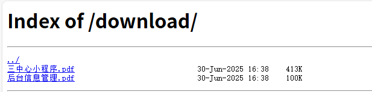

# Nginx目录映射

## 基本配置

```nginx
   location ^~ /download {
      alias /usr/local/nginx/download/; #指定实际目录绝对路径
      autoindex on;  # 开启目录浏览功能
      autoindex_exact_size off; # 默认开启为on,显示出文件的确切大小，单位是bytes。关闭为off，显示出文件大概大小，单位为kB，MB或GB
      autoindex_localtime on; # 默认为off,显示的文件时间为GMT时间。改为on后，显示的文件时间为文件的服务器时间
      autoindex_format html; #以html风格将目录展示在浏览器中，html、xml、json、jsonp 有这几个风格展示目录
      charset utf-8,gbk; #展示中文文件名
      # 判断文件是否以下这些方式结尾的，是的话提示浏览器进行下载
      if ($request_filename ~* ^.*?.(txt|doc|pdf|rar|gz|zip|docx|exe|xlsx|ppt|pptx)$){
         add_header Content-Disposition attachment;
      }
   }
```

> 

## Fancyindex模块

编译模块：

```
./configure \
  --add-module=../ngx-fancyindex-0.5.2 \
```

使用美化包：

```nginx
   location ^~ /download {
      alias /usr/local/nginx/download; #指定实际目录绝对路径
      autoindex on;  # 开启目录浏览功能
      autoindex_exact_size off; # 默认开启为on,显示出文件的确切大小，单位是bytes。关闭为off，显示出文件大概大小，单位为kB，MB或GB
      autoindex_localtime on; # 默认为off,显示的文件时间为GMT时间。改为on后，显示的文件时间为文件的服务器时间
      autoindex_format html; #以html风格将目录展示在浏览器中，html、xml、json、jsonp 有这几个风格展示目录
      charset utf-8,gbk; #展示中文文件名
      # 判断文件是否以下这些方式结尾的，是的话提示浏览器进行下载
      if ($request_filename ~* ^.*?.(txt|doc|pdf|rar|gz|zip|docx|exe|xlsx|ppt|pptx)$){
         add_header Content-Disposition attachment;
      }
      # 启用美化目录列表功能
      fancyindex on;
      # 使用本地时间显示文件修改时间（而非 UTC 时间）
      fancyindex_localtime on;
      # 关闭文件大小的精确显示（使用更友好的 KB/MB/GB 格式）
      fancyindex_exact_size off;

      # 指定页眉文件 (header.html) 和页脚文件 (footer.html) 的路径，
      # 这些文件属于整个网站范围的配置，路径属于请求的地址
      fancyindex_header "/Theme/light/header.html";
      fancyindex_footer "/Theme/light/footer.html";

      # 被忽略的文件不会出现在目录列表中，但仍然可以公开访问
      fancyindex_ignore "Theme";
   }

   location ^~ /Theme {
      alias /usr/local/nginx/download/Theme;
   }
```

> 
>
> 