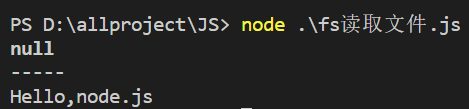
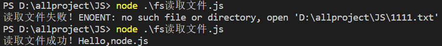
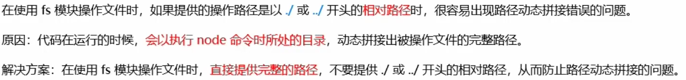

# fs文件系统模块

fs模块是Node.js官方提供的、用来操作文件的模块。它提供一系列的方法和属性，用来满足用户对文件的操作需求

例如：

- fs.readFile()：用来读取指定文件中的内容
- fs.writeFile()：用来向指定的文件中写入内容

## fs.readFile()

> `fs.readFile(path [,options], callback)`
>
> - path：必选参数，表示路径的字符串
> - options：可选参数，表示以什么编码格式来读取文件
> - callback：必选参数，文件读取完后，通过回调函数拿到读取的结果

```js
// 导入fs模块来操作模块
const fs = require('fs')

fs.readFile("111.txt",'utf-8',function(err,dataStr){
    // 打印失败的结果(如果读取成功，则打印为null，失败则值为错误对象)
    console.log(err)
    console.log("-----")
    // 打印成功的结果
    console.log(dataStr)
})
```

> 终端执行
>
> 

```js
// 导入fs模块来操作模块
const fs = require('fs')

fs.readFile("111.txt",'utf-8',function(err,dataStr){
    if(err){
        return console.log('读取文件失败！' + err.message)
    }
    // 打印成功的结果
    console.log('读取文件成功！' + dataStr)
})
```

> 

## fs.writeFile()

> `fs.writeFile(file, data [,options], callback)`
>
> - file：必选参数，表示路径的字符串
> - data：必选参数，表示要写入的内容
> - options：可选参数，表示以什么编码格式来写入文件内容，默认值是utf8
> - callback：必选参数，文件写入完成之后的回调函数

```js
const fs = require('fs')

fs.writeFile('222.txt','hello',function(err){
    if(err){
        return console.log("文件写入失败！" + err.message)
    }
    console.log("文件写入成功！")
})
```

## 路径拼接问题



> __dirname属性代表当前文件所处的目录，可以使用这个属性和文件名进行路径拼接

## path路径模块

path模块是Node.js官方提供的、用来处理路径的模块。它提供一系列的方法和属性，用来满足用户对路径的处理需求。

例如：

- `path.join([...path])`：用来经多个路径片段拼接成一个完整的路径字符串
- `path.basename(path[,etc])`：用来从路径字符串中，将文件名解析出来(获取路径中的最后一部分，etc可选参数，表示文件扩展名)
- `path.extname(path)`：用来获取文件名的后缀

```js
const path = require("path")

const pathStr1 = path.join('/a','/b/c','../','./d','/e')
console.log(pathStr1) // 输出为'/a/b/d/e'

const pathStr2 = path.join(__dirname,'111.txt')
console.log(pathStr2) // 成功拼接

console.log(path.basename(pathStr2)) // 111.txt
console.log(path.basename(pathStr2,'.txt')) //111

console.log(path.extname(pathStr2)) // .txt
```

