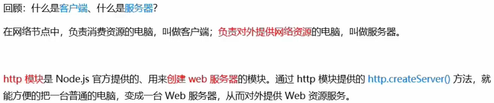
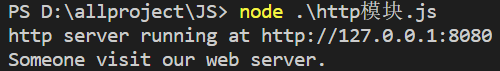
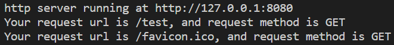
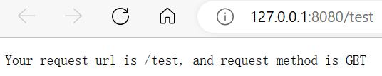
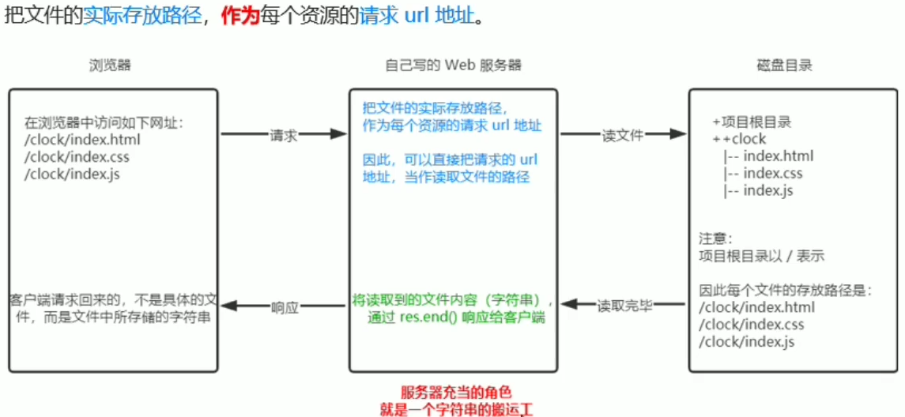

# http模块

## 概念



## 创建web服务器

1. 导入http模块
2. 创建web服务器实例
3. 为服务器实例绑定request事件，监听客户端的请求
4. 启动服务器

```js
const http = require('http')
const server = http.createServer()

// 为服务器实例绑定request事件，监听客户端的请求
server.on('request', (req, res) => {
    // 只要有客户端来请求服务器，就会触发request事件，从而调用这个事件处理函数
    console.log("Someone visit our web server.")
})

// 调用server.listen(端口号，cb回调)方法，即可启动web服务器
server.listen(8080, () => {
    console.log("http server running at http://127.0.0.1:8080")
})
```

> 访问localhost:8080，此时控制台会有打印信息
>
> 

## req请求对象

只要服务器接收到了客户端的请求，就会调用server.on()为服务器绑定request事件处理函数，如果想在事件处理函数中，访问与客户端相关的数据或者数据，可以使用如下的方式

```js
const http = require('http')
const server = http.createServer()

// 为服务器实例绑定request事件，监听客户端的请求
server.on('request', (req, res) => {
    // 客户端请求的url地址
    const url = req.url
    // 客户端请求的method类型
    const method = req.method
    // 拼接内容
    const str = `Your request url is ${url}, and request method is ${method} `
    // 只要有客户端来请求服务器，就会触发request事件，从而调用这个事件处理函数
    console.log(str)
})

// 调用server.listen(端口号，cb回调)方法，即可启动web服务器
server.listen(8080, () => {
    console.log("http server running at http://127.0.0.1:8080")
})
```

> 访问localhost:8080/test，此时控制台会有打印信息
>
> `Your request url is /test, and request method is GET`

## res响应对象

```js
const http = require('http')
const server = http.createServer()

// 为服务器实例绑定request事件，监听客户端的请求
server.on('request', (req, res) => {
    // 客户端请求的url地址
    const url = req.url
    // 客户端请求的method类型
    const method = req.method
    // 拼接内容
    const str = `Your request url is ${url}, and request method is ${method}, 你好 `

    console.log(str)
    // 设置编码方式，使其可以发送带中文的信息
    res.setHeader('Content-Type', 'text/html; charset=utf-8');
    // 向客户端发送指定的内容，并结束这次请求的过程
    res.end(str)
})

// 调用server.listen(端口号，cb回调)方法，即可启动web服务器
server.listen(8080, () => {
    console.log("http server running at http://127.0.0.1:8080")
})
```

> 访问localhost:8080/test，此时控制台会有打印信息
>
> 
>
> 浏览器也有获取到数据
>
> 

## 依据url不同响应内容也不同

1. 获取请求url地址
2. 设置默认的响应内容为404 Not Found
3. 判断用户请求的是否为'/'或者'/index.html'首页
4. 判断用户请求的是否为’/about.html‘关于页面
5. 设置Content-Type响应头，防止中文乱码
6. 使用res.end()方法将内容响应给客户端

```js
const http = require('http')
const server = http.createServer()

// 为服务器实例绑定request事件，监听客户端的请求
server.on('request', (req, res) => {
    // 客户端请求的url地址
    const url = req.url
    // 客户端请求的method类型
    const method = req.method
    // 设置默认内容
    let content = '<h1>404 Not Found</h1>'

    if(url==='/' || url==='/index.html'){
        content = '<h1>首页</h1>'
    }else if(url==='/about.html'){
        content = '<h1>关于页面</h1>'
    }

    // 设置编码方式，使其可以发送带中文的信息
    res.setHeader('Content-Type', 'text/html; charset=utf-8');
    // 向客户端发送指定的内容，并结束这次请求的过程
    res.end(content)
})

// 调用server.listen(端口号，cb回调)方法，即可启动web服务器
server.listen(8080, () => {
    console.log("http server running at http://127.0.0.1:8080")
})
```

> 可以根据请求的url不同响应不同的内容

## 请求静态资源

