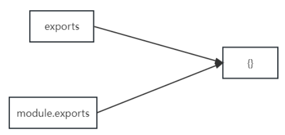
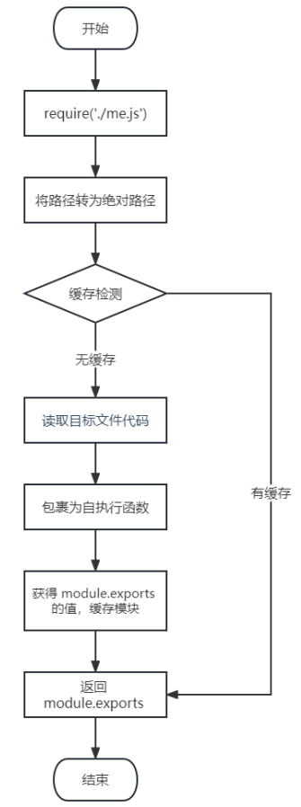

# 模块化

## 概念

将一个复杂的程序文件依据一定规则（规范）拆分成多个文件的过程称之为模块化

> 其中拆分出的每个文件就是一个模块 ，模块的内部数据是私有的，不过模块可以暴露内部数据以便其它模块使用

模块化好处：

- 防止命名冲突
- 高复用性
- 高维护性

## 暴露数据

- `module.exports=value`
- `exports.name=value`

> `module.exports`可以暴露"任意"数据
>
> 不能使用`exports = value`的形式暴露数据，模块内部 module 与 exports 的隐式关系`exports = module.exports = {}`，`require`返回的是目标模块中 `module.exports`的值



## 导入模块

在模块中使用 require 传入文件路径即可引入文件

```
const test = require('./me.js');
```

require使用的注意事项：

- 对于自己创建的模块，导入时路径建议写相对路径 ，且**不能省略**`./`和` ../`
- js 和 json 文件导入时可以不用写后缀，c/c++编写的 node 扩展文件也可以不写后缀，但是一般用不到
- 如果导入其他类型的文件，会以 js 文件进行处理
- 如果导入的路径是个文件夹，则会首先检测该文件夹下**`package.json`文件中`main`属性**对应的文件
  - 如果存在则导入，反之如果文件不存在会报错
  - 如果 main 属性不存在，或者`package.json`不存在，则会尝试导入文件夹下的`index.js`和`index.json`
  - 如果还是没找到，就会报错
- 导入 node.js 内置模块时，直接 require 模块的名字即可，无需加`./`和`../`

me.js

```js
// 声明函数
function tiemo(){
    console.log("贴膜")
}

function again(){
    console.log("再贴一张")
}

// 暴露数据(单个)
// module.exports = tiemo

// 暴露多个数据
// module.exports = {
//     tiemo,
//     again
// }

// 等同于
exports.tiemo = tiemo
exports.again = again
```

模块化.js

```js
// 导入模块
const tiemo = require('./me.js')

// 调用函数(单个)
// tiemo() --> 贴膜
tiemo.again()
tiemo.tiemo()
```

## 导入模块的基本流程

导入**自定义模块**的基本流程：

- 将相对路径转为绝对路径，定位目标文件
- 缓存检测
- 读取目标文件代码
- 包裹为一个函数并执行（自执行函数）。通过`arguments.callee.toString()`查看自执行函数
- 缓存模块的值
- 返回`module.exports`的值



## CommonJS规范

`module.exports`、`exports`以及`require`这些都是`CommonJS`模块化规范中的内容

> Node.js 是实现了 CommonJS 模块化规范，二者关系有点像 JavaScript 与 ECMAScript