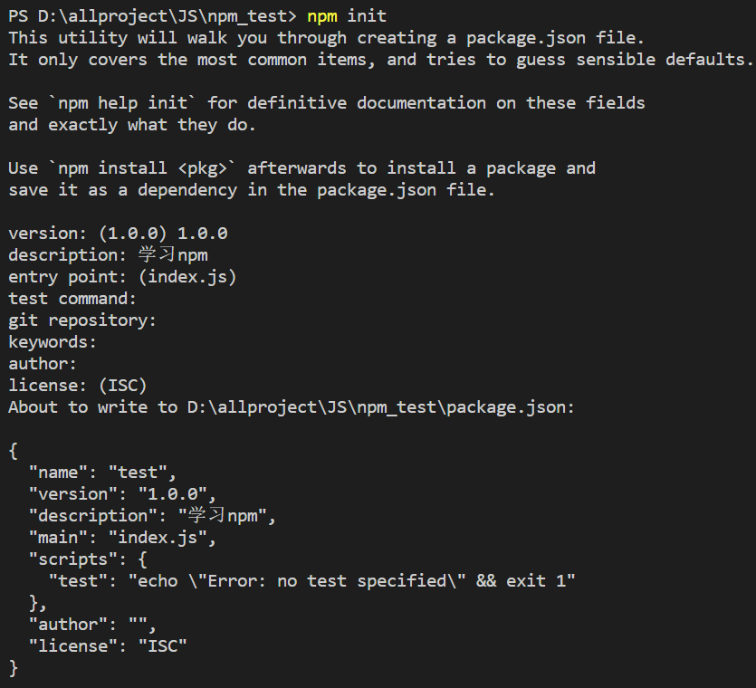
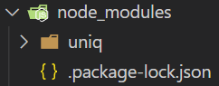

# 包管理工具

## 基本概念

代表一组特定功能的源码集合

管理『包』的应用软件，可以对「包」进行`下载安装`，`更新`，`删除`，`上传`等操作

> 借助包管理工具，可以快速开发项目，提升开发效率

常用的包管理工具

- npm
- yarn
- cnpm

## npm

npm 全称 Node Package Manager ，翻译为中文意思是『Node 的包管理工具』

npm 是 node.js 官方内置的包管理工具，是**必须要掌握住的工具**

### npm安装

node.js 在安装时会自动安装npm ，所以如果你已经安装了 node.js，可以直接使用 npm

可以通过`npm -v`查看版本号测试，如果显示版本号说明安装成功，反之安装失败

### npm基本使用

创建一个空目录，然后以此目录作为工作目录启动命令行工具 ，执行`npm init`



> `npm init`命令的作用是将文件夹初始化为一个『包』， 交互式创建 package.json 文件（每个包都必须要有 package.json，是包的配置文件）

package.json内容示例：

```json
{
    "name": "1-npm", #包的名字
    "version": "1.0.0", #包的版本
    "description": "", #包的描述
    "main": "index.js", #包的入口文件
    "scripts": { #脚本配置
        "test": "echo \"Error: no test specified\" && exit 1"
    },
    "author": "", #作者
    "license": "ISC" #开源证书
}
```

> 初始化的过程中还有一些注意事项： 
>
> 1. package name ( 包名 ) 不能使用中文、大写，默认值是 文件夹的名称 ，所以文件夹名称也不能使用中文和大写
> 2. version ( 版本号 )要求 x.x.x 的形式定义， x 必须是数字，默认值是 1.0.0
> 3. ISC 证书与 MIT 证书功能上是相同的，关于开源证书扩展阅读http://www.ruanyifeng.com/blog/2011/05/how_to_choose_free_software_licenses.html1
> 4. package.json 可以手动创建与修改
> 5. 使用`npm init -y`或者`npm init --yes`极速创建 package.json

### 搜索包

搜索包的方式有两种

- 命令行：`npm s/search 关键字`（**如果用了淘宝镜像则不可用**）
- 网站搜索：https://www.npmjs.com/

### 下载包

可以通过`npm install`和`npm i`命令安装包

```
# 格式
npm install <包名>
npm i <包名>

# 示例
npm install uniq
npm i uniq
```

运行之后文件夹下会增加两个资源



- node_modules：文件夹，用来存放下载的包
- package-lock.json：包的锁文件，用来锁定包的版本

> 安装 uniq 之后， uniq 就是当前这个包的一个**依赖包** ，有时会简称为**依赖**
>
> 创建一个包名字为 A，A 中安装了包名字是 B，就说 B 是 A 的一个依赖包 ，也会说 A 依赖 B

