# 通过nvm管理nodejs版本

nvm的Windows版本下载地址：[Releases · coreybutler/nvm-windows (github.com)](https://github.com/coreybutler/nvm-windows/releases)

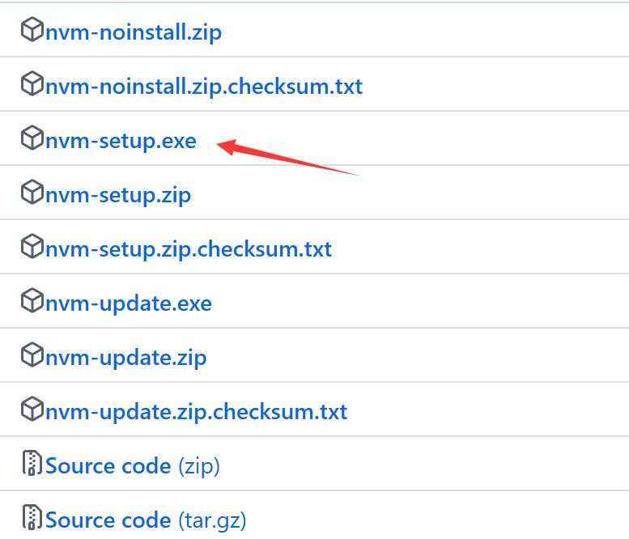

nvm的Linux版本下载地址：[Release v0.40.0 · nvm-sh/nvm · GitHub](https://github.com/nvm-sh/nvm/releases/tag/v0.40.0)

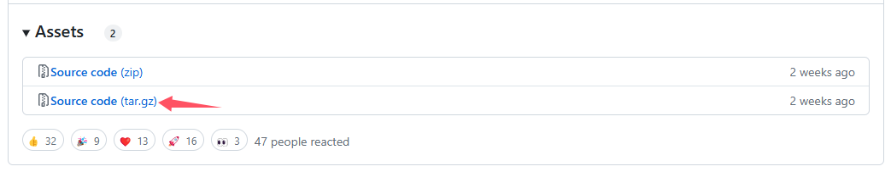

> 安装之前需要卸载之前的node.js
>
> node.js下载地址：[Index of /download/release/v16.20.2/ (nodejs.org)](https://nodejs.org/download/release/v16.20.2/)

## nvm、node、npm 区别

- **nvm**：nodejs 版本管理工具，也就是说：一个 nvm 可以管理很多 node 版本和 npm 版本
- **nodejs**：在项目开发时的所需要的代码库
- **npm**：nodejs 包管理工具，在安装的 nodejs 的时候，npm 也会跟着一起安装，它是包管理工具，npm 管理 nodejs 中的第三方插件

## 删除node.js

通过在cmd命令窗口通过`where node`查找安装的目录，删除此目录

删除系统变量

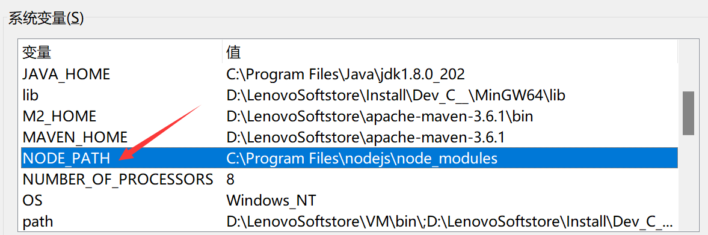

删除环境变量

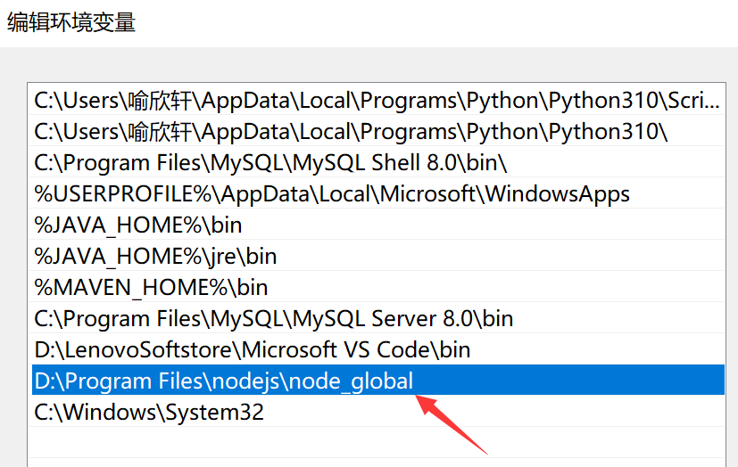

删除目录

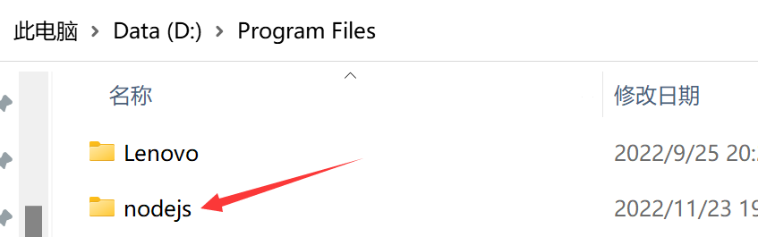

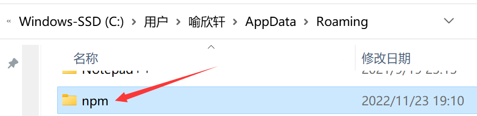

通过`npm -v`和`node -v`检查是否删除干净(此时`vue -V`指令也会失效)

## Windows安装

### 安装nvm

选择nvm安装目录

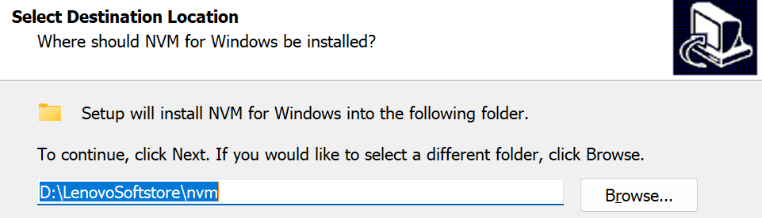

选择node.js安装目录

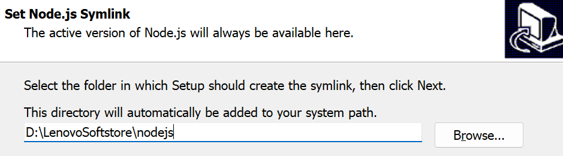

安装成功`nvm -v`会出现版本号，且会自动添加环境变量

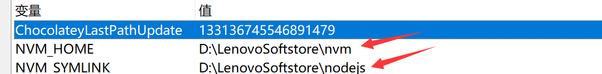

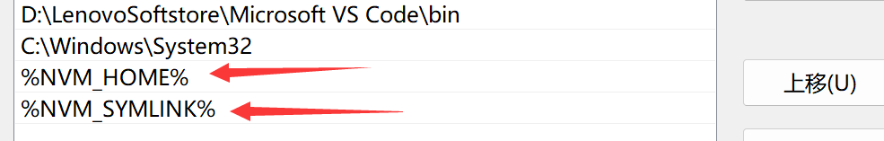

### 修改setting.txt

安装目录下有`setting.txt`文件，添加代理

```
node_mirror https://npm.taobao.org/mirrors/node/
npm_mirror https://npm.taobao.org/mirrors/npm/
```

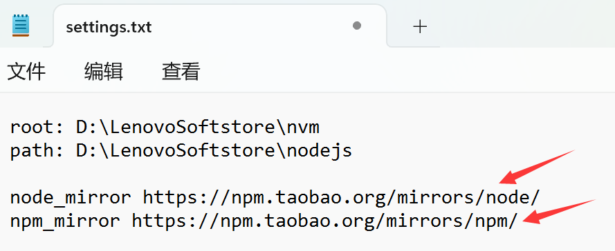

> 如果使用pnpm，可以通过命令设置镜像地址
>
> ```
> pnpm config set registry https://registry.npmmirror.com
> ```

如果安装失败，尝试换一个镜像地址

```
npm_mirror https://registry.npmmirror.com/
```

如果请求的 HTTPS 证书已经过期，可以使用如下命令后再安装依赖

```
npm config set registry https://registry.npmjs.org/
npm cache clean --force
```

### 使用管理员打开cmd窗口安装nodejs

指令`nvm ls available`查看可安装版本

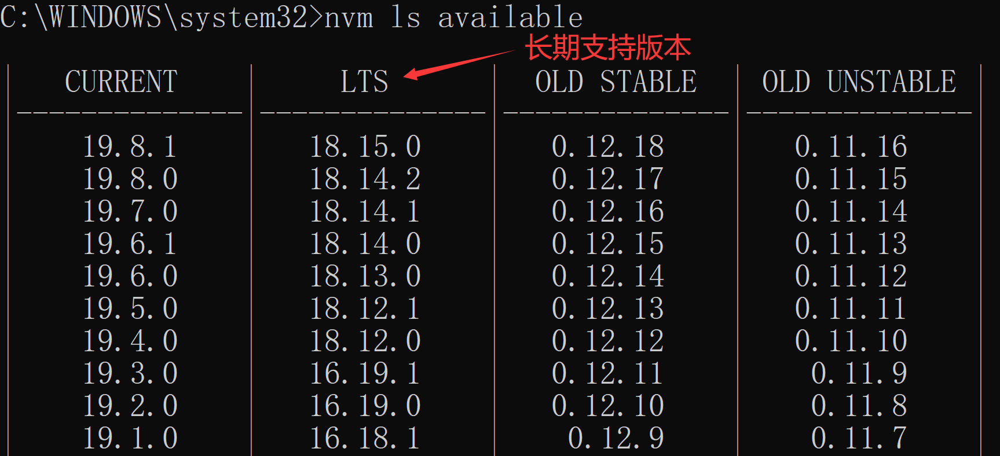

指令`nvm install 16.18.1`安装16.18.1版本

### 切换版本

指令`nvm ls`查看自己安装了的版本

指令`nvm use ${version}`使用版本，指令`nvm uninstall ${version}`卸载版本

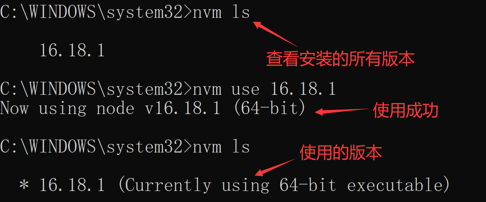

### 目录效果

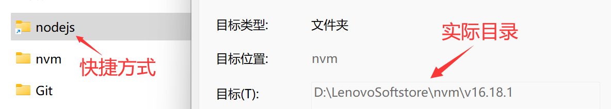

## Linux安装

### 命令安装

```
curl -o- https://raw.githubusercontent.com/nvm-sh/nvm/v0.40.0/install.sh | bash
```

> 脚本主要是下载nvm并克隆仓库，并添加nvm源到`.bashrc`，添加bash补全到`.bashrc`
>
> 安装后nvm命令需要执行命令`source ~/.bashrc`或者开启新窗口才会生效
>
> 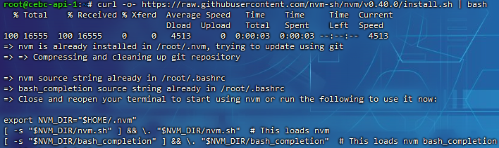

### 手动安装

解压源代码

```
cd /usr/local

tar -zxvf nvm-0.40.0.tar.gz
```

编辑配置

```
vim ~/.bashrc
```

添加配置

```
# 可以用$HOME变量指代'/root'目录
export NVM_DIR="/usr/local/nvm-0.40.0"
[ -s "$NVM_DIR/nvm.sh" ] && \. "$NVM_DIR/nvm.sh"
[ -s "$NVM_DIR/bash_completion" ] && \. "$NVM_DIR/bash_completion"
```

启用配置

```
source ~/.bashrc
```

> 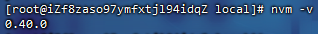

## 项目版本统一

在项目根目录创建`.nvmrc`文件，里面填写node版本号

```
v14.17.0
```

使用命令也可直接生成文件

```
node -v > .nvmrc
```

在此目录通过cmd命令`nvm use`即可直接使用此版本，保证版本统一

## 安装vue

安装vue可以参照《前端环境搭建》博客的流程

## 参考博客

[nvm安装（Windows篇） - 简书 (jianshu.com)](https://www.jianshu.com/p/2a0320b697b8)

[windows中如何将已安装的nodejs高版本降级为低版本_nodejs降低版本windows_Spring_z7的博客-CSDN博客](https://blog.csdn.net/weixin_44582077/article/details/110237056)