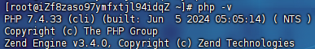
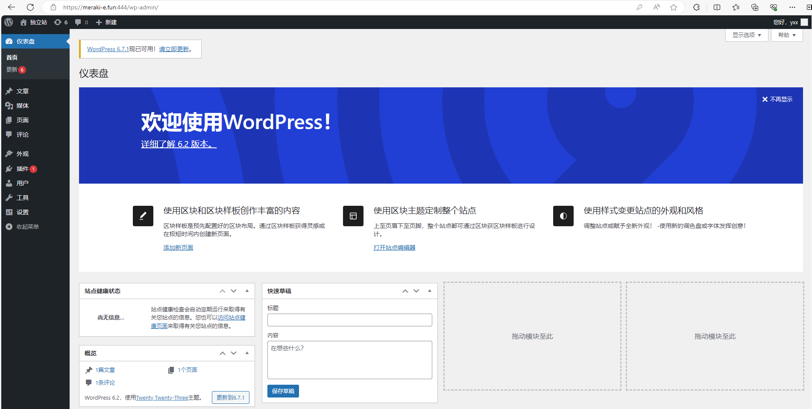

# Php部署

## 安装Php

### 7.4版本

**安装EPEL仓库**（如果尚未安装）： EPEL（Extra Packages for Enterprise Linux）是一个为Enterprise Linux提供高质量附加包的项目：

```
sudo yum install epel-release
```

**安装Remi仓库**：需要安装Remi仓库来获取PHP 7.4的安装包

- 对于CentOS 7：

  - ```
    sudo yum install http://rpms.remirepo.net/enterprise/remi-release-7.rpm
    ```

- 对于CentOS 8：

  - ```
    sudo dnf install https://rpms.remirepo.net/enterprise/remi-release-8.rpm
    ```

**启用Remi仓库**：

- 对于CentOS 7：

  - ```
    sudo yum install yum-utils
    sudo yum-config-manager --enable remi-php74
    ```

- 对于CentOS 8：

  - ```
    sudo dnf module enable php:remi-7.4
    ```

**安装PHP 7.4**：

```
sudo yum install php php-cli php-fpm php-mysqlnd php-xml
```

**安装其他PHP扩展**： 如果需要其他PHP扩展，可以使用`yum`来安装。例如，安装GD库：

```
sudo yum install php-gd
```

**查看版本信息**：

```
php -v
```

> 

**配置文件位置**：

```
sudo cat /etc/php-fpm.d/www.conf
```

### 更高版本

**更新Remi源**：

```
sudo yum install https://rpms.remirepo.net/enterprise/remi-release-7.rpm
```

**禁用7.4模块，启用8.0模块**：

```
sudo yum-config-manager --disable remi-php74
sudo yum-config-manager --enable remi-php80
```

**执行升级**：

```
sudo yum upgrade php\*
```

## Nginx配置文件

```nginx
server {
    # 监听80端口
    listen 80;
    # 服务器名称，替换成域名或IP地址
    server_name mydomain.com;

    # 设置文档根目录，替换成PHP项目路径
    root /path/to/your/php/project;
    index index.php index.html index.htm;

    # 配置日志文件路径
    access_log /var/log/nginx/mydomain.access.log;
    error_log /var/log/nginx/mydomain.error.log;

    # 拦截 script/ 目录下的所有请求
    location ^~ /script/ {
        deny all;
    }

    # PHP请求处理
    location ~ \.php$ {
        # 使用TCP/IP连接，有一定的TCP开销
        # 或者使用Unix域套接字连接到PHP-FPM、fastcgi_pass unix:/run/php-fpm/php-fpm.sock;
        fastcgi_pass 127.0.0.1:9000;

        # 设置FastCGI索引文件
        fastcgi_index index.php;

        # 包含FastCGI参数配置文件，替换成您的fastcgi配置文件路径
        include fastcgi.conf;

        # 分割请求的路径信息
        fastcgi_split_path_info ^(.+?\.php)(/.*)$;

        # 设置变量$path_info，包含路径信息
        set $path_info $fastcgi_path_info;

        # 将路径信息传递给PHP脚本
        fastcgi_param PATH_INFO $path_info;

        # 尝试按顺序查找文件，如果文件不存在则返回404错误
        try_files $fastcgi_script_name =404;
    }

    # 处理所有其他请求
    location / {
        # 尝试按顺序查找文件，如果文件不存在则返回404错误
        try_files $uri $uri/ /index.php?$query_string;
    }

}
```

> 值得注意的是，这里nginx的端口和域名应该和建wordpress数据库表`wp_options`保存的`siteurl`和`home`选项的值一致，否则会导致重定向问题和请求静态文件不到的问题：
>
> 

## 超时优化

> 如果PHP脚本执行时间过长，超过了Nginx或PHP-FPM的设定限制，可能会导致504错误

修改`/etc/php.ini`文件：

```
; 将默认的30秒增加到300秒
max_execution_time = 300

; 内存限制，默认128M
memory_limit = 1536M
```

修改`/etc/php-fpm.d/www.conf`或`/etc/php/7.x/fpm/pool.d/www.conf`配置文件：

```
request_terminate_timeout = 300s
```

> 当模式为`pm = dynamic`时进程设置：
>
> - `pm.max_children`：设置可以同时运行的最大子进程数。这是子进程数量的上限
> - `pm.start_servers`：设置服务启动时创建的初始子进程数
> - `pm.min_spare_servers`：设置空闲状态下的最小子进程数。如果当前空闲子进程数少于这个值，则会创建新的子进程，直到达到 `pm.max_children` 或者没有更多的系统资源可用为止
> - `pm.max_spare_servers`：设置空闲状态下的最大子进程数。如果当前空闲子进程数超过这个值，则会终止多余的子进程，直到空闲子进程数等于 `pm.min_spare_servers`
>
> 优化为Unix域套接字：
>
> ```
> ; 默认为listen = 127.0.0.1:9000
> listen = /run/php-fpm/php-fpm.sock
> 
> ; 可以指定套接字的所有者、组和权限
> ;listen.owner = nobody
> ;listen.group = nobody
> ;listen.mode = 0660
> listen.owner = nginx
> listen.group = nginx
> listen.mode = 0660
> ```

修改nginx配置文件：

```nginx
http {
    # 等待 FastCGI 进程发送响应数据的最长时间
    fastcgi_read_timeout 300;
    # 从代理服务器读取响应的超时时间
    proxy_read_timeout 300;
}
```

重启服务：

```
sudo systemctl restart nginx
sudo systemctl restart php-fpm
```

## 文件上传配置

修改`/etc/php.ini`文件：

```
; 最大POST数据大小，默认2M
post_max_size = 1024M

; 单个文件上传的最大大小，默认2M
upload_max_filesize = 1024M

; 每个脚本运行期间可分配的最大内存量，设置比 post_max_size 稍微大一些
memory_limit = 1536M
```

