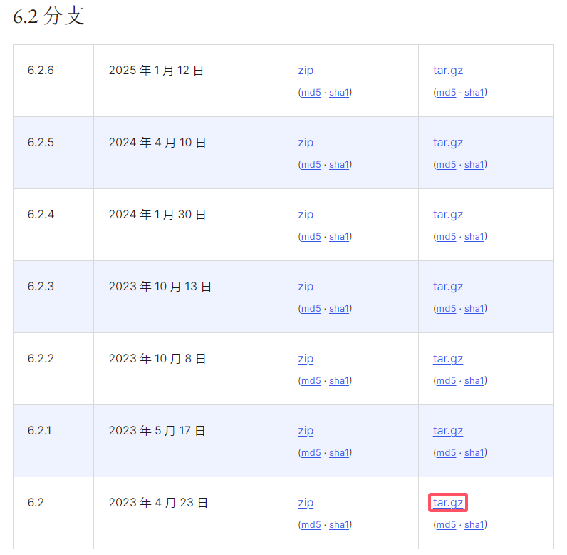
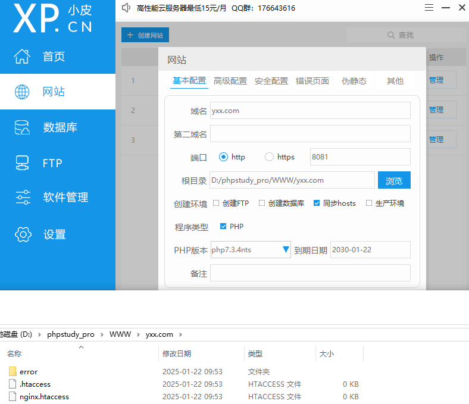
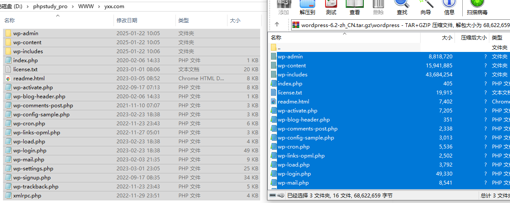
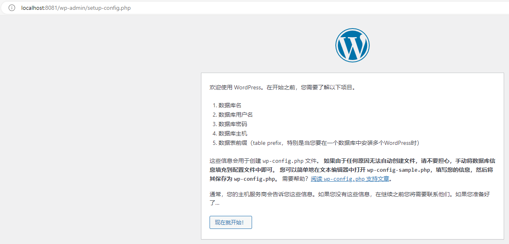

# WordPress

官网：[博客工具、发布平台和内容管理系统 – WordPress.org China 简体中文](https://cn.wordpress.org/)

## 下载使用

> [发行版本归档 – WordPress.org China 简体中文](https://cn.wordpress.org/download/releases/#branch-62)

指定版本：

新建网站：

文件替换：

运行效果：

