# WordPress

官网：[博客工具、发布平台和内容管理系统 – WordPress.org China 简体中文](https://cn.wordpress.org/)

## 下载使用

> [发行版本归档 – WordPress.org China 简体中文](https://cn.wordpress.org/download/releases/#branch-62)

### 版本要求

实际使用时PHP规定在8.0、MySQL8.0：


### 历史版本

指定版本：


### 运行Wordpress

新建网站：


文件替换：


运行效果：


对于6.2版本，php的最低版本应该为7.4：

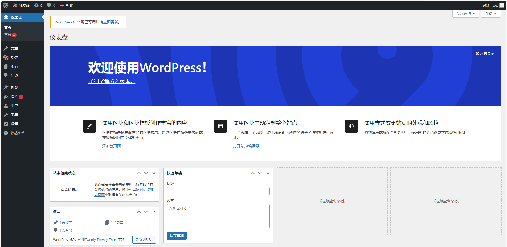

> php对于数据库密码验证方式只支持`mysql_native_password`，而且wordpress对`mysql8.0`兼容性不好，最好使用`mysql5.7`

## 权限修改

给予目录权限：

```
chmod 777 -R wp-content/
```

修改`wp-config.php`，允许文件直接上传，要求文件和目录拥有最高权限777：

```php
define("FS_METHOD", "direct");  
define("FS_CHMOD_DIR", 0777);  
define("FS_CHMOD_FILE", 0777); 
```

> 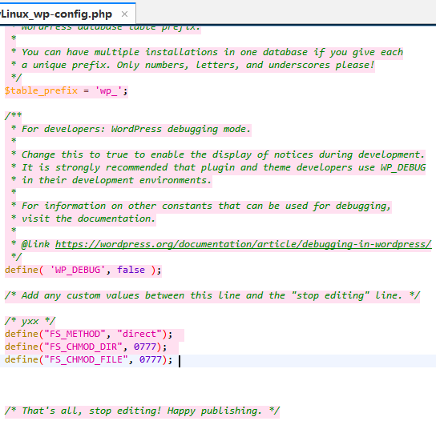

## Astra主题

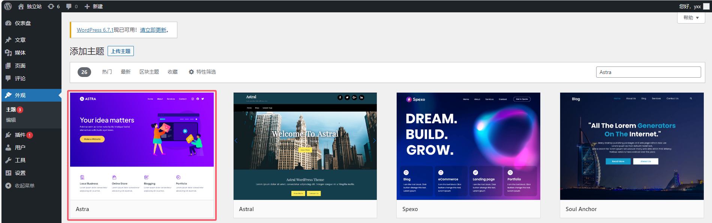

## Astar插件

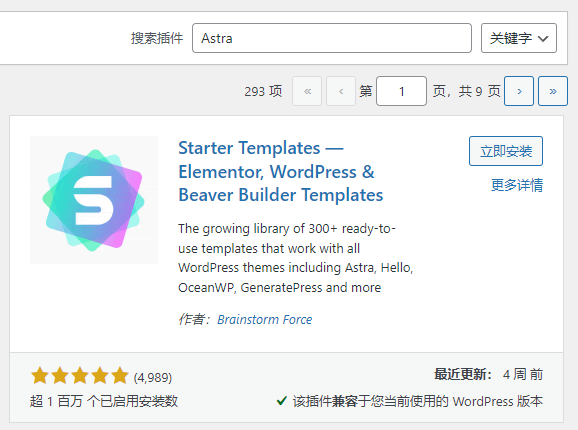

## Elementor插件


## 网站构建

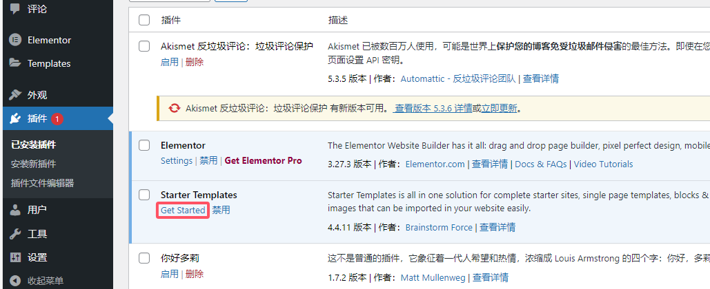

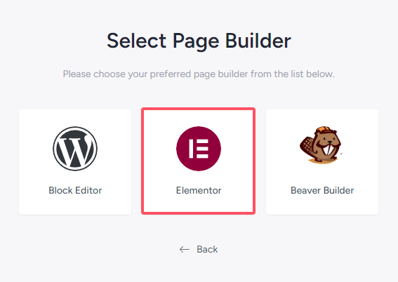

选择一个模板：

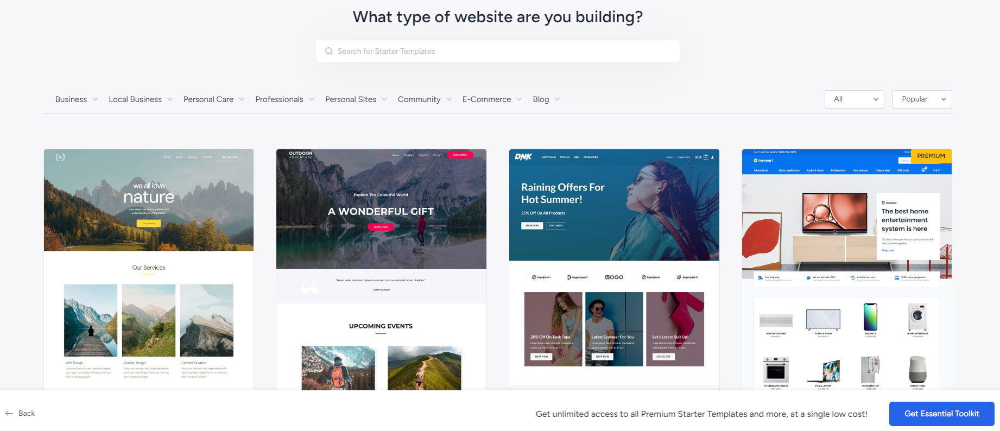

编辑模板：


选择功能：

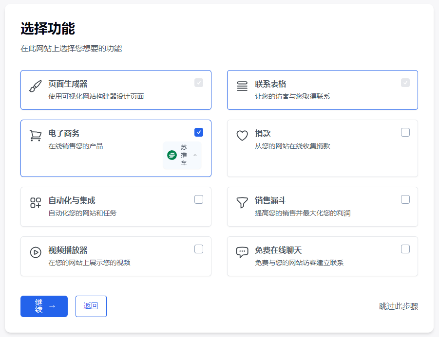

填写信息：


等待构建：

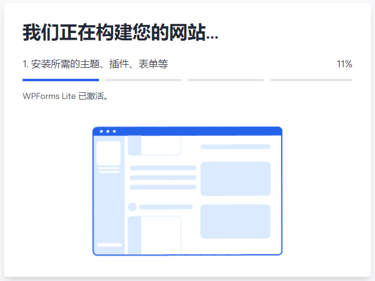

构建完毕：

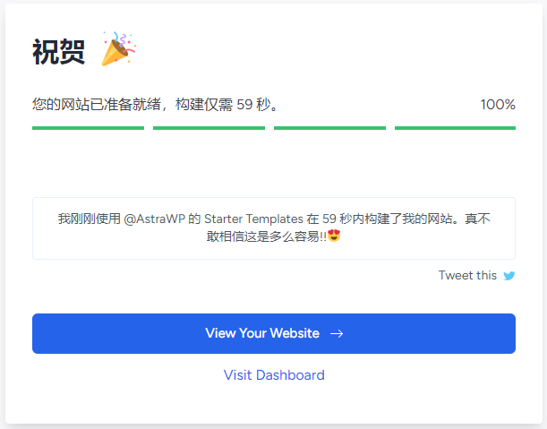

访问首页：

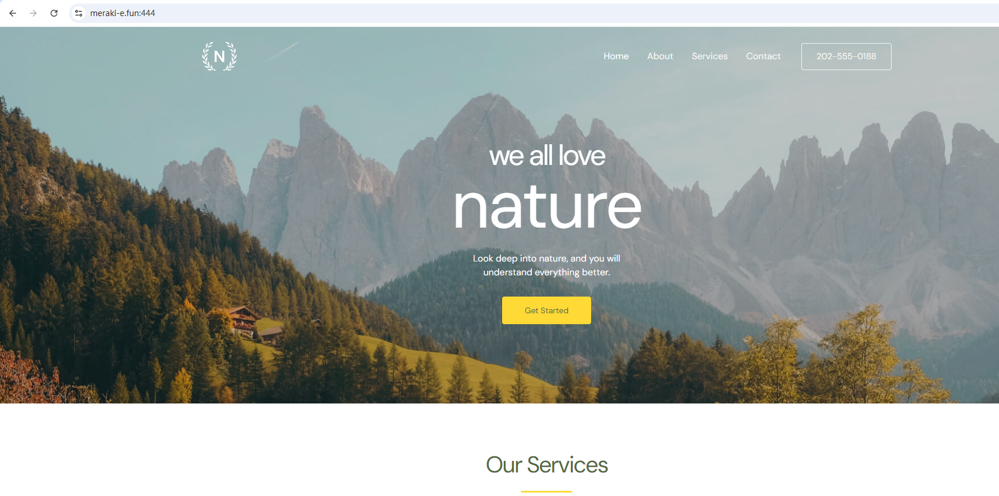

> 管理后台：`/wp-login.php`