# Wordpress电商独立站

## Blocksy主题

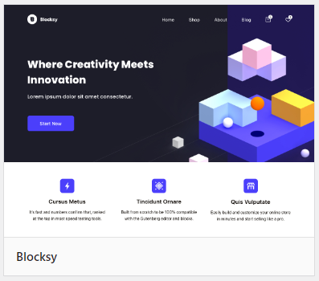

激活插件：

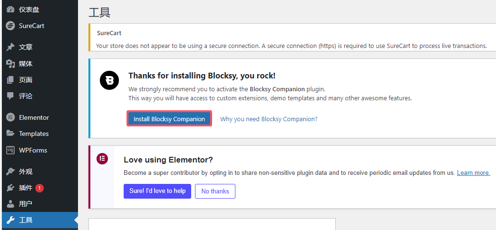

选用模板：

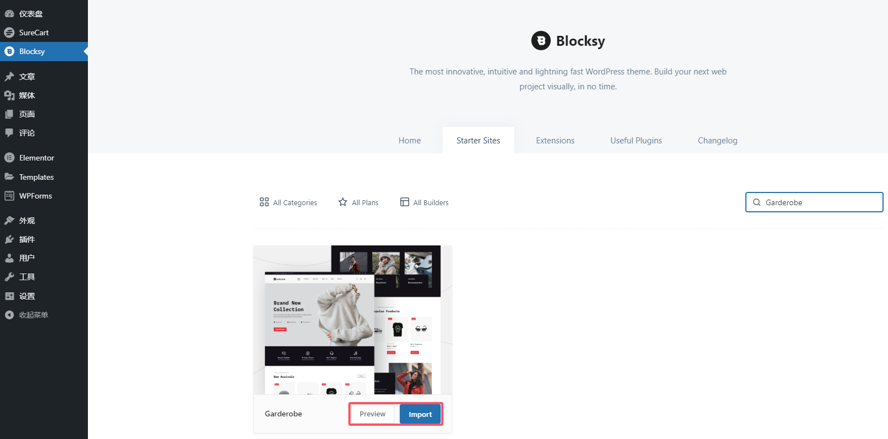

或者：

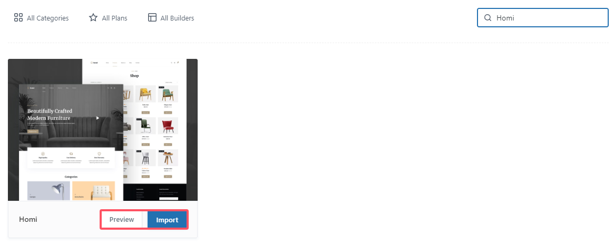

或者：

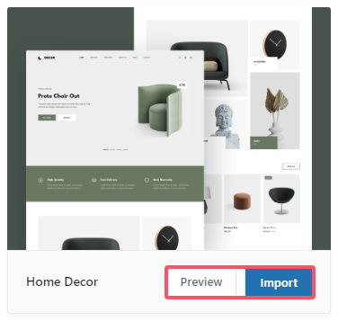

选择后安装子模块：

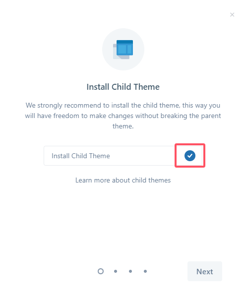

选择页面编辑器：

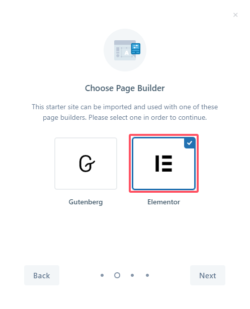

安装和启用插件：

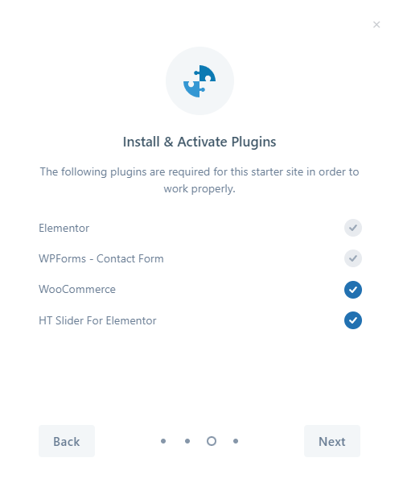

导入内容：

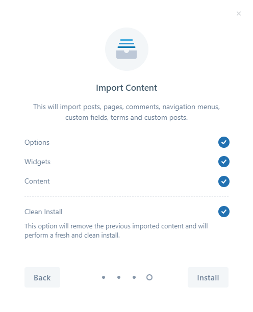

等待安装完成：

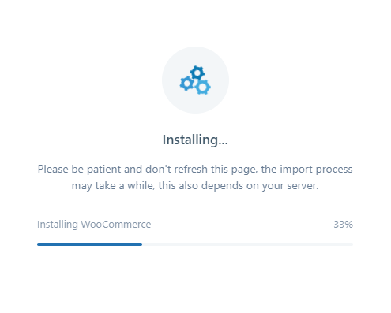

完成后效果：

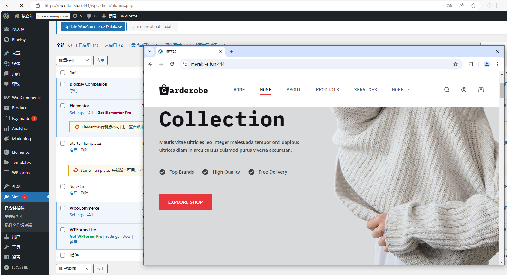

体验网站：

- [Garderobe – Just another WordPress site (startersites.io)](https://startersites.io/blocksy/garderobe/)
- [Homi – Beautifully crafted modern furniture (startersites.io)](https://startersites.io/blocksy/homi/)
- [Home Decor – Just another WordPress site (startersites.io)](https://startersites.io/blocksy/home-decor/)

## WooCommerce

### 配置基本信息

账户和隐私配置：

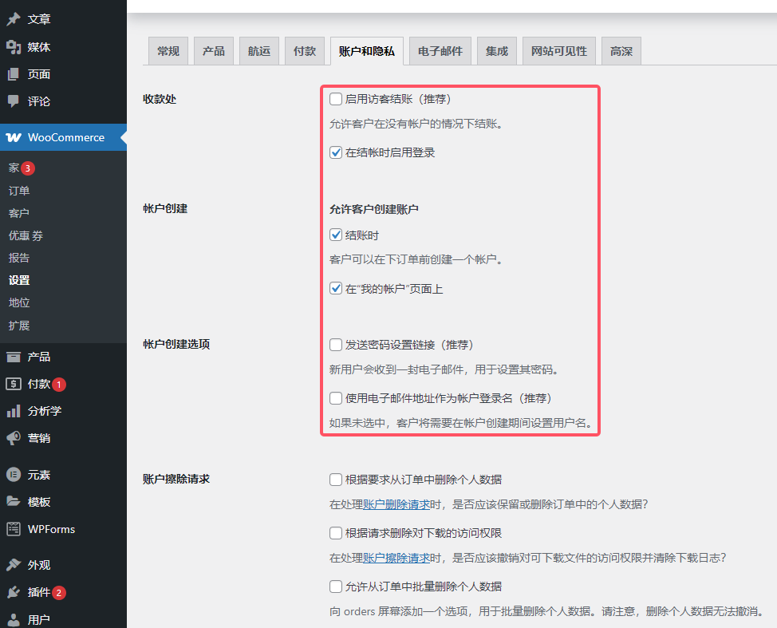

网站可见性配置：

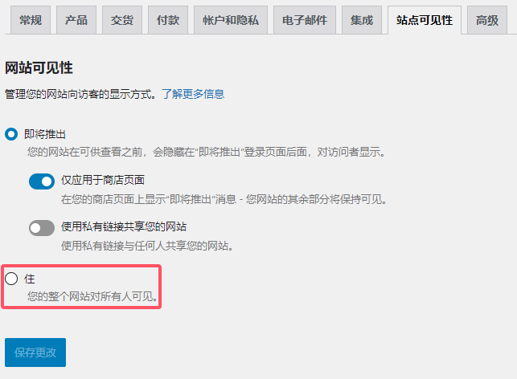

> 防止`products`界面无法访问

## GTranslate插件

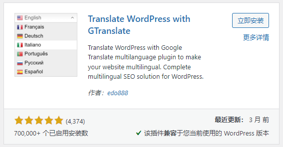

配置：

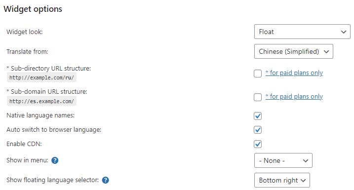

效果：

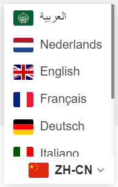

> 参考博客：[多语言 Gtranslate 最新最全教程 | WordPress | 小熊猫出海](https://redpanday.com/wordpress-gtranslate-tutorials/)