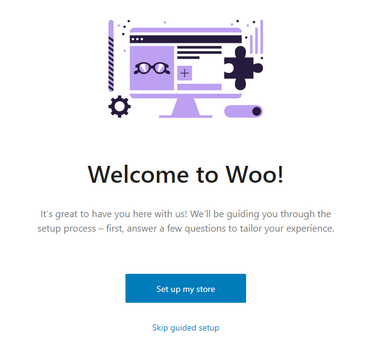
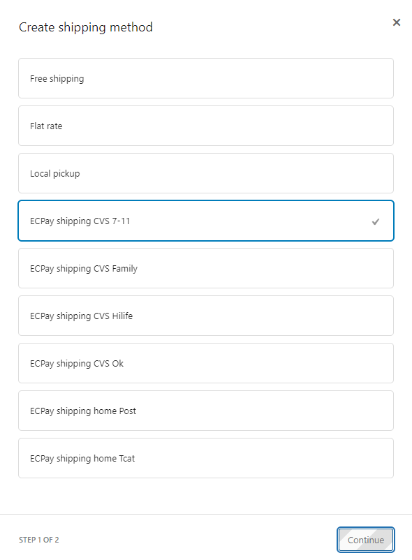

# Wordpress电商独立站

## Blocksy主题

激活插件：

选用模板：

或者：

或者：

选择后安装子模块：

选择页面编辑器：

安装和启用插件：

导入内容：

等待安装完成：

完成后效果：

体验网站：

- [Garderobe – Just another WordPress site (startersites.io)](https://startersites.io/blocksy/garderobe/)
- [Homi – Beautifully crafted modern furniture (startersites.io)](https://startersites.io/blocksy/homi/)
- [Home Decor – Just another WordPress site (startersites.io)](https://startersites.io/blocksy/home-decor/)

## WooCommerce

### 配置基本信息

账户和隐私配置：

网站可见性配置：

> 防止`products`界面无法访问

## GTranslate插件

配置：

效果：

> 参考博客：[多语言 Gtranslate 最新最全教程 | WordPress | 小熊猫出海](https://redpanday.com/wordpress-gtranslate-tutorials/)

## RY Tools for WooCommerce插件

## 现金流

> 需要登录注册配置之后`Return URL`才能测试通过，https://vendor.ecpay.com.tw/User/LogOn_Step1

启用ECPay，免费版支持`C2C`模式：

官方文档：

- 测试配送：[測試介接資訊 - ECPay Developers](https://developers.ecpay.com.tw/?p=7398)
- 测试信用卡：[測試介接資訊 - ECPay Developers](https://developers.ecpay.com.tw/?p=2856)

填写`ECPay gateway options`信息：

填写`ECPay shipping options`信息：

开启支付方式：

## 物流

添加物流选项：

添加物流：

设置物流：

## 整体流程

填写信息：

选择商超：

填写信用卡信息：

