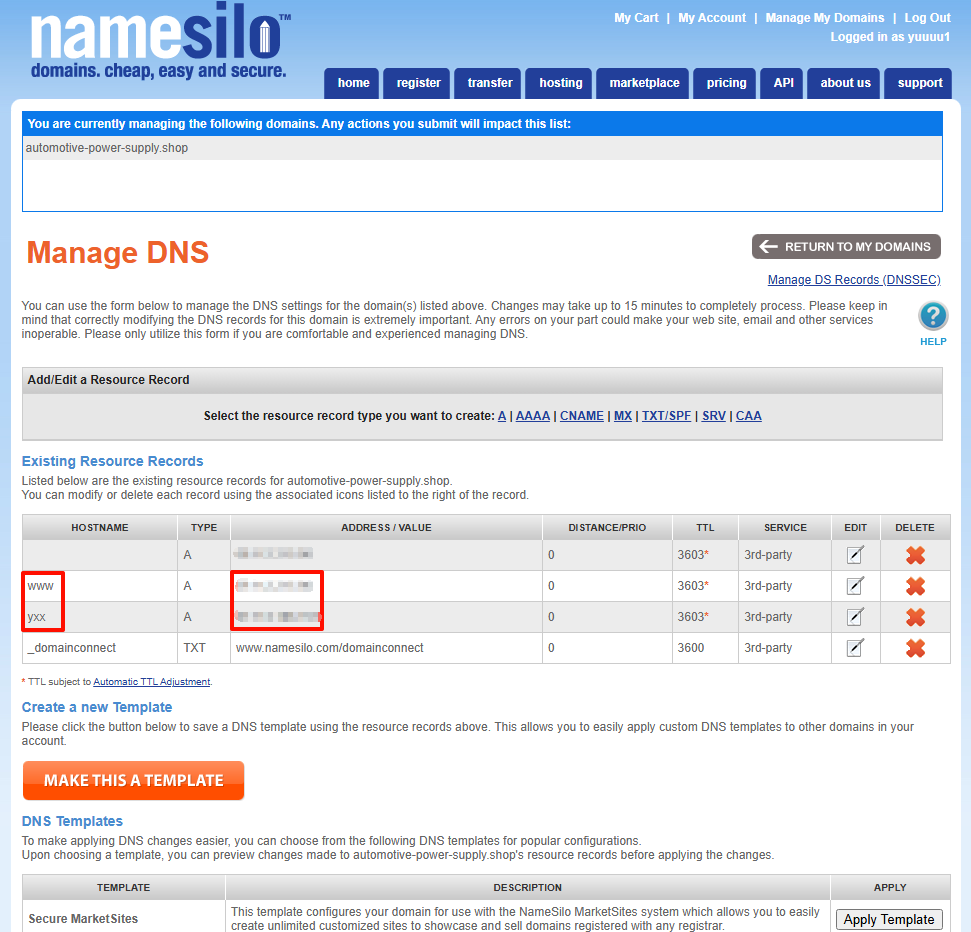

# 国外服务器和域名

> 国外服务器和域名可以不需要进行实名认证和备案

## 服务器

> 搬瓦工：[Mass VPS hosting on Enterprise equipment - BandwagonHost VPS](https://bwh81.net/order/basic/Los Angeles)

### 管理后台

> [Manage services - BandwagonHost VPS](https://bwh81.net/services)

进入管理：

## 域名

> NameSilo：[Register and Transfer Your .SHOP Domain with NameSilo](https://www.namesilo.com/tld/shop#hp)

## 管理后台

> [Domain Manager](https://www.namesilo.com/account_domains.php)

配置效果：

