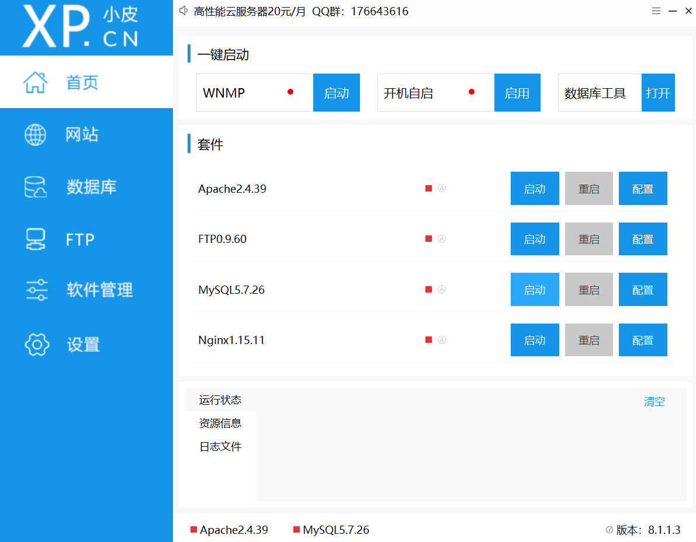
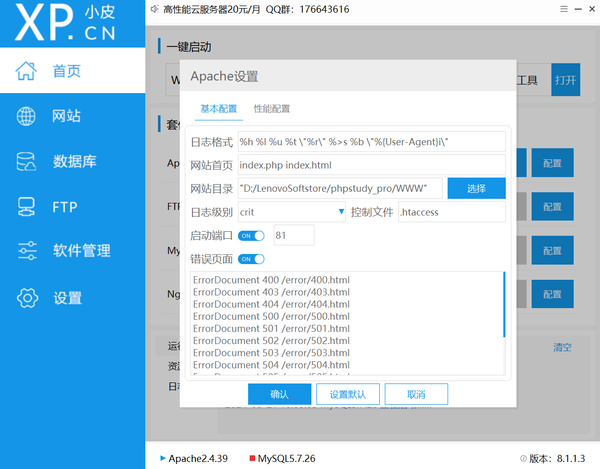
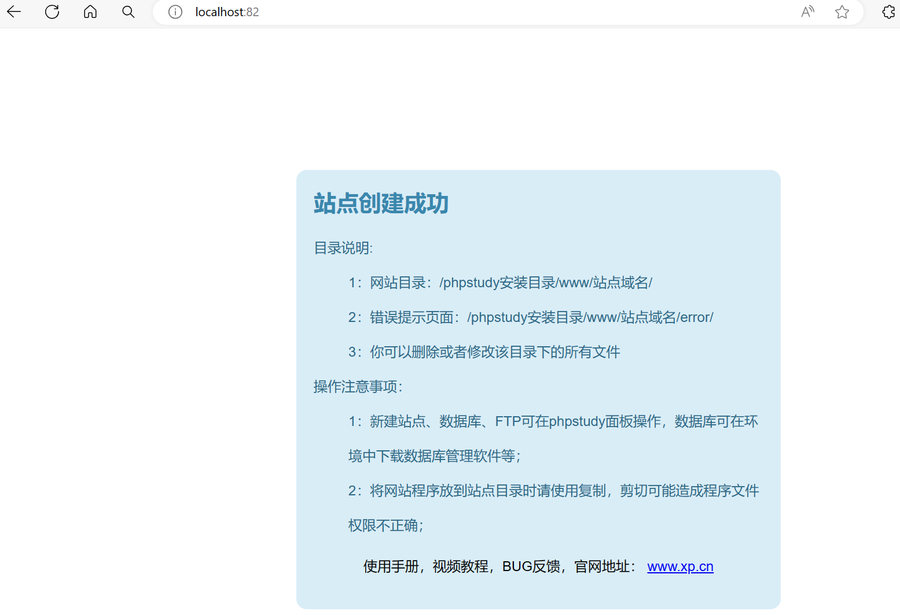
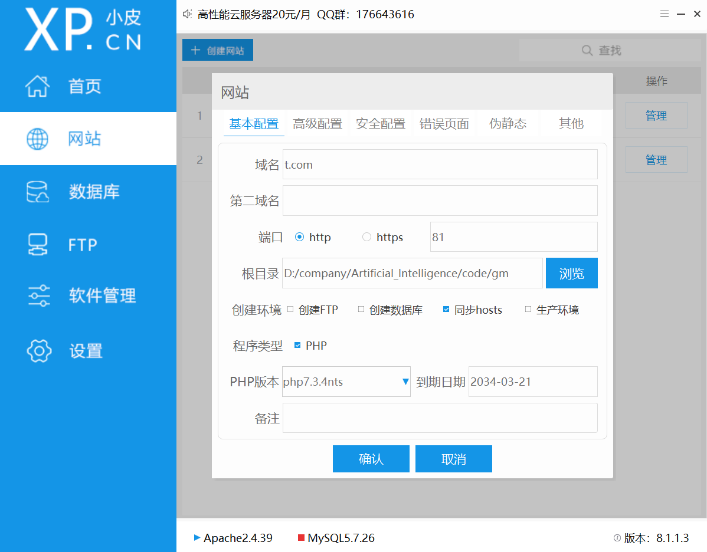
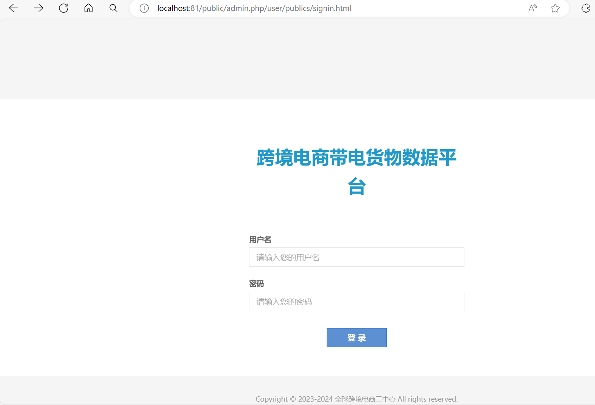
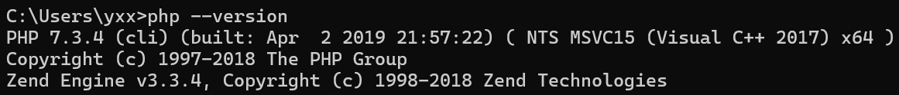
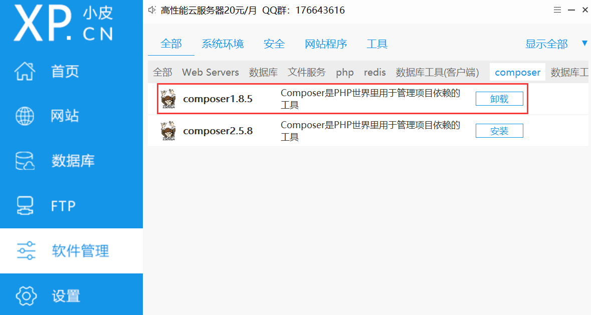
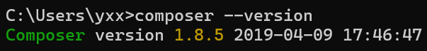
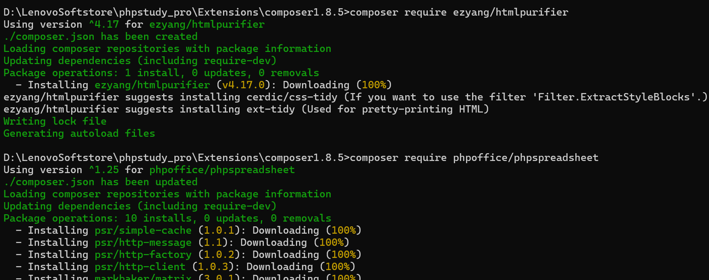
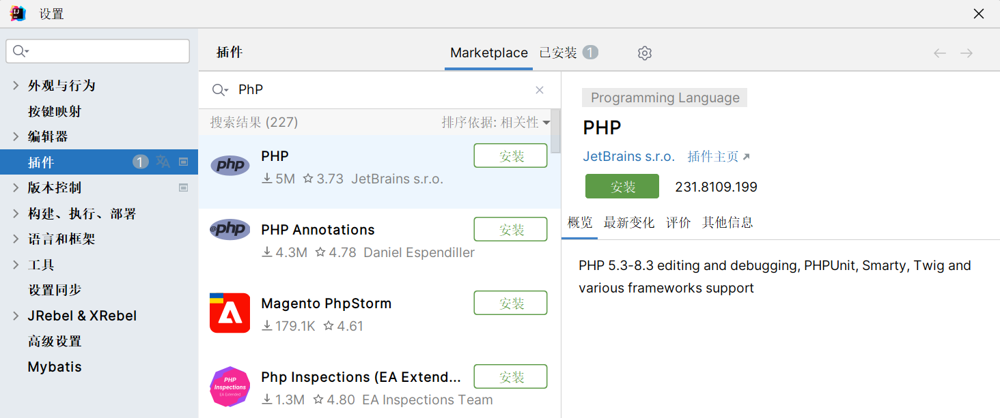

# 运行PhP项目

## 基础示例

下载运行环境：[Windows版phpstudy下载 - 小皮面板(phpstudy) (xp.cn)](https://www.xp.cn/download.html)



修改Apache启动端口为81



在网站中配置网站，配置php目录，默认会有个欢迎网站的示例，一样的修改端口号


访问`http://localhost:82/`



## 添加网站

选择php源代码目录(这里域名可能无法同步到hosts文件中去，手动访问端口号即可)



访问源代码指定地址：`http://localhost:81/public/admin.php`



## 依赖管理

配置php环境变量，在系统用户变量Path中添加路径

```
D:\LenovoSoftstore\phpstudy_pro\Extensions\php\php7.3.4nts
```

保存后运行`php --version`

> 

安装依赖管理工具



添加环境变量到系统变量Path中

```
D:\LenovoSoftstore\phpstudy_pro\Extensions\composer1.8.5
```

保存后运行`composer --version`

> 

在项目源代码`D:\company\Artificial_Intelligence\code\gm`下运行cmd窗口

设置composer腾讯镜像

```
composer config -g repos.packagist composer https://mirrors.cloud.tencent.com/composer/
```

更新依赖`ezyang/htmlpurifier`

```
composer require ezyang/htmlpurifier
```

安装依赖`phpoffice/phpspreadsheet`(解析xlsx的依赖)

```
composer require phpoffice/phpspreadsheet
```

> 

## 更新依赖

如果更新了项目目录下的`composer.json`和`composer.lock`文件，可以使用命令更新依赖

```
composer update
```

## 安装IDEA插件



> php代码保存后刷新网页即可实现热更新