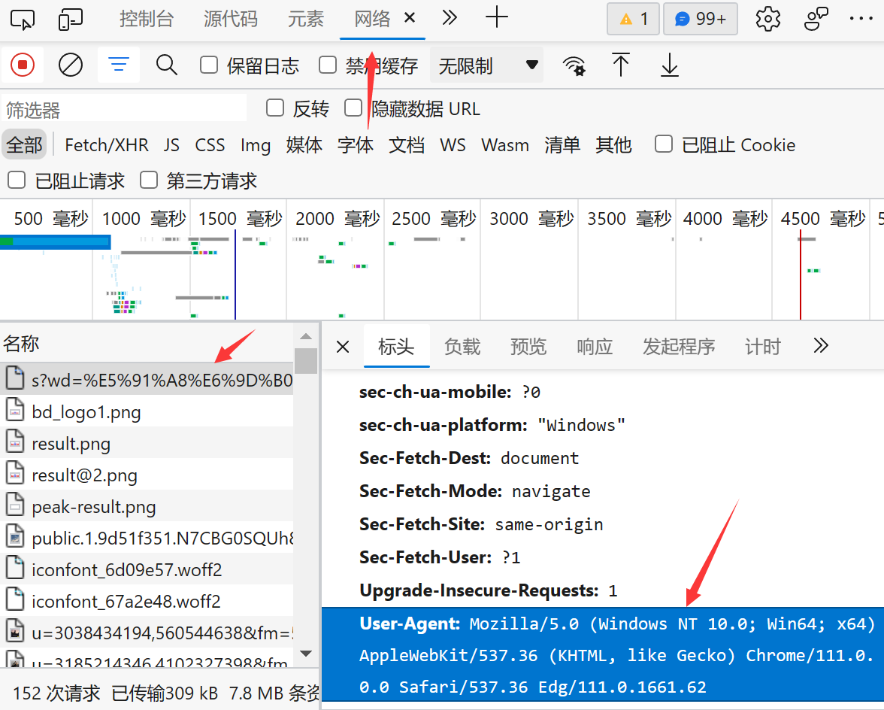

# 基础入门

## 爬取网页代码

### Http

直接使用`urllib.request.urlopen()`模拟浏览器向服务器发送请求，不过需要注意将返回的数据重新进行编码

```python
import urllib.request  # 导入对应的包，不能省略request


def http(url):
    # urlopen方法用于模拟浏览器向服务器发送请求
    response = urllib.request.urlopen(url)
    # 二进制转换为对应页面的编码格式——UTF-8
    return response.read().decode("UTF-8")


url = 'http://www.baidu.com'
content = http(url)
print(content)

```

> ```python
> # 一个类型六个方法
> # 类型：response是HttpResponse类型的数据
> # response方法：
> #   read(n)：一个一个的读，读取n个字符
> #   readline()：读取一行
> #   readlines()：一行一行的读，直到读完
> #   getcode()：返回状态码(200)代表没有错
> #   geturl()：返回url地址
> #   getheaders()：返回状态信息和响应头
> ```

### Https

> UA：User-Agent为用户代理，简称UA，它是一个特殊字符串头，使得服务器能够识别客户使用的操作系统及版本、CPU类型、浏览器及版本、浏览器内核、浏览器渲染引擎、浏览器语言、浏览器插件等
>
> 获取电脑自身的UA可以在打开网页后通过开发者工具查看到
>
> 

相较于Http需要对请求进行定制，使用`urllib.request.Request()`对请求进行定制，再使用`urlopen()`向模拟浏览器发送请求

```python
import urllib.request


def https(url, headers):
    # 对请求进行定制
    request = urllib.request.Request(url=url, headers=headers)
    response = urllib.request.urlopen(request)
    return response.read().decode("UTF-8")


url = 'https://www.baidu.com'
headers = {
    "User-Agent": 'Mozilla/5.0 (Windows NT 10.0; Win64; x64) AppleWebKit/537.36 (KHTML, like Gecko) Chrome/111.0.0.0 '
                  'Safari/537.36 Edg/111.0.1661.62 '
}
content = https(url, headers)
print(content)

```

### 下载

直接使用`urllib.request.urlretrieve()`输入下载路径即可下载

```py
import urllib.request

# 下载网页
url_page = 'http://www.baidu.com'

# urlretrieve方法用于获取资源，url为下载的路径，filename为存放文件的名字
urllib.request.urlretrieve(url=url_page,filename="baidu.html")

# 下载图片
url_img = 'https://tse4-mm.cn.bing.net/th/id/OIP-C.eoJnKkf1NLCEc2dBq6V6mwHaFu?w=222&h=180&c=7&r=0&o=5&dpr=2&pid=1.7'

urllib.request.urlretrieve(url=url_img,filename="img.jpeg")

# 下载视频
url_video = 'https://vd2.bdstatic.com/mda-jmkg7qxvvqm43fv9/sc/mda-jmkg7qxvvqm43fv9.mp4?v_from_s=hkapp-haokan-nanjing&amp;auth_key=1680866177-0-0-f6908190d2e943db7417021a31946156&amp;bcevod_channel=searchbox_feed&amp;pd=1&amp;cd=0&amp;pt=3&amp;logid=2777127047&amp;vid=14064482904129894400&amp;abtest=107353_1-109133_1&amp;klogid=2777127047'

urllib.request.urlretrieve(url=url_video,filename="video.mp4")

```

### 编解码

对于地址中的中文需要转换为Unicode的编码方式，使用`urllib.parse.quote()`方法转换

```python
import urllib.request
import urllib.parse


def https(url, headers):
    request = urllib.request.Request(url=url, headers=headers)
    response = urllib.request.urlopen(request)
    return response.read().decode("UTF-8")


url = 'https://www.baidu.com/s?wd='
headers = {
    "User-Agent": 'Mozilla/5.0 (Windows NT 10.0; Win64; x64) AppleWebKit/537.36 (KHTML, like Gecko) Chrome/111.0.0.0 '
                  'Safari/537.36 Edg/111.0.1661.62 '
}
# 将“周杰伦”转换为unicode编码方式
url = url + urllib.parse.quote('周杰伦')
content = https(url, headers)
print(content)

```

> 转换结果：https://www.baidu.com/s?wd=%E5%91%A8%E6%9D%B0%E4%BC%A6

对于多个参数需要进行转换的情况，使用`urllib.parse.urlencode()`将字典里的内容转换

```py
import urllib.request
import urllib.parse


def https(url, headers):
    request = urllib.request.Request(url=url, headers=headers)
    response = urllib.request.urlopen(request)
    return response.read().decode("UTF-8")


# 保留'?'
url = 'https://www.baidu.com/s?'
headers = {
    "User-Agent": 'Mozilla/5.0 (Windows NT 10.0; Win64; x64) AppleWebKit/537.36 (KHTML, like Gecko) Chrome/111.0.0.0 '
                  'Safari/537.36 Edg/111.0.1661.62 '
}
data = {
    'wd': '周杰伦',
    'sex': '男'
}
# 将多个参数转换为unicode编码，方法会在参数中间自动使用'&'进行拼接
url = url + urllib.parse.urlencode(data)
content = https(url, headers)
print(content)

```

> 转化结果：wd=%E5%91%A8%E6%9D%B0%E4%BC%A6&sex=%E7%94%B7