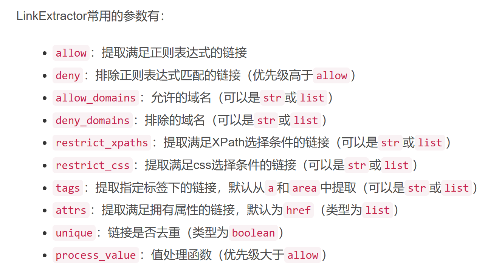
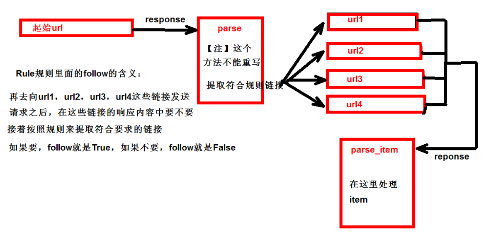
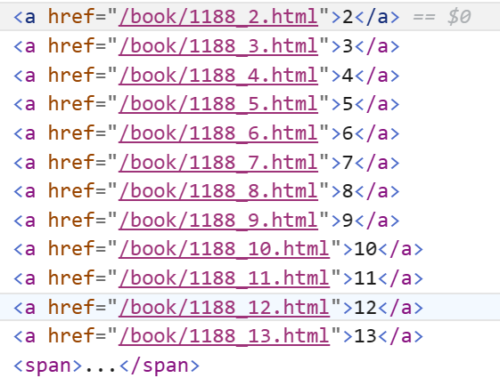
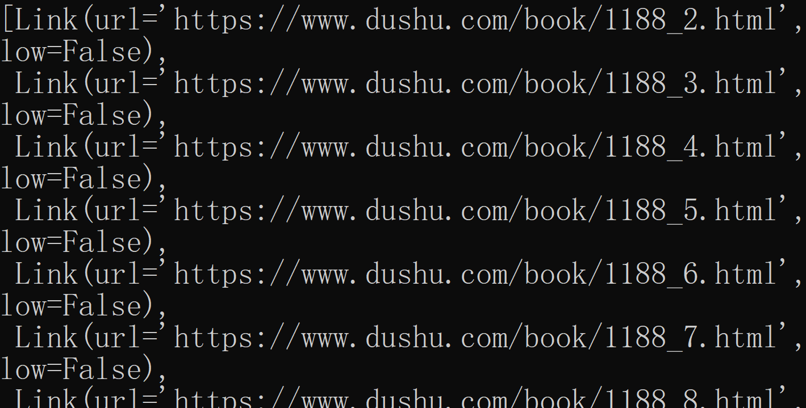
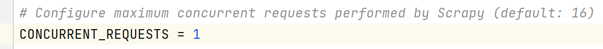

# CrawlSpider

链接提取器，继承自scrapy.Spider

> CrawlSpider可以定义规则，再解析html内容的时候，可以根据链接规则提取出指定的链接，然后再向这些链接发送请求。所以，如果有**需要跟进链接的需求**，意思就是爬取了网页之后，需要提取链接再次爬取，使用CrawlSpider是非常合适的

## 使用方式

在方法中写规则提取指定链接：



```python
scrapy.linkextractors.LinkExtractor(
allow = (), # 正则表达式 提取符合正则的链接
deny = (), # (不用)正则表达式 不提取符合正则的链接
allow_domains = (), # (不用)允许的域名
deny_domains = (), # (不用)不允许的域名
restrict_xpaths = (), # xpath，提取符合xpath规则的链接
restrict_css = ()) # 提取符合选择器规则的链接
```

使用示例：

- 正则用法：`links1 = LinkExtractor(allow=r'list_23_\d+\.html')`
- xpath用法：`links2 = LinkExtractor(restrict_xpaths=r'//div[@class="x"]')`
- css用法：`links3 = LinkExtractor(restrict_css='.x')`

提取链接：

- `link.extract_links(response)`

使用示例：`rules = (Rule(LinkExtractor(allow=r"/book/1188_\d+\.html"), callback="parse_item", follow=True),)`

> 注意事项
>
> - callback只能写函数名字符串, `callback="parse_item"`
>
> - 在基本的spider中，**如果重新发送请求**，则`scrapy.Request()`的callback写的是`callback=self.parse_item`
>
> - `follow=true`代表是否跟进——按照提取链接规则不断进行提取

## 运行原理



## 实际案例

读书网下一页跳转规律

> 

通过测试来确认获取链接的正则表达式

```
scrapy shell https://www.dushu.com/book/1188.html
```

获取服务器返回的代码后导入包进行测试

```
from scrapy.linkextractors import LinkExtractor
```

通过正则表达式获取地址(**"\d"**代表数字，**"+"**代表可以有多个)

```
link = LinkExtractor(allow=r'/book/1188_\d+.html')
```

> 使用xpath获取
>
> ```
> link = LinkExtractor(restrict_xpaths=r'//div[@class="pages"]')
> ```
>
> 不能通过`//div[@class="pages"]/a[@class!="disabled"]/@href`获取到链接，只要定位到div即可，方法会自动解析，还会去除重复地址进行解析

打印内容(**自动拼接了前缀地址**)

```
link.extract_links(response)
```

> 

### 准备工作

创建项目

```
scrapy startproject scrapy_dushu
```

跳转到spiders路径

```
cd scrapy_dushu\scrapy_dushu\spiders
```

创建CrawSpider爬虫类

```
scrapy genspider -t crawl read www.dushu.com
```

生成的CrawlSpider爬虫类代码为

```python
import scrapy
from scrapy.linkextractors import LinkExtractor
from scrapy.spiders import CrawlSpider, Rule


class ReadSpider(CrawlSpider):
    name = "read"
    allowed_domains = ["www.dushu.com"]
    start_urls = ["http://www.dushu.com/"]

    rules = (Rule(LinkExtractor(allow=r"Items/"), callback="parse_item", follow=True),)

    def parse_item(self, response):
        item = {}
        #item["domain_id"] = response.xpath('//input[@id="sid"]/@value').get()
        #item["name"] = response.xpath('//div[@id="name"]').get()
        #item["description"] = response.xpath('//div[@id="description"]').get()
        return item

```

> 补全后缀地址为：`http://www.dushu.com/book/1188_1.html`

注释settings.py中的robots协议遵守(**值得注意的是，就算修改并发数为"1"，使用CrawlSpider也无法让数据顺序一致，自己手写的就不会存在这种问题**)

> 

运行爬虫为

```
scrapy crawl read
```

### items.py

```python
# Define here the models for your scraped items
#
# See documentation in:
# https://docs.scrapy.org/en/latest/topics/items.html

import scrapy


class ScrapyDushuItem(scrapy.Item):
    # define the fields for your item here like:
    # name = scrapy.Field()
    name = scrapy.Field()
    src = scrapy.Field()

```

### piplines.py

```python
# Define your item pipelines here
#
# Don't forget to add your pipeline to the ITEM_PIPELINES setting
# See: https://docs.scrapy.org/en/latest/topics/item-pipeline.html


# useful for handling different item types with a single interface
from itemadapter import ItemAdapter
import requests


class ScrapyDushuPipeline:

    def __init__(self):
        self.fp = None

    # 在爬虫文件开启之前执行的方法(方法名字固定)
    def open_spider(self, spider):
        self.fp = open('book.json', 'w+', encoding='utf-8')
        self.fp.write("{\"data\": [")

    def process_item(self, item, spider):
        # 最后一个不能带","
        self.fp.write("{\"" + item["name"] + "\": \"" + item["src"] + "\"},")
        return item

    # 在爬虫文件执行完之后执行的方法(方法名字固定)
    def close_spider(self, spider):
        # 处理最后一个","
        self.fp.seek(self.fp.tell()-1)
        self.fp.write("]}")
        self.fp.close()


# 开启多条管道，在定义管道类后需要在settings.py中添加管道
class ScrapyDushuDownloadPipeline:
    def process_item(self, item, spider):
        url = item.get('src')
        # 文件不允许出现以下任何特殊字符/ \ : * ? " < > |
        filename = 'books/' + item.get('name').replace("/", "").replace("\\", "").replace(":", "").replace("*", "").replace("?", "").replace("\"", "").replace("<", "").replace(">", "").replace("|", "") + '.jpg'
        headers = {
            "User-Agent": 'Mozilla/5.0 (Windows NT 10.0; Win64; x64) AppleWebKit/537.36 (KHTML, like Gecko) Chrome/111.0.0.0 '
                          'Safari/537.36 Edg/111.0.1661.62 ',
            "referer": 'https://www.dushu.com/',
            "cookie": 'Hm_lvt_8008bbd51b8bc504162e1a61c3741a9d=1684382137; Hm_lpvt_8008bbd51b8bc504162e1a61c3741a9d=1684398715'
        }

        #对返回的二进制数据进行处理
        response = requests.get(url=url, headers=headers)

        with open(filename, 'wb') as fp:
            fp.write(response.content)

        return item

```

### read.py

```python
import scrapy
from scrapy.linkextractors import LinkExtractor
from scrapy.spiders import CrawlSpider, Rule
from scrapy_dushu.items import ScrapyDushuItem
import os  # os.mkdir("单级目录") os.makedirs("多级目录")


class ReadSpider(CrawlSpider):
    name = "read"
    allowed_domains = ["www.dushu.com"]
    # 加"1"符合rules，就能拉取到第一页的内容
    start_urls = ["http://www.dushu.com/book/1188_1.html"]

    rules = (Rule(LinkExtractor(allow=r"/book/1188_\d+\.html"), callback="parse_item", follow=True),)

    folder_name = "books"
    if os.path.exists(folder_name):
        print("目录\"" + folder_name + "\"已存在，不可重复创建")
    else:
        os.makedirs(folder_name)

    def parse_item(self, response):
        item = {}
        #item["domain_id"] = response.xpath('//input[@id="sid"]/@value').get()
        #item["name"] = response.xpath('//div[@id="name"]').get()
        #item["description"] = response.xpath('//div[@id="description"]').get()

        img_list = response.xpath('//div[@class="bookslist"]//img')

        for img in img_list:
            name = img.xpath('./@alt').extract_first()
            # 网站图片采用的懒加载
            src = img.xpath('./@data-original').extract_first()

            book = ScrapyDushuItem(name=name, src=src)
            yield book

```

> 最终数据获取到了，但是基本乱序
>
> 值得注意的是：由于存在图片地址为空的情况，`name: None`，没有强转导致写入失败，所以为图片地址为空的都不会收录进去

## 手写跳转

mine.py

```python
import scrapy
from scrapy_mine_dushu.items import ScrapyMineDushuItem


class MineSpider(scrapy.Spider):
    name = "mine"
    allowed_domains = ["www.dushu.com"]
    start_urls = ["http://www.dushu.com/book/1188_1.html"]

    page = 0
    page_list = []

    def parse(self, response):
        img_list = response.xpath('//div[@class="bookslist"]//img')

        for img in img_list:
            name = img.xpath('./@alt').extract_first()
            # 网站图片采用的懒加载
            src = img.xpath('./@data-original').extract_first()

            book = ScrapyMineDushuItem(name=name, src=src)
            yield book

        # 只获取第一次进入时页面的跳转地址
        if self.page == 0:
            self.page_list = response.xpath('//div[@class="pages"]/a[not(@class="disabled")]/@href').extract()

        if self.page < len(self.page_list):
            page_url = 'http://www.dushu.com' + self.page_list[self.page]
            self.page = self.page + 1
            yield scrapy.Request(url=page_url, callback=self.parse)

```

> 为空也会写入`"None"`进去，且是按顺序爬取的
>
> 值得注意的是，这是一个正常的spider，使用正常指令创建的，代码不可以在CrawlSpider创建的爬虫上面跑
>
> ```
> scrapy genspider mine www.dushu.com
> ```
