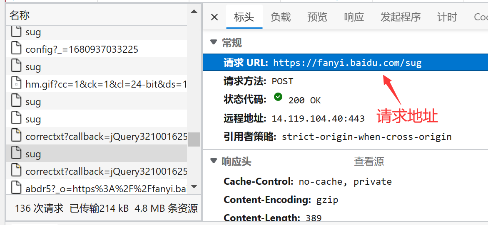
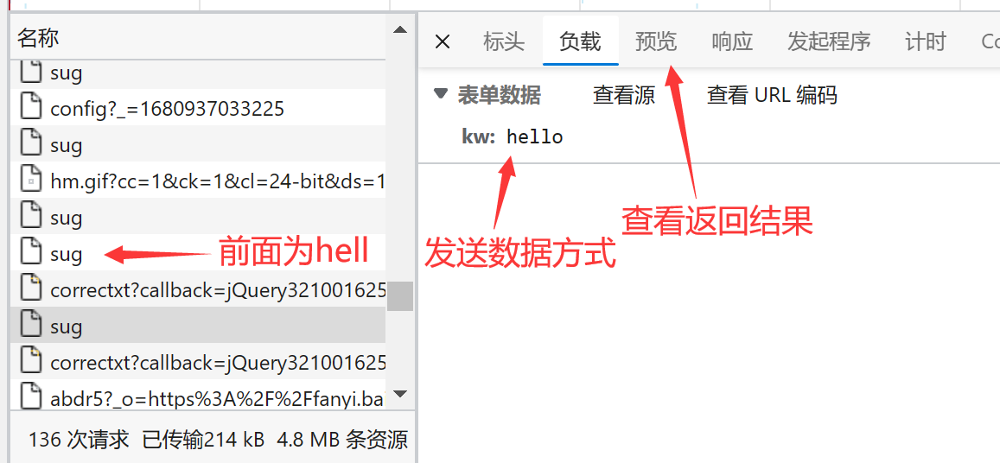
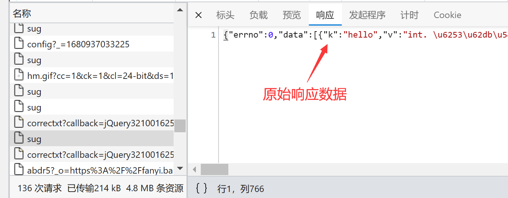
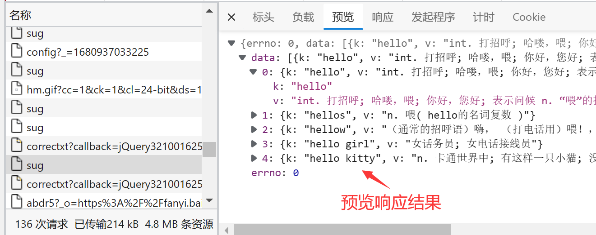
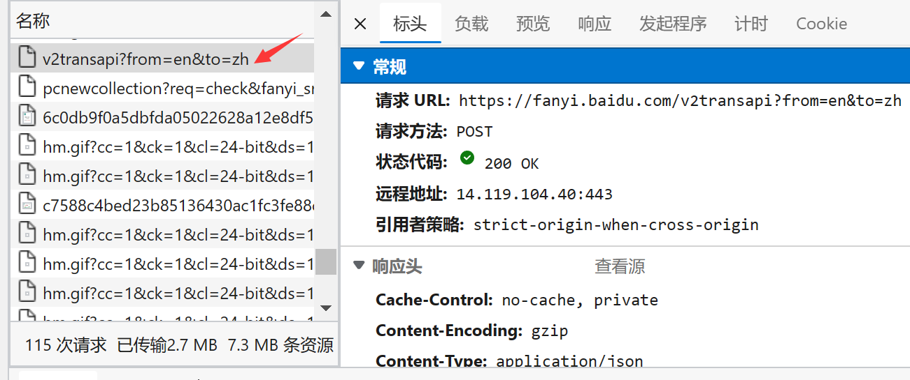
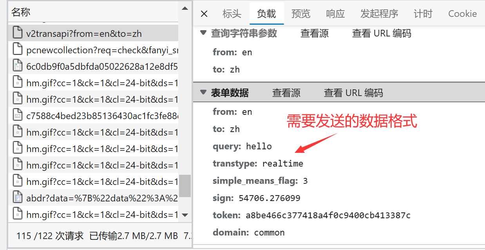
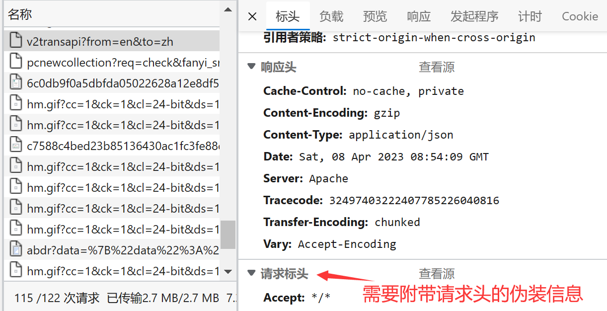
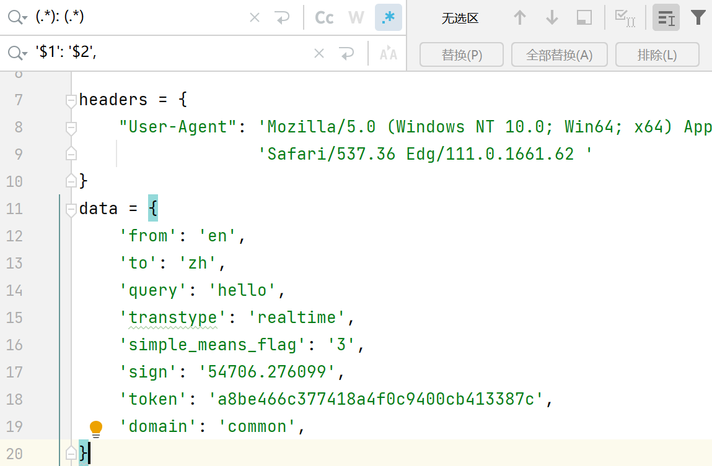
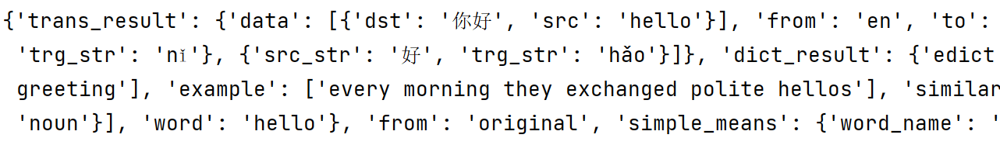

# Post请求

## 请求百度翻译

post请求的参数必须进行编码后再转换为字节类型，又因为无法拼接到url后面，需要**在对请求进行定制时将参数传递过去**

> 
>
> 
>
> 
>
> 

```python
import urllib.request
import urllib.parse
import json

url = 'https://fanyi.baidu.com/sug'

headers = {
    "User-Agent": 'Mozilla/5.0 (Windows NT 10.0; Win64; x64) AppleWebKit/537.36 (KHTML, like Gecko) Chrome/111.0.0.0 '
                  'Safari/537.36 Edg/111.0.1661.62 '
}

data = {
    'kw': 'hello'
}
# post请求的参数必须进行编码，编码后还需要转换为机器能够读懂的字节类型
# urlencoded是一种编码方式，可以将复杂的数据类型转化为字符串，然后在URL中进行传递
data = urllib.parse.urlencode(data).encode("UTF-8")

# 将url的地址，请求的参数，UA信息放入定制请求当中
request = urllib.request.Request(url=url, data=data, headers=headers)

# 模拟浏览器向服务器发送请求
response = urllib.request.urlopen(request)

# 将发送回来的请求进行处理
content = response.read().decode("UTF-8")

print(content)

# io对象转化为dict对象
content = json.loads(content)

print(content)

```

> 打印结果：{"errno":0,"data":[{"k":"hello","v":"int. \u6253\u62db\u547c; \u54c8\u55bd\uff0c\u5582; \u4f60\u597d\uff0c\u60a8\u597d; \u8868\u793a\u95ee\u5019 n. \u201c\u5582\u201d\u7684\u62db\u547c\u58f0\u6216\u95ee\u5019\u58f0 vi. \u558a\u201c\u5582"},{"k":"hellos","v":"n. \u5582( hello\u7684\u540d\u8bcd\u590d\u6570 )"},{"k":"hellow","v":"\uff08\u901a\u5e38\u7684\u62db\u547c\u8bed\uff09\u55e8\uff0c \uff08\u6253\u7535\u8bdd\u7528\uff09\u5582\uff01\uff0c \uff08\u82f1\uff09\uff08\u8868\u793a\u60ca\u8bb6\uff09\u54ce\u54df"},{"k":"hello girl","v":"\u5973\u8bdd\u52a1\u5458; \u5973\u7535\u8bdd\u63a5\u7ebf\u5458"},{"k":"hello kitty","v":"n. \u5361\u901a\u4e16\u754c\u4e2d; \u6709\u8fd9\u6837\u4e00\u53ea\u5c0f\u732b; \u6ca1\u6709\u5634\u5df4; \u8138\u86cb\u5706\u5706\u7684"}]}
>
> 由于结果本身就是采用的unicode编码，所以还需要再转换为中文，将io对象转化为dict对象，转换后结果为：
>
> {'errno': 0, 'data': [{'k': 'hello', 'v': 'int. 打招呼; 哈喽，喂; 你好，您好; 表示问候 n. “喂”的招呼声或问候声 vi. 喊“喂'}, {'k': 'hellos', 'v': 'n. 喂( hello的名词复数 )'}, {'k': 'hellow', 'v': '（通常的招呼语）嗨， （打电话用）喂！， （英）（表示惊讶）哎哟'}, {'k': 'hello girl', 'v': '女话务员; 女电话接线员'}, {'k': 'hello kitty', 'v': 'n. 卡通世界中; 有这样一只小猫; 没有嘴巴; 脸蛋圆圆的'}]}

## Https请求

> 对于https请求，直接发送请求会因为ssl证书的原因导致报错，`urllib.error.URLError: <urlopen error [SSL: BAD_ECPOINT] bad ecpoint (_ssl.c:997)>`，此时可以创建一个不验证证书的上下文，允许代码接受任何服务器提供的证书(会降低安全性)

```python
import urllib.request
import json
import ssl

data = {
    "pageNo": 1,
    "pageSize": 2
}

headers = {
    'Content-Type': 'application/json'
}

# 将字典转换为json格式的字符串
data = json.dumps(data).encode("UTF-8")

request = urllib.request.Request(url='https://www.jkqcyl.com/prod-api/notice/list', data=data, headers=headers, method='POST')

# 创建一个不验证证书的上下文(因为Python的SSL模块是基于操作系统的OpenSSL库的，如果还是报错，可能是操作系统的OpenSSL库版本过低，可以使用requests库来进行发送)
context = ssl._create_unverified_context()

response = urllib.request.urlopen(request, context=context)
print(response.read().decode("utf-8"))

```

## 请求百度翻译详细翻译

反爬的核心是确认请求是否是浏览器的真实请求，所以会判断发送的请求报文中是否有对应的数据，除了UA信息的要求外，有些网站的访问还需要其它信息

> 
>
> 
>
> 

Ctrl + R：使用正则表达式对数据进行替换



```python
import urllib.request
import urllib.parse
import json

url = 'https://fanyi.baidu.com/v2transapi?from=en&to=zh'

headers = {
    "User-Agent": 'Mozilla/5.0 (Windows NT 10.0; Win64; x64) AppleWebKit/537.36 (KHTML, like Gecko) Chrome/111.0.0.0 '
                  'Safari/537.36 Edg/111.0.1661.62 ',
    'Accept': '*/*',
    # 这句需要注释
    # 'Accept-Encoding': 'gzip, deflate, br',
    'Accept-Language': 'zh-CN,zh;q=0.9,en;q=0.8,en-GB;q=0.7,en-US;q=0.6',
    'Acs-Token': '1680944046838_1680944049955_6GmyV+VY3Wda59bQZ1yJZyP/d5DPZ5SPYBP/j9b2IwtvUJY+jz3flxab55eZg9i11DDAlG1g9u+n2RE+0j7YYC8NMTvKFJ86Hrm0wpHMn0U1NT6+XiS9JdJC20FMgWTWcQZtk2B0x74jdaZa5z5eFZdIww52hunagv5at/zfuH9w6YL4fDwtEHACN2ZIVKaCqXVy4Eoa7APfOrwR4JQnP/gal51wty5mBY7uMj9Ik4d52pfuwHXPoRoIuhRMiLcSVB0YBqxcW9Zydg23c9Nw/yE58SnMAKX9nVXcVX7TagbinUTBv1e+4h7DEiPirBTBQDJ9gqVrsDHjJrx9bEC5xN2M4JSSTItaKnzlo5x/AM/5YZgF6gJsUVKc+R3vesch/Dvc95yYUv8zqA+LAXCV0k8ba5wvz2MYMgD1G2bI9VpoWM5aXNerBZFDE/QiWpv/oXHt/5PIDlTylsYxwXBiKimTAx+/c8BGzNDK1xdy3bDY0FjNRm1byhBaS9G1XP/0oXRSmnVOpORHoDvxOfsA2g==',
    'Connection': 'keep-alive',
    'Content-Length': '135',
    'Content-Type': 'application/x-www-form-urlencoded; charset=UTF-8',
    # 需要的关键信息
    'Cookie': 'BIDUPSID=A41D6B5FD120445567925B077E292643; PSTM=1596894195; __yjs_duid=1_978f9bdcc3a4df2b26ac30cfe93c77d81620385573024; BDUSS=1tZ2ZRdXRBRjZwQnFSSHpvSGNkbW9yNThRT3VwM3pmR3F1WFhiOWY5ODFOTlJnSVFBQUFBJCQAAAAAAAAAAAEAAAAqHOF2ucLK2NK7t73H6QAAAAAAAAAAAAAAAAAAAAAAAAAAAAAAAAAAAAAAAAAAAAAAAAAAAAAAAAAAAAAAAAAAAAAAADWnrGA1p6xgYU; BDUSS_BFESS=1tZ2ZRdXRBRjZwQnFSSHpvSGNkbW9yNThRT3VwM3pmR3F1WFhiOWY5ODFOTlJnSVFBQUFBJCQAAAAAAAAAAAEAAAAqHOF2ucLK2NK7t73H6QAAAAAAAAAAAAAAAAAAAAAAAAAAAAAAAAAAAAAAAAAAAAAAAAAAAAAAAAAAAAAAAAAAAAAAADWnrGA1p6xgYU; HISTORY_SWITCH=1; SOUND_SPD_SWITCH=1; FANYI_WORD_SWITCH=1; REALTIME_TRANS_SWITCH=1; SOUND_PREFER_SWITCH=1; BAIDUID=5350A9EEBAF520C93CA156C84DB9B9B7:FG=1; APPGUIDE_10_0_2=1; BDSFRCVID=kBPOJeC62wFMPujfycI2rpCqyeW64snTH6_ntGSyL_iLw4zF4H5_EG0PnU8g0Kub1DMtogKKLmOTHpKF_2uxOjjg8UtVJeC6EG0Ptf8g0f5; H_BDCLCKID_SF=tbAq_IIytD83qbjkqRQh-JDfqxbXqb5mWmOZ0l8KttozVTC4046JM-DRM-vr04uOX2TbaUjmWIQrDl5OXxnK2fQ0-n3UW5OmL664KKJxJRLWeIJoLfcpqfudhUJiBM7LBan7QpvIXKohJh7FM4tW3J0ZyxomtfQxtNRJ0DnjtnLhbC_GDT_Mjjo3eUbyKPcX5-o0WR7OK5rjDnCrqtOdXUI8LNDHqlRLfInnBJuM-tTKqhOlLxnkj5tsDnO7tqRX2Cjx2IO72bK5VC5hMUIbMUL1Db3eW6vMtg3t3tcJ3PooepvoX-cc3MkQyPjdJJQOBKQB0KnGbUQkeq8CQft20b0EeMtjKjLEtbKjVC-KtCK3fP36q4Q2MttjhpobetJyaR3W_xJvWJ5TMCoG35QoWM4q3Jjm0RQ9ae6U_4bpK-38ShPCBPTk-4-rbb3vQfoNMNbPKhnY3l02V-Tae-t2ynLI2ton34RMW23rWl7mWPJvsxA45J7cM4IseboJLfT-0bc4KKJxbnLWeIJIjjC5DTJbDN_eJTnfb5kX34Jo5RbEfb74q4b_entyqtnZKxtqte7dXJoTQnclEn7e5fn_Lq-Ihfjx0bjnWncdWf3DylcfECTGX-r1-fAmKPT405OTLT-O0KJc0R_MHRo_hPJvyUADXnO7bUnlXbrtXp7_2J0WStbKy4oTjxL1Db3JKjvMtIFtVD_aJI-aMKKlePJE5-L8qxby26nW0HR9aJ5nJDobsl6M5t6t2ttPDl5j3bo85Gkq_PO8QpP-_nrmQpbBXh4tXhtJhfKJWnTdKl0MLnrlbb0xynoDDf0I5MnMBMnramOnaPJc3fAKftnOM46JehL3346-35543bRTLnLy5KJtMDcnK4-Xjjv3jGoP; Hm_lvt_64ecd82404c51e03dc91cb9e8c025574=1680834232; BDORZ=B490B5EBF6F3CD402E515D22BCDA1598; BA_HECTOR=8l85a02ha001akak0ka10kf11i3251n1m; ZFY=EYNP7eUTKY1BB4bT98m2bTEbxlHzk1gYNCeLS:BAvt3Y:C; BAIDUID_BFESS=5350A9EEBAF520C93CA156C84DB9B9B7:FG=1; BDSFRCVID_BFESS=kBPOJeC62wFMPujfycI2rpCqyeW64snTH6_ntGSyL_iLw4zF4H5_EG0PnU8g0Kub1DMtogKKLmOTHpKF_2uxOjjg8UtVJeC6EG0Ptf8g0f5; H_BDCLCKID_SF_BFESS=tbAq_IIytD83qbjkqRQh-JDfqxbXqb5mWmOZ0l8KttozVTC4046JM-DRM-vr04uOX2TbaUjmWIQrDl5OXxnK2fQ0-n3UW5OmL664KKJxJRLWeIJoLfcpqfudhUJiBM7LBan7QpvIXKohJh7FM4tW3J0ZyxomtfQxtNRJ0DnjtnLhbC_GDT_Mjjo3eUbyKPcX5-o0WR7OK5rjDnCrqtOdXUI8LNDHqlRLfInnBJuM-tTKqhOlLxnkj5tsDnO7tqRX2Cjx2IO72bK5VC5hMUIbMUL1Db3eW6vMtg3t3tcJ3PooepvoX-cc3MkQyPjdJJQOBKQB0KnGbUQkeq8CQft20b0EeMtjKjLEtbKjVC-KtCK3fP36q4Q2MttjhpobetJyaR3W_xJvWJ5TMCoG35QoWM4q3Jjm0RQ9ae6U_4bpK-38ShPCBPTk-4-rbb3vQfoNMNbPKhnY3l02V-Tae-t2ynLI2ton34RMW23rWl7mWPJvsxA45J7cM4IseboJLfT-0bc4KKJxbnLWeIJIjjC5DTJbDN_eJTnfb5kX34Jo5RbEfb74q4b_entyqtnZKxtqte7dXJoTQnclEn7e5fn_Lq-Ihfjx0bjnWncdWf3DylcfECTGX-r1-fAmKPT405OTLT-O0KJc0R_MHRo_hPJvyUADXnO7bUnlXbrtXp7_2J0WStbKy4oTjxL1Db3JKjvMtIFtVD_aJI-aMKKlePJE5-L8qxby26nW0HR9aJ5nJDobsl6M5t6t2ttPDl5j3bo85Gkq_PO8QpP-_nrmQpbBXh4tXhtJhfKJWnTdKl0MLnrlbb0xynoDDf0I5MnMBMnramOnaPJc3fAKftnOM46JehL3346-35543bRTLnLy5KJtMDcnK4-Xjjv3jGoP; delPer=0; PSINO=6; H_PS_PSSID=38185_36555_38413_38470_38441_38398_38468_38289_36805_38486_37931_26350_38423_37881; ZD_ENTRY=baidu; __bid_n=183f3ffe061ac70da34207; FPTOKEN=qxJyNgLXGExLdxJAYNkp85ypDOyb/D6ytKqVJ3DrNXmYCZ3U4trkDDjFt1nl0Sv2AOH/JcAYbmAyu0yRhVyV9ZsEWjnTGgMGCZ2HWmoRmWTlx/Wc4N65ODCBJtxOzsQdymkvXV541IIXne1GixkU6X+ZOueBJvkKjcht6ViRvlezW1Ca9AaQnciPfrJAtUNrjTg9dNFvTrrA5W/JoH1OOOgdg7TNft+lvG833T8KATmt4/QaepM5nNRftlHGYkbV9O8DPTheuP0sejOox3U1EmzIZ+vBZOimV8xYFdYlG1giLp4QH2fTjUjS8qj+Ivbn0VgriU5l/sQPrJeHgpY6aQYnUI05LIUzcWRoX529hB51DLu3O3aSC7lXsrx+FbMG9CpfjcO7W4K35aXsSDoHwg==|ausuEx6FGrkGDa5bOBbV2K6t78lYOfrobBNLvyffSHA=|10|e0b443ac0a7f0d28c39c69098e2205c8; Hm_lpvt_64ecd82404c51e03dc91cb9e8c025574=1680944046; ab_sr=1.0.1_ODAzMmQ0ZmZlMzQ2YTk0OWJjNGY3YTcyZDdjZWVlNGM1YjhmOTA0MjU4OGViZTQxMDYxMjA4ZWQ1ODA3MmQyODBlZTkwNWMzMjVlYWU3OTQwZmVkMzhhZjgxMTExNDkwNGU1MDU5MTQyOGFhNzYyN2ZjNTZhOTBlMjk3ODc5NGZlNjNiNzc2YjY4MzU2OWY0MTAzYjZiZTI0Y2M2ODEyN2ZhNGUyNWI0ZDNhN2FlY2Q0Njg5ZjI5M2MxYjNjMDc2',
    'Host': 'fanyi.baidu.com',
    'Origin': 'https://fanyi.baidu.com',
    'Referer': 'https://fanyi.baidu.com/',
    'sec-ch-ua': '"Microsoft Edge";v="111", "Not(A:Brand";v="8", "Chromium";v="111"',
    'sec-ch-ua-mobile': '?0',
    'sec-ch-ua-platform': '"Windows"',
    'Sec-Fetch-Dest': 'empty',
    'Sec-Fetch-Mode': 'cors',
    'Sec-Fetch-Site': 'same-origin',
    'X-Requested-With': 'XMLHttpRequest',
}
data = {
    'from': 'en',
    'to': 'zh',
    'query': 'hello',
    'transtype': 'realtime',
    'simple_means_flag': '3',
    'sign': '54706.276099',
    'token': 'a8be466c377418a4f0c9400cb413387c',
    'domain': 'common',
}
# 对data数据进行处理
data = urllib.parse.urlencode(data).encode("UTF-8")

# 请求对象定制
request = urllib.request.Request(url=url, data=data, headers=headers)

# 模拟浏览器发送请求
response = urllib.request.urlopen(request)

# 获取响应的数据并处理
content = json.loads(response.read().decode("UTF-8"))

print(content)

```

> 当缺少需要的请求头信息时，返回结果为：{'errno': 997, 'errmsg': '未知错误', 'query': 'hello', 'from': 'en', 'to': 'zh', 'error': 997}
>
> 结果很长，这里只列出一部分
>
> 

## 关于decode和encode

两者是互为“逆操作”：

> decode的作用是将二进制数据**解码**成unicode编码，如str1.decode('utf-8')，表示将utf-8的字符串解码成unicode编码。简单来说：decode就是把二进制数据(bytes)转化成人看得懂的英文或者汉字(decode用的比较多)
>
> encode的作用是将unicode编码的字符串**编码**成二进制数据，如str2.encode('utf-8')，表示将unicode编码的字符串编码成utf-8。简单来说：encode就是把人看得懂的英文或者汉字转换为机器能够读懂的二级制数据(bytes)