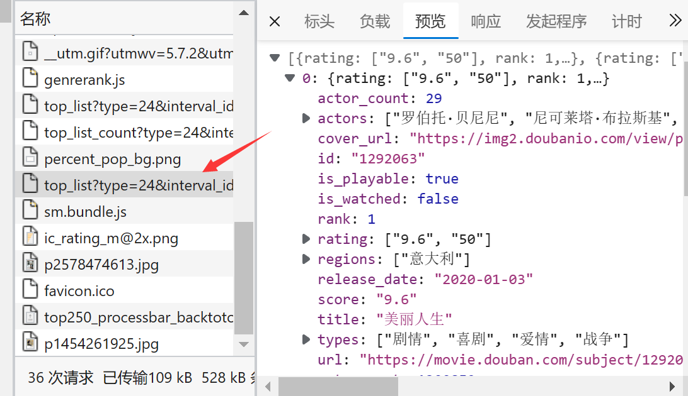
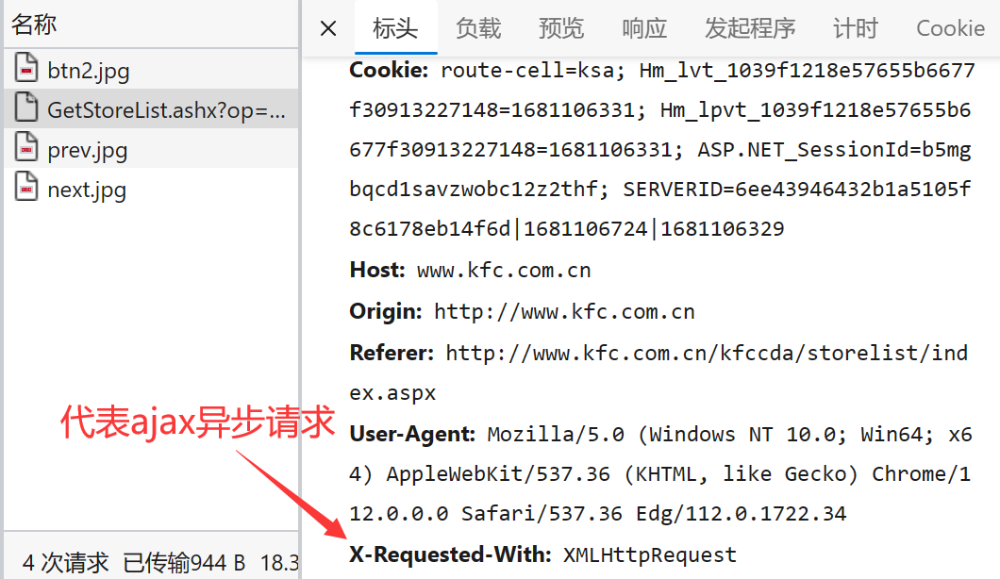
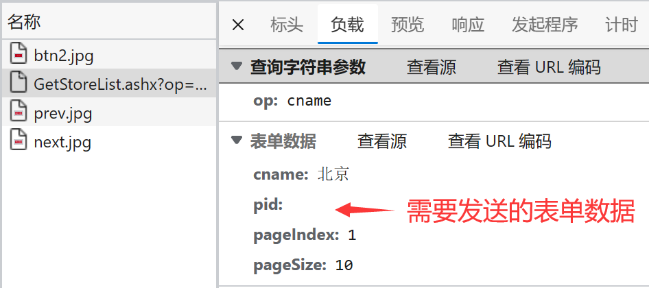

# Ajax请求

## ajax的get请求

豆瓣电影排名在用户滑动时才会继续加载，后端响应给前端的json数据

> 

```python
import urllib.request

url = 'https://movie.douban.com/j/chart/top_list?type=24&interval_id=100%3A90&action=&start=0&limit=20'

headers = {
    "User-Agent": 'Mozilla/5.0 (Windows NT 10.0; Win64; x64) AppleWebKit/537.36 (KHTML, like Gecko) Chrome/111.0.0.0 '
                  'Safari/537.36 Edg/111.0.1661.62 '
}

request = urllib.request.Request(url=url, headers=headers)

content = urllib.request.urlopen(request).read().decode("UTF-8")

# 数据返回到本地，python文件默认是gbk编码，需要修改为utf-8
with open('douban.json', 'w', encoding='utf-8') as fp:
    fp.write(content)

```

> 成功将json数据保存为文件(文件写入只能支持写入str类型，不支持list)

多次获取，获取多页的数据

```python
import random
import urllib.request
import urllib.parse
import time


def create_request(page):
    base_url = 'https://movie.douban.com/j/chart/top_list?type=24&interval_id=100%3A90&action=&'

    headers = {
        "User-Agent": 'Mozilla/5.0 (Windows NT 10.0; Win64; x64) AppleWebKit/537.36 (KHTML, like Gecko) '
                      'Chrome/111.0.0.0 '
                      'Safari/537.36 Edg/111.0.1661.62 '
    }

    date = {
        'start': (page - 1) * 20,
        'limit': 20
    }

    url = base_url + urllib.parse.urlencode(date)

    return urllib.request.Request(url=url, headers=headers)


if __name__ == '__main__':
    start_page = int(input("请输入起始的页码"))
    end_page = int(input("请输入结束的页码"))

    for page in range(start_page, end_page + 1):
        # 每一页定制请求
        request = create_request(page)
        # 获取每一页的内容
        content = urllib.request.urlopen(request).read().decode("UTF-8")

        # 数据返回到本地，python在windows中默认是gbk编码，需要修改为utf-8
        with open('douban' + str(page) + '.json', 'w', encoding='utf-8') as fp:
            fp.write(content)

        # 防止访问过快
        time.sleep(random.random() + 1)

```

> 成功将每页的数据保存

## ajax的post请求

对于肯德基的餐厅查询，是ajax的post请求

> 
>
> 

```python
import urllib.request
import urllib.parse
import time
import random


def fun(page):
    url = 'http://www.kfc.com.cn/kfccda/ashx/GetStoreList.ashx?op=cname'

    header = {
        "User-Agent": 'Mozilla/5.0 (Windows NT 10.0; Win64; x64) AppleWebKit/537.36 (KHTML, like Gecko) Chrome/111.0.0.0 '
                      'Safari/537.36 Edg/111.0.1661.62 '
    }
    
    data = {
        'cname': '北京',
        'pid': '',
        'pageIndex': page,
        'pageSize': '10',
    }
    
    # 对data数据进行处理
    data = urllib.parse.urlencode(data).encode("UTF-8")

    # 请求头定制
    return urllib.request.Request(url=url, data=data, headers=header)


if __name__ == '__main__':
    start_page = int(input("请输入起始的页码"))
    end_page = int(input("请输入结束的页码"))
    for page in range(start_page,end_page+1):
        request = fun(page)
        # 获取指定页信息
        content = urllib.request.urlopen(request).read().decode("UTF-8")
        # 将结果打印到控制台
        print(content)
        # 防止访问过快
        time.sleep(random.random() + 1)

```

