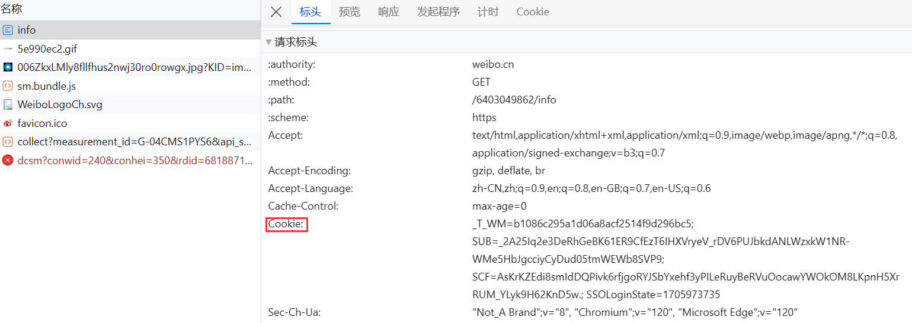
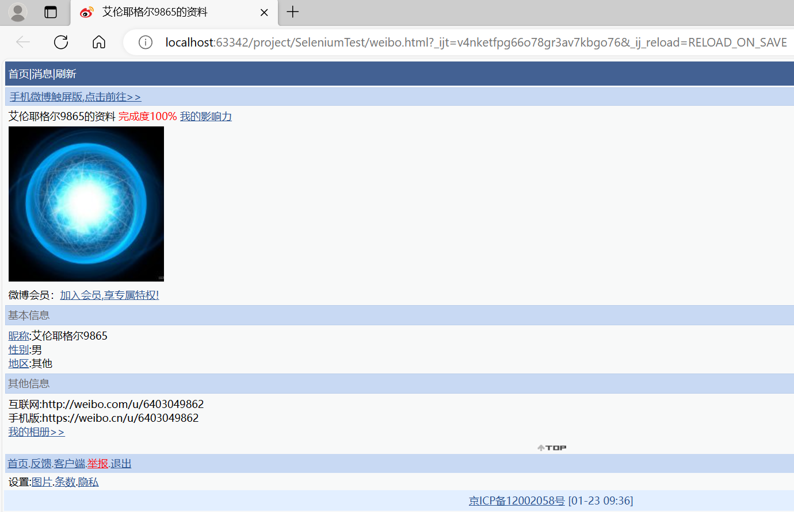

# Cookie登录

数据采集的时候，对于需要登录后才能访问到的页面，需要在请求头中添加自己登录成功之后的cookie才能访问成功，否则会跳转到登录页面(有些登录页面不是utf-8(gb2312)，所以使用utf-8解码会报解码错误)

这里先登录获取cookie的值，然后设置到请求头中



```python
import urllib.request

url = 'https://weibo.cn/6403049862/info'

headers = {
    "User-Agent": 'Mozilla/5.0 (Windows NT 10.0; Win64; x64) AppleWebKit/537.36 (KHTML, like Gecko) Chrome/111.0.0.0 '
                  'Safari/537.36 Edg/111.0.1661.62 ',
    # ":"开头的不需要
    # ':authority': 'weibo.cn',
    # ':method': 'GET',
    # ':path': '/6403049862/info',
    # ':scheme': 'https',
    'accept': 'text/html,application/xhtml+xml,application/xml;q=0.9,image/webp,image/apng,*/*;q=0.8,application/signed-exchange;v=b3;q=0.7',
    # 一定注释这一条
    # 'accept-encoding': 'gzip, deflate, br',
    'accept-language': 'zh-CN,zh;q=0.9,en;q=0.8,en-GB;q=0.7,en-US;q=0.6',
    'cookie': '_T_WM=b1086c295a1d06a8acf2514f9d296bc5; SUB=_2A25Iq2e3DeRhGeBK61ER9CfEzT6IHXVryeV_rDV6PUJbkdANLWzxkW1NR-WMe5HbJgcciyCyDud05tmWEWb8SVP9; SCF=AsKrKZEdi8smIdDQPivk6rfjgoRYJSbYxehf3yPILeRuyBeRVuOocawYWOkOM8LKpnH5XrRUM_YLyk9H62KnD5w.; SSOLoginState=1705973735',
    # 判断当前路径是否由上一路径所进来的 一般情况下是用于做图片的防盗链
    'referer': 'https://weibo.cn/',
    'sec-ch-ua': '"Chromium";v="112", "Microsoft Edge";v="112", "Not:A-Brand";v="99"',
    'sec-ch-ua-mobile': '?0',
    'sec-ch-ua-platform': '"Windows"',
    'sec-fetch-dest': 'document',
    'sec-fetch-mode': 'navigate',
    'sec-fetch-site': 'same-origin',
    'sec-fetch-user': '?1',
    'upgrade-insecure-requests': '1',
}

request = urllib.request.Request(url=url, headers=headers)

response = urllib.request.urlopen(request)

content = response.read().decode("UTF-8")

with open('weibo.html', 'w', encoding="UTF-8") as fp:
    fp.write(content)

```

> 保存为html后运行效果
>
> 
