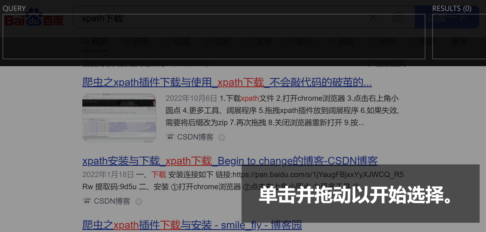
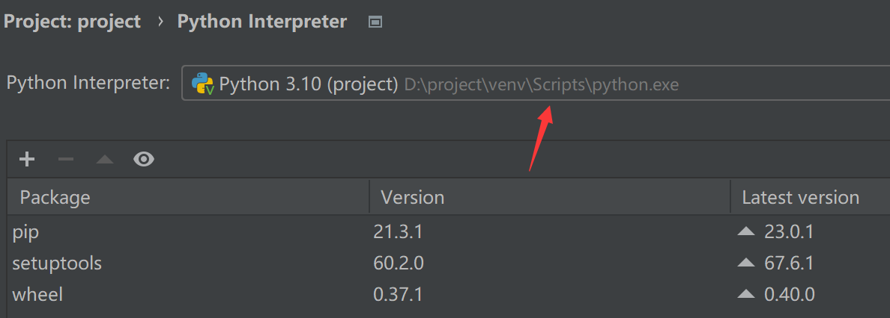
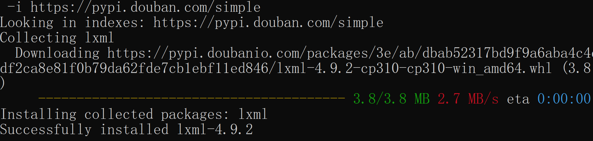
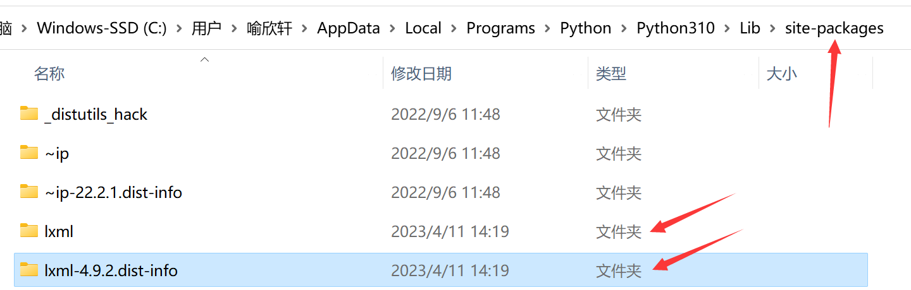
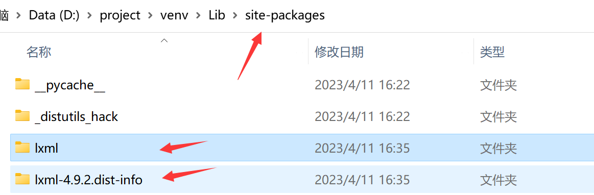
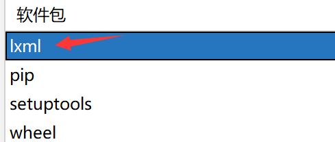
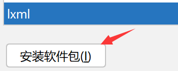
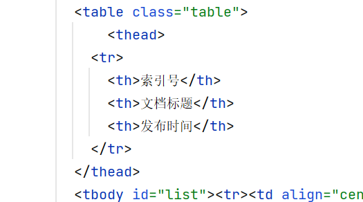
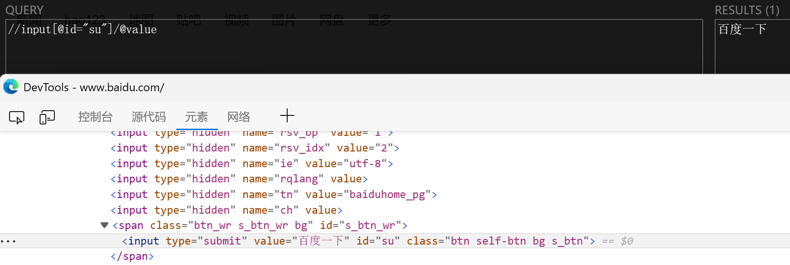

# xpath

## xpath安装

### 浏览器xpath安装

下载地址：[XPath Helper_2.0.2_chrome扩展插件最新版下载_极简插件 (zzzmh.cn)](https://chrome.zzzmh.cn/info/hgimnogjllphhhkhlmebbmlgjoejdpjl)

直接将插件拖入浏览器的插件扩展中即可，插件默认为crx文件，如果安装无法成功安装可以修改后缀为zip

通过Ctrl + Shift + X即可调用



### Python的xpath库安装

找到**项目路径**，需要在**项目对应的Scripts目录下**执行安装操作



在对应目录打开cmd命令窗口，输入cmd指令(通过国内的镜像)

```
pip install lxml -i https://pypi.tuna.tsinghua.edu.cn/simple
```



python目录下的Scripts执行结果



项目下执行结果



如果下载完毕没有显示出来，需要去pycharm的设置中手动安装



双击进入后再安装即可



## xpath的基础语法

> xpath解析：
>
> - 本地文件：`etree.parse('xxx.html')`
> - 服务器文件：`etree.HTML(response.read().decode("UTF-8"))`
>
> 注：xpath解析的代码得严格标识，**html的每个标签一定得有结束符**，否则解析会报错

```python
from lxml import etree

tree = etree.parse('xpath.html')

# 路径查询
# /：查找子节点  //：查找子孙节点，不考虑层次关系
li_list = tree.xpath('//ul/li/text()')  # text()将标签对应的内容取出来-->['北京', '上海', '深圳', '武汉', '大连']
one = tree.xpath('(//ul/li/text())[1]')  # 获取数据结果的第一个-->'北京'

print(li_list)
# 谓词查询
# @id：选择有设置id的标签，不填写值代表获取所有
li_list = tree.xpath('//ul/li[@id="l1"]/text()')  # ['北京']

# 属性查询
# @class：选择有设置class的标签，不填写值代表获取所有
li_list = tree.xpath('//ul/li[@id]/@class')  # 这里获取的是class的值，如果需要获取标签的内容可以写成'//ul/li[@id and @class]/text()'-->['u1']
print(li_list)

# 模糊查询
# contains：选择其中满足包含条件的标签
li_list = tree.xpath('//li[contains(@id,"2")]/text()')  # 选择id中包含2的标签-->['上海']
print(li_list)
# starts-with：选择其中以某个字符开头的标签(@id,"c")
li_list = tree.xpath('//li[starts-with(@id,"c")]/text()')  # ['深圳']
print(li_list)

# 内容查询(/text())

# 逻辑查询
# and：与(只允许条件之间) or：或(只允许条件之间)  |：或(只允许结果之间操作)  not()：不包含某个属性或标签，例如：[not(@class="disabled")]代表去除元素中class等于disabled的项
li_list = tree.xpath('//ul/li[contains(@id,"l")]/text() | //ul/li[starts-with(@id,"c")]/text()')
print(li_list)  # ['北京', '上海', '深圳']

```

> 获取标签内的源代码
>
> ```python
> from lxml import etree
> 
> with open("1.html", "r", encoding="utf-8") as fp:
>     tree = etree.HTML(fp.read())
> 
>     element = tree.xpath('/html/body/div[3]/div/div/div/div[4]/table')[0]
>     content = etree.tostring(element, encoding="unicode")
>     print(content)
> 
> ```
>
> 在指定编码方法后可以正确输出标签内的代码
>
> ```
> <table class="table">
>                    <thead>
>                  <tr>
>                    <th>索引号</th>
>                    <th>文档标题</th>
>                    <th>发布时间</th>
>                  </tr>
> ...
> ```
>
> 

xpath.html

```html
<!DOCTYPE html>
<html lang="en">
<head>
    <meta charset="UTF-8"/>
    <title>Title</title>
</head>
<body>
    <ul>
        <li id="l1" class="u1">北京</li>
        <li id="l2">上海</li>
        <li id="c1">深圳</li>
        <li>武汉</li>
    </ul>
</body>
</html>
```

## 获取百度首页的字符

直接抓取找到对应的源代码，通过xpath将结果取出



通过纯代码执行

```python
from lxml import etree
import urllib.request

url = 'https://www.baidu.com'

headers = {
    "User-Agent": 'Mozilla/5.0 (Windows NT 10.0; Win64; x64) AppleWebKit/537.36 (KHTML, like Gecko) Chrome/111.0.0.0 '
                  'Safari/537.36 Edg/111.0.1661.62 '
}

request = urllib.request.Request(url=url, headers=headers)

content = urllib.request.urlopen(request).read().decode("UTF-8")

# 数据返回到本地，python文件默认是gbk编码，需要修改为utf-8
with open('baidu.html', 'w', encoding='utf-8') as fp:
    fp.write(content)

parser = etree.HTMLParser(encoding="UTF-8")  # 通过方法etree.HTMLParser()修复html文件缺失的信息，方法体中可以指定编码方式

tree = etree.parse("baidu.html", parser=parser)

li_list = tree.xpath('//input[@id="su"]/@value')

print(li_list)

```

## 特殊情况写法

> 存在只有同级标签值不同的情况


```python
tree.xpath('//div[@class="city-selector-tab-main-city-title" and text()="' + economize_name[i] + '"]/../div[@class="city-selector-tab-main-city-list"]/a/text()')
```

