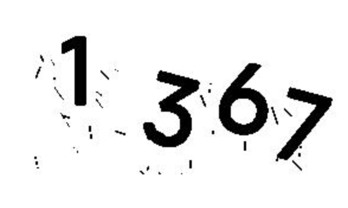

# Tesseract

Tesseract是一个由HP实验室开发，由Google维护的开源的**光学字符识别（OCR）引擎**

> **训练的大致流程**：安装jTessBoxEditor -> 获取样本文件 -> Merge样本文件 –> 生成BOX文件 -> 定义字符配置文件 -> 字符矫正 -> 执行批处理文件 -> 将生成的 traineddata放入tessdata中

下载地址：[Index of /tesseract (uni-mannheim.de)](https://digi.bib.uni-mannheim.de/tesseract/)(尽量不要下载dev(开发中的版本)，alpha(内部测试版,一般不向外部发布,会有很多Bug)，beta(公测版本，即针对所有用户公开的测试版本)等版本)


官方网站：https://github.com/UB-Mannheim/tesseract/wiki

官方文档：https://github.com/tesseract-ocr/tessdoc

官方说明文档：https://tesseract-ocr.github.io/tessdoc/

语言包地址：https://github.com/tesseract-ocr/tessdata

最好版本语言包地址：https://gitcode.net/mirrors/tesseract-ocr/tessdata_best

## 安装Tesseract

在组件安装时不选择下载，自己后面手动下载：


安装目录：


加入到用户环境变量Path：

```
D:\LenovoSoftstore\Tesseract
```

测试是否安装成功：

```
tesseract -v
```


查看已经安装的语言包：

```
tesseract --list-langs
```


## 安装语言包


> 该目录下有tessdata，tessdata_best，tessdata_fast等5种语言包，其中tessdata是检测速度和准确度居中的语言包，后缀best对应最慢和最准确的语言包（**实测准确率不高，推荐使用均衡**），后缀fast对应最快和准确度较差的语言包

上面的语言包是github的，这里使用国内的镜像加速下载(可以选择性的下载，直接下载就是下载所有语言包)：[mirrors / tesseract-ocr / tessdata · GitCode](https://gitcode.net/mirrors/tesseract-ocr/tessdata)

将中文相关的语言包移动到对应目录下


## 安装python库

tesseract驱动库：

```
pip install pytesseract -i https://pypi.tuna.tsinghua.edu.cn/simple
```

图像处理库：

```
pip install Pillow -i https://pypi.tuna.tsinghua.edu.cn/simple
```

## 测试使用

测试图片：


```python
import pytesseract
from PIL import Image


def demo():
    # 打开要识别的图片
    image = Image.open('test.png')
    # 使用pytesseract调用image_to_string方法进行识别，传入要识别的图片，lang='chi_sim'是设置为中文识别，
    text = pytesseract.image_to_string(image, lang='chi_sim')

    # 输入所识别的文字
    print(text, type(text))


if __name__ == '__main__':
    demo()

```

> 运行结果：(每个文字之间有空格，不同行文字之间会换行)
>
> 

## 识别验证码

原图：


```python
import os
import pytesseract
from PIL import Image
from collections import defaultdict
from io import BytesIO

# tesseract.exe所在的文件路径
pytesseract.pytesseract.tesseract_cmd = 'D:/LenovoSoftstore/Tesseract/tesseract.exe'


# 获取图片中像素点数量最多的像素
def get_threshold(image):
    pixel_dict = defaultdict(int)

    # 像素及该像素出现次数的字典
    rows, cols = image.size
    for i in range(rows):
        for j in range(cols):
            pixel = image.getpixel((i, j))
            pixel_dict[pixel] += 1

    # 获取最多或者最少的
    count_max = max(pixel_dict.values())  # 获取像素出现出多的次数
    pixel_dict_reverse = {v: k for k, v in pixel_dict.items()}
    threshold = pixel_dict_reverse[count_max]  # 获取出现次数最多的像素点

    return threshold


# 按照阈值进行二值化处理
# threshold: 像素阈值
def get_bin_table(threshold):
    # 获取灰度转二值的映射table
    table = []
    for i in range(256):
        rate = 0.1  # 在threshold的适当范围内进行处理
        if threshold * (1 - rate) <= i <= threshold * (1 + rate):
            table.append(1)
        else:
            table.append(0)
    return table


# 去掉二值化处理后的图片中的噪声点
def cut_noise(image):
    rows, cols = image.size  # 图片的宽度和高度
    change_pos = []  # 记录噪声点位置

    # 遍历图片中的每个点，除掉边缘
    for i in range(1, rows - 1):
        for j in range(1, cols - 1):
            # pixel_set用来记录该店附近的黑色像素的数量
            pixel_set = []
            # 取该点的邻域为以该点为中心的九宫格
            for m in range(i - 1, i + 2):
                for n in range(j - 1, j + 2):
                    if image.getpixel((m, n)) != 1:  # 1为白色,0位黑色
                        pixel_set.append(image.getpixel((m, n)))

            # 如果该位置的九宫内的黑色数量小于等于4，则判断为噪声
            if len(pixel_set) <= 4:
                change_pos.append((i, j))

    # 对相应位置进行像素修改，将噪声处的像素置为1（白色）
    for pos in change_pos:
        image.putpixel(pos, 1)

    return image  # 返回修改后的图片


# 处理图片白噪点
def deal_with_noise(image):
    imgry = image.convert('L')  # 转化为灰度图

    # 获取图片中的出现次数最多的像素，即为该图片的背景
    max_pixel = get_threshold(imgry)

    # 将图片进行二值化处理
    # 注意，是否使用二值化要看具体情况，有些图片二值化之后，可能关键信息会丢失，反而识别不出来
    table = get_bin_table(threshold=max_pixel)
    out = imgry.point(table, '1')

    # 去掉图片中的噪声（孤立点）
    out = cut_noise(out)
    return out


# 获取ocr结果
def get_ocr_result(out, ocr_type="all"):
    # 仅识别图片中的数字
    if ocr_type == "digits":
        text = pytesseract.image_to_string(out, config='digits')
    # 识别图片中的数字和字母
    else:
        text = pytesseract.image_to_string(out)

    # 去掉识别结果中的特殊字符
    exclude_char_list = ' .:\\|\'\"?![],()~@#$%^&*_+-={};<>/¥'
    text = ''.join([x for x in text if x not in exclude_char_list])
    # print(text)
    return text


# 传入参数为图片地址，返回结果为：识别结果
def ocr_img_path(img_path: str, deal_with=True, ocr_type="all", is_save=False):
    image = Image.open(img_path)
    if deal_with:
        out = deal_with_noise(image)
    else:
        out = image
    # 保存图片
    if is_save:
        os.makedirs("temp", exist_ok=True)
        out.save("temp/" + img_path.split("/")[-1].split("\\")[-1])

    return get_ocr_result(out, ocr_type)


# 传入参数为图片IO，，返回结果为：识别结果
def ocr_img_io(img_io, deal_with=True, ocr_type="all"):
    img_file = BytesIO(img_io)
    image = Image.open(img_file)
    if deal_with:
        out = deal_with_noise(image)
    else:
        out = image
    return get_ocr_result(out, ocr_type)


def main():
    # 识别指定文件目录下的图片
    # 图片存放目录
    dir = 'D:/project/文字识别'

    correct_count = 0  # 图片总数
    total_count = 0  # 识别正确的图片数量

    # 遍历figures下的png,jpg文件
    for file in os.listdir(dir):
        if file.endswith('.png') or file.endswith('.jpg'):
            # print(file)
            image_path = '%s/%s' % (dir, file)  # 图片路径

            answer = file.split('.')[0]  # 图片名称，即图片中的正确文字
            recognizition = ocr_img_path(image_path)  # 图片识别的文字结果

            print((answer, recognizition))
            if recognizition == answer:  # 如果识别结果正确，则total_count加1
                correct_count += 1

            total_count += 1

    print('Total count: %d, correct: %d.' % (total_count, correct_count))
    '''
    # 单张图片识别
    image_path = 'E://figures/code (1).jpg'
    OCR_lmj(image_path)
    '''


if __name__ == '__main__':
    main()

```

处理后图片：



运行结果：

> ```
> ('test2', '1367\n')
> Total count: 1, correct: 0.
> ```