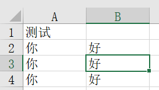

# xlxs文件操作

库的差异

> - 如果文件是后缀xls的话，用xlwt和xlrd进行读写
>
> - 如果文件后缀是xlsx的话，用openpyxl进行读写

安装openpyxl库

```
pip install openpyxl -i https://pypi.tuna.tsinghua.edu.cn/simple
```

导入包

```python
import openpyxl
```

方法：

- `wb = openpyxl.Workbook()`：新建新的工作簿

- `wb = openpyxl.load_workbook("工作簿全路径")`：加载存在的工作簿

- `wb.sheetnames`：获取所有工作表名称

- `ws = wb.active`：加载工作表，默认为第一张sheet

- `num_rows = ws.max_row`：获取总行数

- `num_cols = ws.max_column`：获取总列数

- `ws.insert_rows(1)`：在第一行插入空白行，原本第一行的列会向下移变成第二行，以此类推

- `ws = wb.worksheets[1]`：加载第二张表

- `ws['A1'] = "province_name"`：设置单元格"A1"的值为"province_name"

- `ws.append(list)`：追加写入一行内容

- `wb.save("工作簿全路径")`：保存数据

- `ws_range = ws.iter_rows(min_row=1, max_row=3, min_col=1, max_col=2)`：获取工作表单元格区域（**第一行第一个到第三行第二个区域**），循环遍历输出方式为：

  - ```python
        ws_range = ws.iter_rows(min_row=1, max_row=3, min_col=1, max_col=2)
        for row in ws_range:
            for col in row:
                print(col.value)
    ```

- `ws.cell(row=i, column=j).value`：获取到第i行，第j列的单元格数据(**并非从0开始，无需减一**)

  - ```python
        for row in range(1, ws.max_row + 1):
            for col in range(1, ws.max_column + 1):
                print(ws.cell(row=row, column=col).value)
    ```

- `sheet.delete_rows(index)`：删除指定的行，下面的行**会立即往前移**，所以如果要删除多行不能边读边删，应该保存需要删除的行，然后结束从底往前删

  - ```py
    def deal_xlsx(sheet):
        # 迭代行
        ws_range = sheet.iter_rows(min_row=1, max_row=sheet.max_row, min_col=1, max_col=1)
        delete_list = []
        index = 1
        for row in ws_range:
            for col in row:
                # print(col.value)
                # 如果此行的第一列的值不包含id关键字，则将其删除，这里对于删除后往上移的一行如果为None会丢失迭代
                if '0' not in str(col.value) and '编码' not in str(col.value):
                    delete_list.append(index)
                index = index + 1
        # 逆序
        delete_list = delete_list[::-1]
        for i in delete_list:
            sheet.delete_rows(i)
    ```

- `yellow_fill = PatternFill(start_color='FFFF00', end_color='FFFF00', fill_type='solid')`：颜色填充对象，修改`fill`属性填充单元格为黄色`ws.cell(row=n_row_book, column=n_col_book).fill = yellow_fill`

## 示例代码

```python
import openpyxl
import os

# 创建一个新的
if not os.path.exists("工作簿.xlsx"):
    # 加载工作簿
    wb = openpyxl.Workbook()
    # 加载工作表
    ws = wb.active

    # 设置单元格数据
    ws['A1'] = "测试"
    # 追加一行的数据
    list = ['你', '好']
    ws.append(list)
    wb.save("工作簿.xlsx")
# 如果有，则追加数据
else:
    wb = openpyxl.load_workbook("工作簿.xlsx")
    ws = wb.active
    # 追加一行的数据
    list = ['你', '好']
    ws.append(list)
    wb.save("工作簿.xlsx")

    # 打印数据(第一行第一个到第三行第二个区域)
    ws_range = ws.iter_rows(min_row=1, max_row=3, min_col=1, max_col=2)

    for row in ws_range:
        for col in row:
            print(col.value)

```

> ```
> 测试
> None
> 你
> 好
> 你
> 好
> ```
>
> 

## 参考博客

- [【Python】使用Python操作XLSX数据表_python xlsx_爱吃糖的范同学的博客-CSDN博客](https://blog.csdn.net/weixin_52058417/article/details/123266853)
- [python--xlsx文件的读写_python xlsx_囊萤映雪的萤的博客-CSDN博客](https://blog.csdn.net/liuyingying0418/article/details/101066630)
