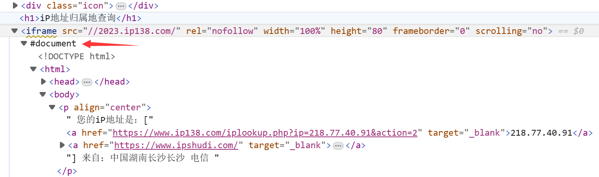

# 反反爬经验

## Selenium

> 在Web应用中经常会遇到frame/iframe表单嵌套页面的应用，WebDriver只能在一个页面上对元素识别与定位，对于frame/iframe表单内嵌页面上的元素无法直接定位，**直接下载网页源代码也是无法获取到内嵌页面的代码的**
>
> 需要通过`switch_to.frame()`方法将当前定位的主体切换为frame/iframe表单的内嵌页面中
>
> 

- `switch_to.frame()`：切换为frame/iframe表单的内嵌页面中
- `switch_to.parent_frame()`：退出内嵌页面

```python
from selenium import webdriver
from selenium.webdriver.common.by import By  # 导入用于定位的库
import time

driver = webdriver.Chrome()

# 打开ip138网站
driver.get("http://www.ip138.com/")

# 定位到内嵌网页(iframe),并进入表单
xf = driver.find_element(By.XPATH, '/html/body/div/div[2]/div[2]/div/div[1]/div[1]/iframe')
driver.switch_to.frame(xf)

# driver.switch_to.frame(name or id) #默认直接取表单的id或name属性,如果都没有则通过上边的定位方式
print(driver.find_element(By.XPATH, '/html/body/p[1]').text)

# 退出内嵌网页(iframe)，如果想操作外层的页面，不退出是会报错的
driver.switch_to.default_content()

time.sleep(3)
driver.quit()
```

> 成功获取到嵌套网页中的内容

## 编码

> 对于结果可能使用unicode编码，或者包含unicode编码和中文混合的情况，可以通过如下代码解析

```python
# 定义包含特殊字符的字符串
str_with_special_chars = r'{"errno":0,"data":[{"k":"hello","v":"int. \u6253\u62db\u547c; \u54c8\u55bd\uff0c\u5582; \u4f60\u597d\uff0c\u60a8\u597d; \u8868\u793a\u95ee\u5019 n. \u201c\u5582\u201d\u7684\u62db\u547c\u58f0\u6216\u95ee\u5019\u58f0 vi. \u558a\u201c\u5582"}'

# 解析Unicode编码字符
decoded_str = bytes(str_with_special_chars, 'utf-8').decode('unicode-escape')

# 打印解析后的字符串
print(decoded_str)
```

> {"errno":0,"data":[{"k":"hello","v":"int. 打招呼; 哈喽，喂; 你好，您好; 表示问候 n. “喂”的招呼声或问候声 vi. 喊“喂"}