# 超级鹰识别图片文字

查看价格体系和开发文档：[验证码类型与价格表-超级鹰验证码识别 (chaojiying.com)](https://www.chaojiying.com/price.html)

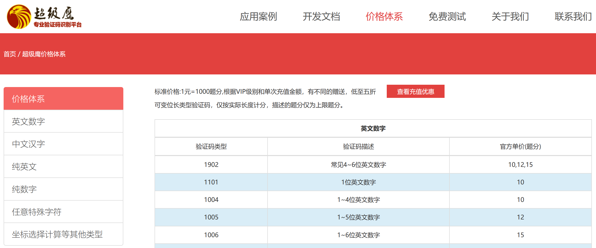

在开发文档中获取python模板：[超级鹰验证码识别API接口文档 HTTP标准接口-超级鹰验证码识别API接口 (chaojiying.com)](http://www.chaojiying.com/api-5.html)

下载模板文档后，存在需要更改的信息：

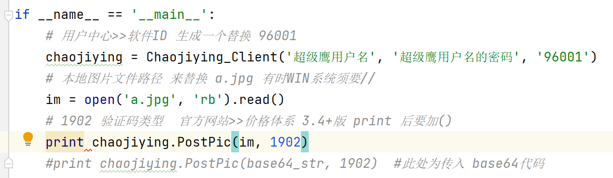

## 获取软件ID

在个人中心：

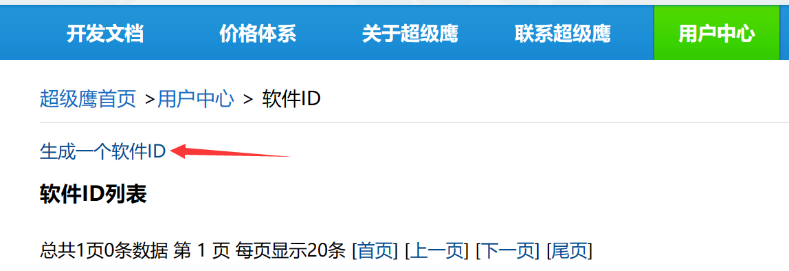

下一步：

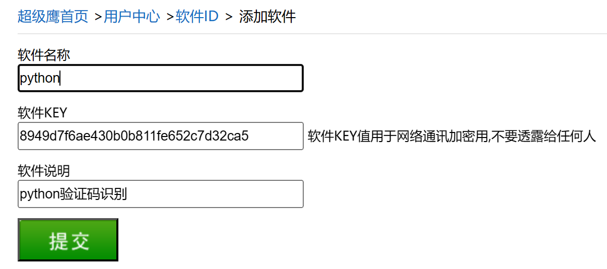

复制软件ID：

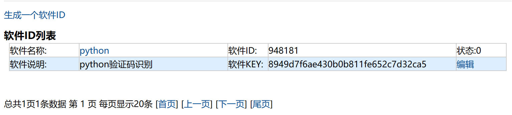

## 修改信息

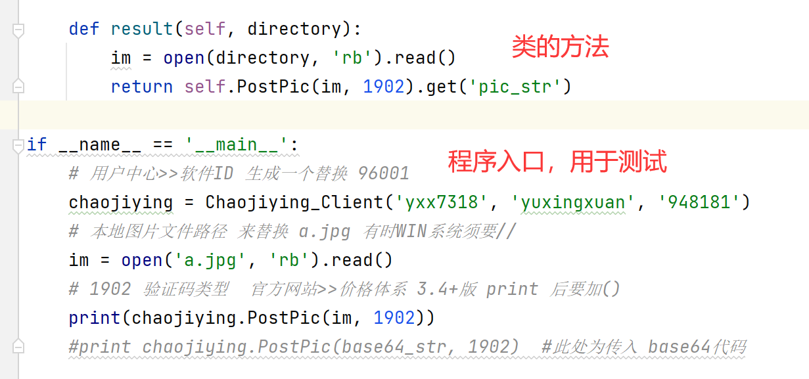

使用接口后可以自动识别验证码：(**目录以主程序的目录为基准**)

## 示例程序

requesets的cookie.py

```python
import requests
from lxml import etree
# import urllib.request
from chaojiying_Python import chaojiying

url = 'https://so.gushiwen.cn/user/login.aspx?from=http://so.gushiwen.cn/user/collect.aspx'

headers = {
    "User-Agent": 'Mozilla/5.0 (Windows NT 10.0; Win64; x64) AppleWebKit/537.36 (KHTML, like Gecko) Chrome/111.0.0.0 '
                  'Safari/537.36 Edg/111.0.1661.62 '
}

response = requests.get(url=url, headers=headers)

content = etree.HTML(response.text)

__VIEWSTATE = '//div/input[@id="__VIEWSTATE"]/@value'

__VIEWSTATEGENERATOR = '//div/input[@id="__VIEWSTATEGENERATOR"]/@value'

__VIEWSTATE = content.xpath(__VIEWSTATE)

__VIEWSTATEGENERATOR = content.xpath(__VIEWSTATEGENERATOR)

img = 'https://so.gushiwen.cn' + content.xpath('//img[@id="imgCode"]/@src')[0]

# 因为request不一样，所以这里下载的图片其实已经算另外一个请求了
# urllib.request.urlretrieve(img, filename='验证码.jpg')

# 通过session()的返回值，将请求变成一个对象
session = requests.session()
# 获取验证码的内容
response_code = session.get(img)
# 此时返回的时二进制数据
content_code = response_code.content
# wb模式将二进制数据写入到文件
with open('验证码.jpg', 'wb') as fp:
    fp.write(content_code)

username = 'yxx7318'
password = 'yuxingxuan'
soft_id = '948181'
directory = '验证码.jpg'

# 获取对象
cjy = chaojiying.Chaojiying_Client(username, password, soft_id)
# 执行方法
code = cjy.result(directory)
print(code)

data = {
    '__VIEWSTATE': __VIEWSTATE,
    '__VIEWSTATEGENERATOR': __VIEWSTATEGENERATOR,
    'from': 'http://so.gushiwen.cn/user/collect.aspx',
    'email': '1303490776@qq.com',
    'pwd': 'yuxingxuan',
    'code': code,
    'denglu': '登录'
}

# 通过同一个session来登录
response = session.post(url=url, headers=headers, data=data)

content = response.text

with open('gushiwen.html', 'w', encoding='utf-8') as fp:
    fp.write(content)
```

> 可以获取到识别的验证码，自动登录成功

## 官方说明

### 识别图片

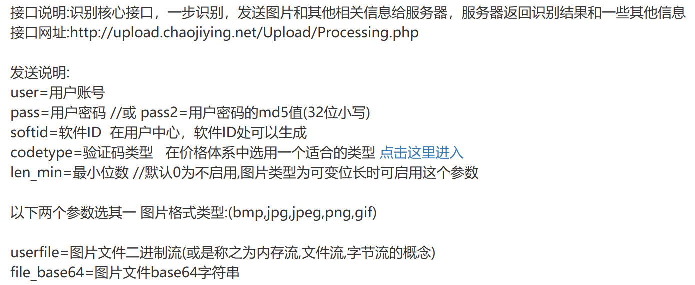

返回内容：

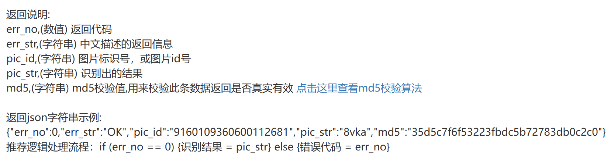

### 报错返分

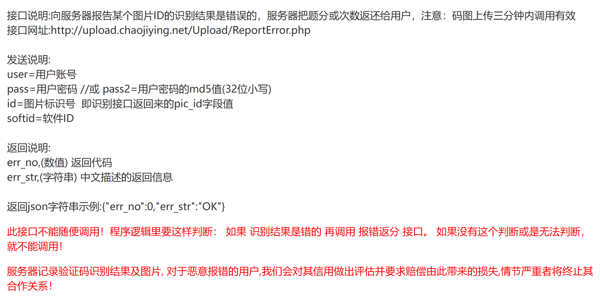

### 查询信息

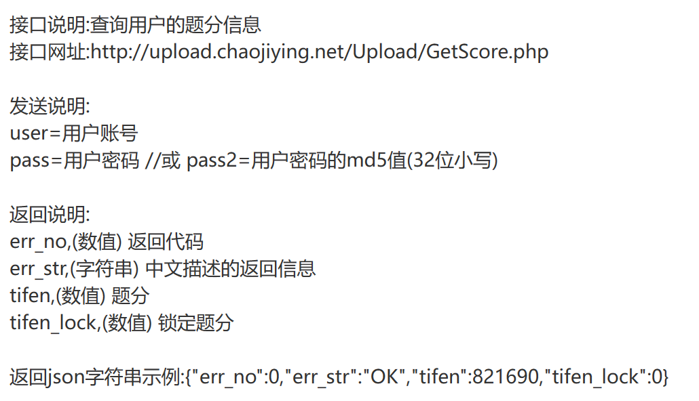

### 防盗用

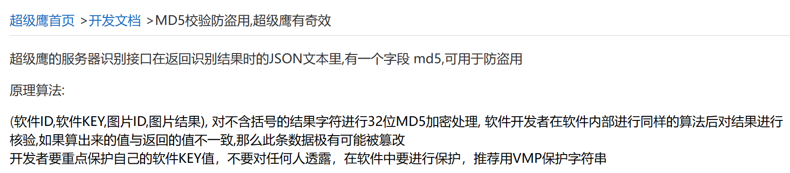

## chaojiying.py

```python
#!/usr/bin/env python
# coding:utf-8

import requests
from hashlib import md5


class Chaojiying_Client(object):

    def __init__(self, username, password, soft_id):
        self.username = username
        password = password.encode('utf8')
        self.password = md5(password).hexdigest()
        self.soft_id = soft_id
        self.base_params = {
            'user': self.username,
            'pass2': self.password,
            'softid': self.soft_id,
        }
        self.headers = {
            'Connection': 'Keep-Alive',
            'User-Agent': 'Mozilla/4.0 (compatible; MSIE 8.0; Windows NT 5.1; Trident/4.0)',
        }

    def PostPic(self, im, codetype):
        """
        im: 图片字节
        codetype: 题目类型 参考 http://www.chaojiying.com/price.html
        """
        params = {
            'codetype': codetype,
        }
        params.update(self.base_params)
        files = {'userfile': ('ccc.jpg', im)}
        r = requests.post('http://upload.chaojiying.net/Upload/Processing.php', data=params, files=files,
                          headers=self.headers)
        return r.json()

    def PostPic_base64(self, base64_str, codetype):
        """
        im: 图片字节
        codetype: 题目类型 参考 http://www.chaojiying.com/price.html
        """
        params = {
            'codetype': codetype,
            'file_base64': base64_str
        }
        params.update(self.base_params)
        r = requests.post('http://upload.chaojiying.net/Upload/Processing.php', data=params, headers=self.headers)
        return r.json()

    def ReportError(self, im_id):
        """
        im_id:报错题目的图片ID
        """
        params = {
            'id': im_id,
        }
        params.update(self.base_params)
        r = requests.post('http://upload.chaojiying.net/Upload/ReportError.php', data=params, headers=self.headers)
        return r.json()

    def result(self, directory):
        im = open(directory, 'rb').read()
        return self.PostPic(im, 1902).get('pic_str')


if __name__ == '__main__':
    # 用户中心>>软件ID 生成一个替换 96001
    chaojiying = Chaojiying_Client('yxx7318', 'yuxingxuan', '948181')
    # 本地图片文件路径 来替换 a.jpg 有时WIN系统须要//
    im = open('a.jpg', 'rb').read()
    # 1902 验证码类型  官方网站>>价格体系 3.4+版 print 后要加()
    print(chaojiying.PostPic(im, 1902))
    # {'err_no': 0, 'err_str': 'OK', 'md5': '1cd64fed165c404e96ff6dea279b7bf2', 'pic_id': '2270815361126020084', 'pic_str': '15l1'}
    # print chaojiying.PostPic(base64_str, 1902)  #此处为传入 base64代码

```
