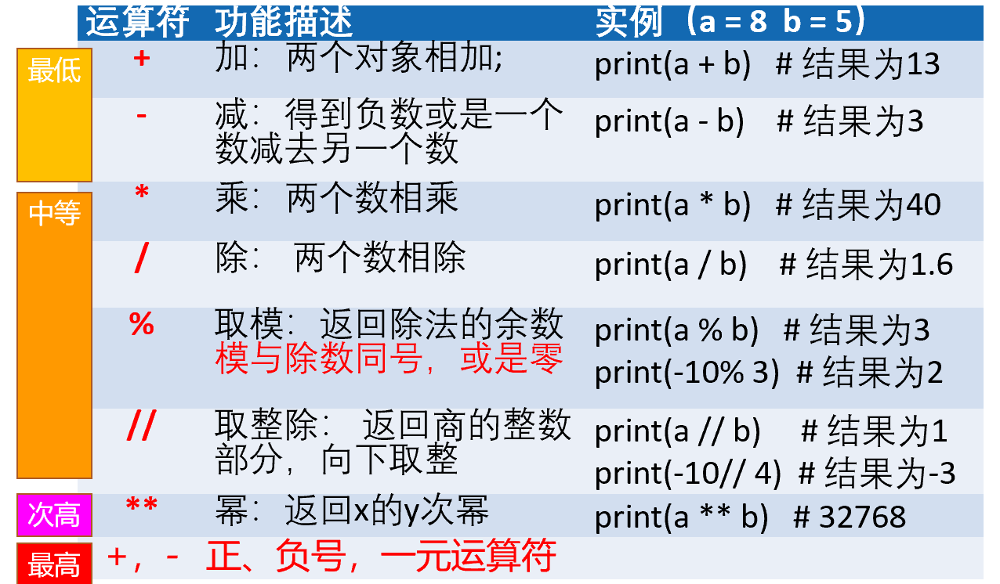
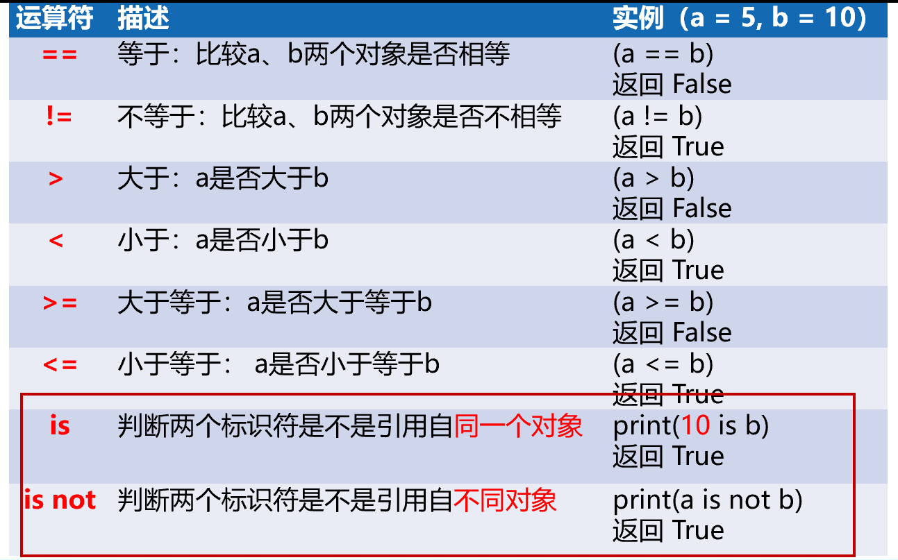
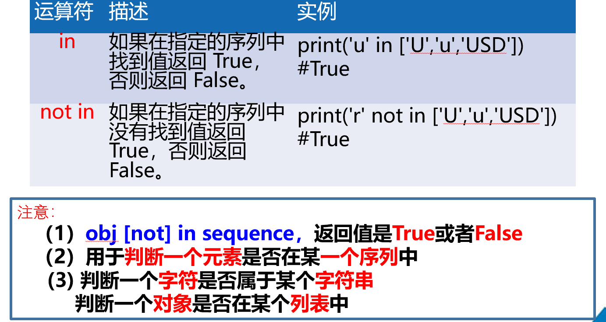
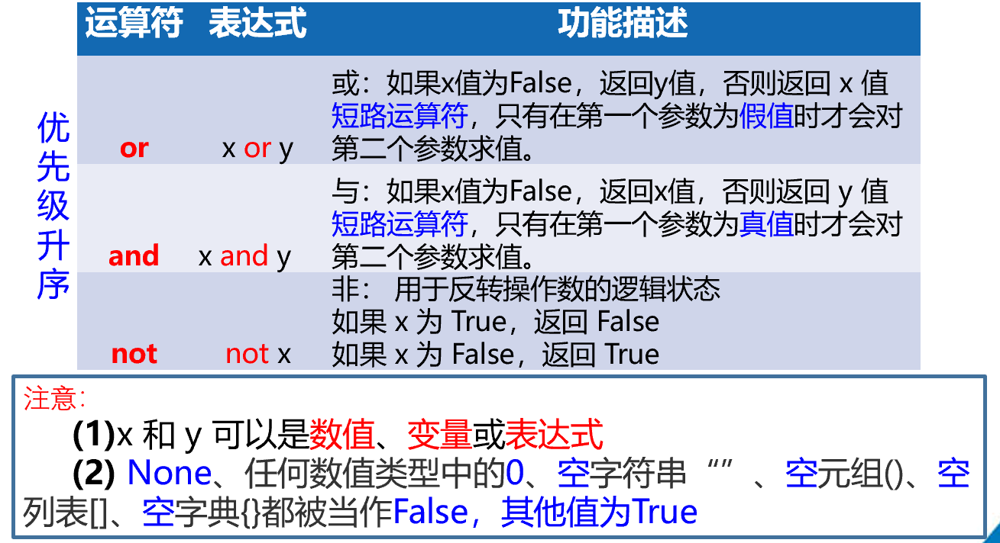
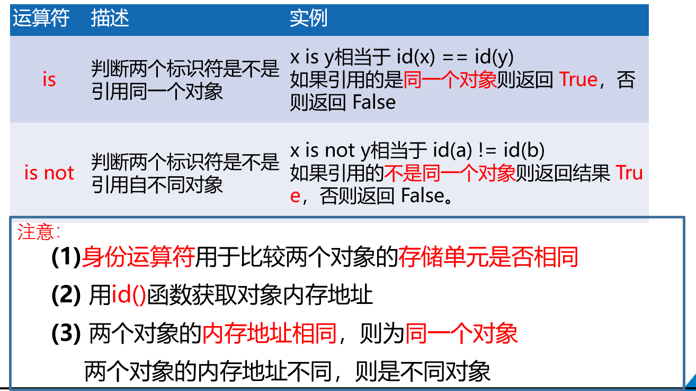
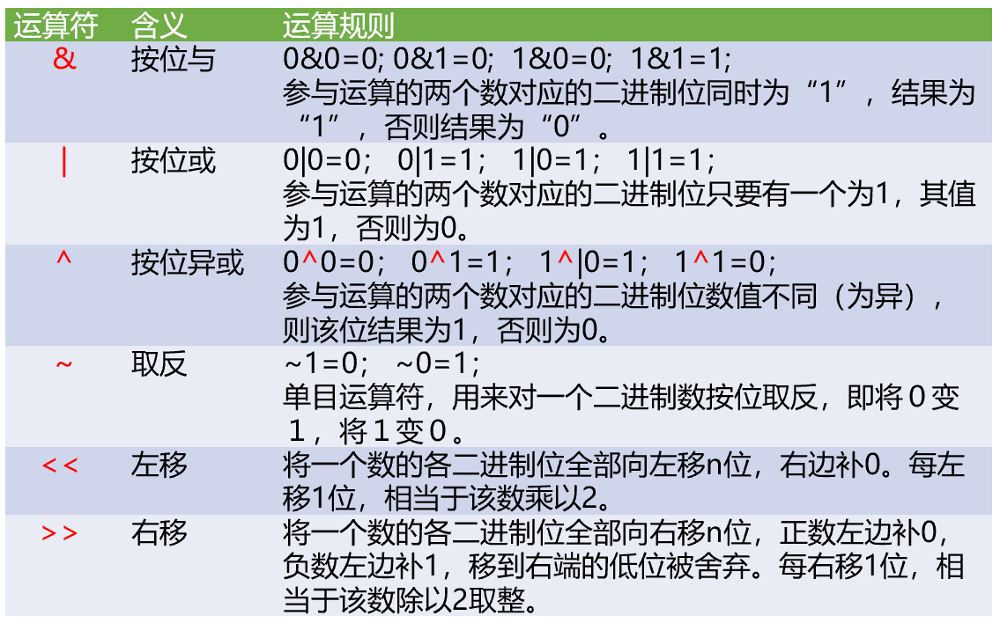
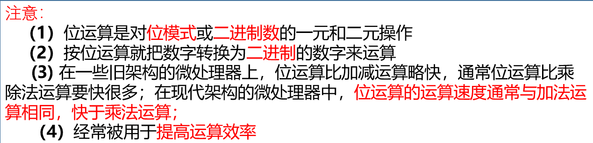
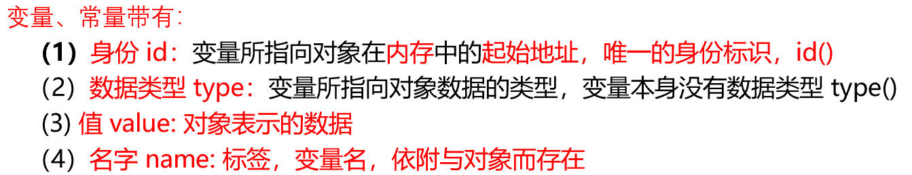
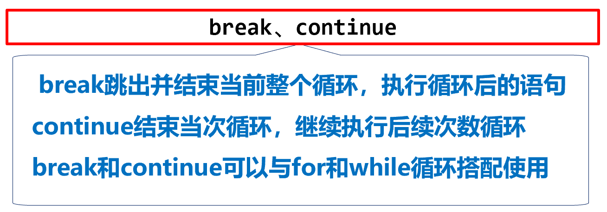

# 基础知识

## 标准输入输出

### 输入input()

从控制台获得用户输入的函数，用户输入的信息以**字符串类型**保存在<变量>中（如果需要进行数学运算则需要进行数据类型转化**int(input())**

**格式：<变量>=input(<提示字符串>)**

例如：**input([prompt])**

如果存在 prompt 实参，则将其写入标准输出，末尾不带换行符。该函数从输入中读取一行，转换为字符串（除了末尾的换行符）并返回。当读取到 EOF （End Of File）时，则触发 EOFError。读回车符得到空字符串。

### 输出print()

以字符形式向控制台输出结果的函数，**多个参数之间使用','分隔，并不是像Java一样采用'+'**

**格式：print(<拟输出字符串或者字符串变量>)**

可选参数为

- sep：多个参数输出的分隔字符，默认空格(sep=' ')

- end：输出结束时的字符，默认是换行符\n(end='\n')

- file：定义流输出的文件，默认为标准的系统输出可以重定义为输出到文件(file=sys.stdout)

- flush：立即把内容输出到流文件，不作缓存(flush=false)

例如：**print(objects,objects1,sep=' ', end='\n', file=sys.stdout)**

将 objects 打印到 file 指定的文本流，以 sep 值分隔并在输出末尾加上 end。sep， end， file 参数如果存在，它们必须以关键字参数的形式给出。sep 和 end 值都必须为字符串，值为 None时使用默认值。file 参数必须是一个具有 write(string) 方法的对象，如果参数不存在或为 None，则将使用 sys.stdout。 由于要打印的参数会被转换为文本字符串，因此 print() **不能用于二进制模式的文件对象**。

**通过"%"精准输出**

```python
name = "逆境中成长"
name1 = 1
print("我将会在%s%d" % (name, name1))#里面必须加括号才能看成是一次print输出的结果
```

```python
我将会在逆境中成长1
```

**通过print()写入文件**

```python
print("Hello, World!", file=open('file.txt', 'w'))
```

```py
会在对应目录下生成file.txt文件，内容为"Hello，world"
```

## 引入外部功能库

引入外部公共库的函数**import **库名 或者**from <库名> import <函数名>**，区别在于前一种使用函数时需要带库名字，后一种不需要带库名。

import 语句：import总是位于文件的顶部，在模块注释和文档注释之后，在模块的全局变量与常量之前。

导入应该按照以下顺序分组：

- 标准库导入

- 第三方库导入

- 本地应用/库导入

## 注释

- 单行注释：以#开头，其后内容为注释

- 多行注释：以'''开头和结尾

**(Python中单引号和双引号功能相同)**

## 分支语句

由判断条件决定程序运行方向的语句，每个保留字在所在行**最后存在一个冒号（:）**，语法的一部分

## 运算符

### 算数运算符



运算符号与其它语言的表示一样但是用法存在3需要注意的地方：

1. Python中一切皆对象，对象存储在内存，给变量赋值，表示增加一个访问标签（变量名），用于访问对象所在的地址

2. 赋值运算在左边的，都表示左边的变量和右边的变量**进行运算再赋值给左边的变量**

3. Python放弃了自增++，自减--运算

运算符号也没有新的表示方法，要注意：

1. /精确除法，有余数；//取整除法，没有余数，向下取整数，不是四舍五入（10//3=3，10//-3=-4）

2. **%在C语言和Java时为取余，但是在Python时为取模**。取模和取余步骤一致，先求整数商： c = a/b，再计算模或者余数： r = a - c*b。取模需要向负无穷方向舍入，而取余是向0方向舍入。（10%3=1，-10%3=2，-10%-3=-1，10%-3=-2）

3. 虽然运算符号有优先级，但推荐尽量使用“()”来控制表达式的执行顺序，不使用优先级来控制程序执行顺序

### 比较运算符



### 成员运算符



### 逻辑运算符



### 身份运算符



### 位运算





## 变量和常量

- 变量：程序中用于保存和表示数据的占位符号

- 常量：常量也被称为次变量，常量的值是不可以改变的，常量用全部大写字母的变量名表示



## 循环控制保留字

