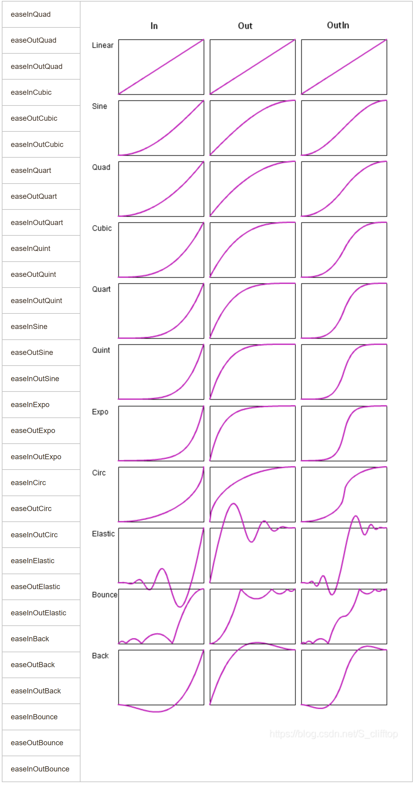

# PyAutoGui

pyautogui是一个Python模块，可以模拟用户在屏幕上的鼠标和键盘操作。它可以自动化鼠标和键盘输入，可以用于各种自动化任务，例如GUI测试、自动化数据输入、自动化游戏玩法等。pyautogui提供了一组函数来控制鼠标和键盘，例如移动鼠标、单击、双击、右键单击、按下和释放键等。它还提供了一些额外的功能，例如捕捉屏幕截图、识别颜色和图像等，以及其他一些实用工具，例如获取屏幕尺寸和鼠标位置

安装库

```
pip install pyautogui -i  https://pypi.tuna.tsinghua.edu.cn/simple
```

## 全局配置

```python
# 操作停顿时间(默认为0.1)
pyautogui.PAUSE = 10


pyautogui.FAILSAFE = True  # 防止操作失控，设置鼠标移动某点是抛异常
pyautogui.FAILSAFE_POINTS = [(100, 0)]  # 鼠标移动到(100,0)位置时抛出异常
```

## 鼠标控制

```python
import pyautogui


# -- 控制鼠标 --
# 获取当前鼠标位置
print(pyautogui.position())

# 获取屏幕大小
screen_size = pyautogui.size()
# 将鼠标移动到屏幕中间
pyautogui.moveTo(screen_size[0]/2, screen_size[1]/2, duration=1)

# 点击鼠标左键
pyautogui.click(None, None, button='left')

# 将鼠标从当前位置拖动到指定位置，duration为拖动时间，拖动方式默认直线，这里更换新的模式
pyautogui.dragTo(2549, 1541, duration=1, tween=pyautogui.easeInBack)
```

> **pyautogui.click()：单击点击事件**
>
> ```python
> pyautogui.click(x=None, y=None, clicks=1, interval=0.0, button=PRIMARY, duration=0.0, tween=linear)
> # x,y:为点击的位置坐标，以电脑左上角为原点
> # clicks:为点击次数，默认为1
> # interval:多次点击间的间隔（比如双击，第一次点击完后，等待设置的秒数在执行下一次点击）
> # button:设置左击还是右击，默认左击
> # duration:设置执行的时间
> # tween:鼠标移动到指定位置的规律
> ```
>
> **pyautogui.doubleClick()：双击点击事件**
>
> ```python
> pyautogui.doubleClick()  # 双击，默认左双击
> # x,y:为点击的位置坐标，以电脑左上角为原点
> # clicks:为点击次数，默认为1
> # interval:两次点击间的间隔（比如双击，第一次点击完后，等待设置的秒数在执行下一次点击）
> # button:设置左击还是右击，默认左击
> # duration:设置执行的时间
> # tween:鼠标移动到指定位置的规律
> ```
>
> ```python
> pyautogui.tripleClick()  # 单击三次，默认左击
> ```
>
> **pyautogui.moveTo()：以坐标为原点移动到指定的坐标上**
>
> ```python
> pyautogui.moveTo(x=None, y=None, duration=0.0, tween=pyautogui.easeInOutElastic)  # 鼠标移动到坐标位置，以电脑屏幕左上角为原地定位
> # x,y:为移动的位置坐标，以电脑左上角为原点
> # button:设置左击还是右击，默认左击
> # duration:设置执行的时间
> # tween:鼠标移动到指定位置的规律,默认匀速直线运行(linear)
> ```
>
> tween参数的值：
>
> 
>
> **pyautogui.move()：以鼠标当前位置移动x,y个像素**
>
> ```python
> pyautogui.move(x=None, y=None, duration=0.0, tween=pyautogui.easeInQuad)  # 在当前位置移动，以当前位置为坐标
> ```
>
> > 该方法与moveTo()的区别在于开始移动的位置不一样，x,y参数是以当前位置相对移动的像素，可正值可负值
>
> **pyautogui.mouseDown()：按下鼠标**
>
> ```python
> pyautogui.mouseDown(x=None, y=None, button='', duration=0.0)  # 按下鼠标，填写坐标的话，就是移动到某个坐标下按下
> # x,y为移动到某点按下，不填的话默认当前位置按下
> # button按下的点击项，默认左按下
> # duration整体指令运行的时间
> ```
>
> **pyautogui.mouseUp()：松开鼠标**
>
> ```python
> pyautogui.mouseUp()  # 释放鼠标
> ```
>
> **pyautogui.dragRel()：在鼠标当前位置点击后相对移动**
>
> ```python
> pyautogui.dragRel(xOffset=20, yOffset=100, duration=3, tween=pyautogui.easeInQuad, button='left')  # 在鼠标当前位置点击后相对移动，结束后自动松开
> # xOffset,yOffset为移动的距离
> # duration整个移动的耗时
> # tween移动的速度+轨迹
> # button设置点击项，默认左击
> ```
>
> **pyautogui.dragTo()：从当前位置拖拽到指定坐标轴**
>
> ```python
> pyautogui.dragTo(x=None, y=None, duration=0.0, tween=pyautogui.easeInQuad, button="left")  # 鼠标从当前位置拖拽到指定坐标
> # x,y为坐标，鼠标移动到指定的坐标（x,y）
> # duration整个移动的耗时
> # tween移动的速度+轨迹
> # button设置点击项，默认左击
> ```

## 键盘控制

```python
import pyautogui


# -- 控制键盘 --
# 通过键盘依次输入对应字符串，interval为每次输入的间隔时间
pyautogui.typewrite("Hello, world!", interval=0.1)

# 模拟按下键盘的"Ctrl"和"a"键
pyautogui.keyDown("ctrl")
pyautogui.keyDown("a")
pyautogui.keyUp("ctrl")
pyautogui.keyUp("a")

# 打印"a"
pyautogui.press("a")

# 多键组合使用
pyautogui.hotkey('ctrl', 'z')
```

> **pyautogui.keyDown() ：按下某按键**，**pyautogui.keyUp() ：松开某按键**
>
> ```python
> pyautogui.keyDown('shift')  # 按下shift键
> pyautogui.keyUp('shift')  # 松开shift键
> ```
>
> > 按键表示表示基本都是键盘字符，有些也存在多个代表——`'\t'可以代表Tab键`，`'\n'可以代表Enter键`，`num0代表0键`等
>
> **pyautogui.press()：输入内容**
>
> ```python
> pyautogui.press("a")  # 打印A
> ```
>
> **pyautogui.typewrite()：缓慢输入**
>
> ```python
> pyautogui.typewrite("message", interval=2)  # 缓慢输入
> # message:为输入的内容
> # interval:设置每两个字符输入的时间间隔，单位s
> ```
>
> > 由于只能支持ASCII编码，所以无法输入中文，但是可以通过Pyperclip模块将中文内容放入剪切板再通过调用"Ctrl" + "V"键输入
> >
> > ```
> > pip install pyperclip -i  https://pypi.tuna.tsinghua.edu.cn/simple
> > ```
> >
> > > - `pyperclip.copy(String)`：将文本复制到剪贴板
> > > - `pyperclip.paste()`：从剪贴板获取文本，返回字符串
> > > - `pyperclip.waitForPaste(timeout)`：直到剪贴板上有非空字符串时，才会返回
> > > - `pyperclip.waitForNewPaste(timeout)`：直到剪贴板上的文本被更改，才会传返回
>
> **pyautogui.hotkey()：多键组合使用**
>
> ```python
> pyautogui.hotkey('ctrl', 'a')  # 多键组合使用
> ```

## 弹框

```python
import pyautogui


# -- 弹框(返回用户的选择) --
# alert弹框
print(pyautogui.alert(text='alert', title='pyautogui', button='你好'))

# confirm弹框
print(pyautogui.confirm(text='confirm', title='pyautogui', buttons=['你好', '世界', '！']))

# password弹框
print(pyautogui.password(text='confirm', title='pyautogui', default='12345'))

# prompt弹框
print(pyautogui.prompt(text='confirm', title='pyautogui', default='你好世界！'))
```

> 当弹框运行时程序会暂停往下走，进行选择后才会继续往下执行

## 截图

```python
import pyautogui


# -- 截图 --
# 截取全屏
img = pyautogui.screenshot()
img.save('全屏.png')

# 截取某坐标的图片
region = (0, 100, 1200, 150)  # 这里前两个代表坐标，后两个代表从坐标开始向右和向下所截取矩形的长和宽
img = pyautogui.screenshot(region=region)
img.save('部分.png')

# 根据图片获取在当前屏幕匹配的第一个图片的中心坐标，confidence参数只有在安装OpenCV之后才可用
x, y = pyautogui.locateCenterOnScreen("img.png")
print(x,y)

# 根据图片获取在当前屏幕匹配的第一个图片的左上角坐标+宽+高
Box = pyautogui.locateOnScreen('img.png')
print(Box)

# 根据图片获取在当前屏幕匹配的所有坐标及宽高
imgs = pyautogui.locateAllOnScreen("img.png")  # 返回页面所有可匹配的图片，返回一个生成器（左，顶，宽，高）
for img in imgs:
    print(img)
```

## 页面滚动

```python
import pyautogui
import time


# -- 页面滚动 --
# 垂直滚动(正上负下)
pyautogui.scroll(500)
for i in range(1, 5):
    pyautogui.scroll(-i * 100)
    time.sleep(0.1)

# 水平滚动只有Linux里面有，所以在Windows下都是"垂直"
pyautogui.hscroll(500)
pyautogui.vscroll(2000)
```

## 游戏扩展

> 在 Windows 上，PyAutoGUI使用稍旧的、略微弃用的Windows API来模拟鼠标和键盘输入，当遇到使用DirectX的程序交互时，就像大多数3D视频游戏一样， DirectX的子集之一是DirectInput。 DirectInput基本上是视频游戏开发人员在处理游戏的用户输入时使用的更简单、更强大的界面。很多时候，游戏开发者会选择只支持DirectInput，因为它的开发较少而且玩家不太可能注意到。所以如果需要在游戏里面实现模拟键盘和鼠标，只需要让PyAutoGUI使用DirectInput Windows API，而不是它当前使用的API

安装库

```
pip install pydirectinput -i https://pypi.tuna.tsinghua.edu.cn/simple
```

> 如果在导入模块时，导入的模块名称与自身的py文件名称相同时，会产生冲突，所以创建的py文件不要和模块名称相同

使用方式基本保持一致，将pyautogui对键盘和鼠标的操作替换为pydirectinput即可

```python
import pyautogui
import time
 
time.sleep(4)
pyautogui.keyDown('w')
time.sleep(1)
pyautogui.keyUp('w')
```

替换后

```python
import pyautogui
import pydirectinput
import time
 
time.sleep(4)
pydirectinput.keyDown('w')
time.sleep(1)
pydirectinput.keyUp('w')
```

## 参考博客

- [详解pyautogui模块 - 余生没有余生 - 博客园 (cnblogs.com)](https://www.cnblogs.com/lihongtaoya/p/16839051.html)

- [关于pyautogui在游戏窗口不工作解决办法_pyautogui无法点击游戏_22岁的老11年老码农的博客-CSDN博客](https://blog.csdn.net/LK1014104648/article/details/126786534)
- [python 游戏按键精灵 PyDirectInput介绍_directinput python_羽徵角的博客-CSDN博客](https://blog.csdn.net/lylelo/article/details/119882006)