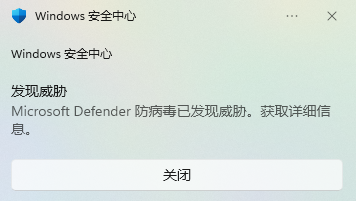

# 打包exe

## 安装库

```
pip install Pyinstaller -i https://pypi.tuna.tsinghua.edu.cn/simple
```

## 打包一个py文件

通过cmd命令切换到需要的打包目录

```python
# 这一般是用来打包界面化的程序的，如用tkinter、Pyqt5等制作的程序
# -F代表合并为一个exe文件
Pyinstaller -F xxx.py

# -w 的意思就是exe运行的时候不弹出那个命令行（黑窗口）
Pyinstaller -F -w xxx.py

# 这一般用来添加exe的图标
Pyinstaller -F -i xxx.ico xxx.py
```

> 生成在当前目录下的dist文件夹下

## 打包多个py文件

生成spec文件

```
pyi-makespec -F -w main.py
```

修改spec文件，在Analysis下指定多个py文件，在EXE下指定图标

```
# -*- mode: python ; coding: utf-8 -*-


block_cipher = None


a = Analysis(
    ['main.py', '处理字符串.py', '实训报告自动评分.py', '操作xlsx.py', '配置文件.py', '评语与评分.py'],
    pathex=[],
    binaries=[],
    datas=[],
    hiddenimports=[],
    hookspath=[],
    hooksconfig={},
    runtime_hooks=[],
    excludes=[],
    win_no_prefer_redirects=False,
    win_private_assemblies=False,
    cipher=block_cipher,
    noarchive=False,
)
pyz = PYZ(a.pure, a.zipped_data, cipher=block_cipher)

exe = EXE(
    pyz,
    a.scripts,
    a.binaries,
    a.zipfiles,
    a.datas,
    [],
    name='main',
    debug=False,
    bootloader_ignore_signals=False,
    strip=False,
    upx=True,
    upx_exclude=[],
    runtime_tmpdir=None,
    console=False,
    disable_windowed_traceback=False,
    argv_emulation=False,
    target_arch=None,
    codesign_identity=None,
    entitlements_file=None,
    icon='favicon.ico',
)

```

> 其它参数：
>
> - `pathex`用于指定打包的py文件目录，打包自定义的模块
>
>   - ```
>         pathex=[
>             '/path/to/first/module/directory',
>             '/path/to/second/module/directory',
>             # ... 更多路径 ...
>         ],
>     ```
>
> - `datas`选项用于指定其他类型的文件打包进exe（对于`('mydoc.docx', '.')`，`'mydoc.docx'`可以为文件或者目录，`'.'`代表放在打包后的exe根目录）
>
>   - ```
>         datas=[
>             ('static', 'app/static'),
>             ('static/file2.png', 'app/static/file2.png'),
>             # ... 更多文件 ...
>         ],
>
> 目录配置：
>
> `sys._MEIPASS`是PyInstaller在打包程序时设置的一个特殊变量，它指向程序的临时目录，这个方法可以输入filename，返回打包后filename的读取路径
>
> ```python
>      import sys
>      def source_path(filename):
>          abs_path = os.path.abspath(__file__)
>          base_path = getattr(sys, '_MEIPASS', os.path.dirname(abs_path))
>          return os.path.join(base_path, filename)
> ```
>
> - `os.path.abspath(__file__)` 返回当前执行的文件（`__file__`）的绝对路径
> - `os.path.dirname()` 返回指定文件的目录路径，所以 `os.path.dirname(base_path)` 返回的是当前执行的文件的目录路径
> - `sys._MEIPASS` 是一个特殊的属性，它只在使用 PyInstaller 打包 Python 程序时存在。程序运行的当前目录是一个临时的文件夹，而**不是程序所在的文件夹**。因此，不能直接使用相对路径来访问你的程序中的文件
> - `getattr()`代表如果 `sys._MEIPASS` 存在，就返回 `sys._MEIPASS`，否则返回 `base_path`
> - `os.path.join()` 函数用于拼接路径
>
> 这个方法无论是直接运行 Python 程序还是运行被 PyInstaller 打包后的程序，都能正确获取到文件的绝对路径

以spec文件运行

```
Pyinstaller main.spec
```

## 基于模块打包

带cmd窗口：

```
# -*- mode: python ; coding: utf-8 -*-
from PyInstaller.utils.hooks import collect_submodules


a = Analysis(
    ['main.py', 'PathUtil.py'], # 目录获取方法放置最外层目录
    binaries=[],
	pathex=['D:\\PythonProject\\GraduationProject'],
    datas=[
        ('favicon.ico', '.')
    ],
    hiddenimports=collect_submodules('GraduationProject'),  # 收集GraduationProject下的所有子模块
    hookspath=[],
    hooksconfig={},
    runtime_hooks=[],
    excludes=[],
    noarchive=False,
    optimize=0,
)
pyz = PYZ(a.pure)

exe = EXE(
    pyz,
    a.scripts,
    a.binaries,
    a.datas,
    [],
    name='main',
    debug=False,
    bootloader_ignore_signals=False,
    strip=False,
    upx=True,
    upx_exclude=[],
    runtime_tmpdir=None,
    console=True,
    disable_windowed_traceback=False,
    argv_emulation=False,
    target_arch=None,
    codesign_identity=None,
    entitlements_file=None,
)

```

不带cmd窗口：

```
# -*- mode: python ; coding: utf-8 -*-
from PyInstaller.utils.hooks import collect_submodules


a = Analysis(
    ['main.py', 'PathUtil.py'], # 目录获取方法放置最外层目录
    binaries=[],
	pathex=['D:\\PythonProject\\GraduationProject'],
    datas=[
        ('favicon.ico', '.')
    ],
    hiddenimports=collect_submodules('GraduationProject'),  # 收集GraduationProject下的所有子模块
    hookspath=[],
    hooksconfig={},
    runtime_hooks=[],
    excludes=[],
    noarchive=False,
    optimize=0,
)
pyz = PYZ(a.pure)

exe = EXE(
    pyz,
    a.scripts,
    a.binaries,
    a.datas,
    [],
    name='main',
    debug=False,
    bootloader_ignore_signals=False,
    strip=False,
    upx=True,
    upx_exclude=[],
    runtime_tmpdir=None,
    console=False,
    disable_windowed_traceback=False,
    argv_emulation=False,
    target_arch=None,
    codesign_identity=None,
    entitlements_file=None,
    icon='favicon.ico',
)

```

> 不带cmd窗口可能会导致在打包的时候系统防火墙报病毒，打包完成后使用不会受影响
>
> 

## 参考博客

- [用 Pyinstaller 模块将 Python 程序打包成 exe 文件（全网最全面最详细）_pyinstaller打包_小康2022的博客-CSDN博客](https://blog.csdn.net/weixin_62651706/article/details/127585881)
- [使用pyinstaller将具有多个python文件的项目打包为exe（含依赖库）_pyinstaller打包依赖库_shewei1977的博客-CSDN博客](https://blog.csdn.net/shewei1977/article/details/127763928)
- [Pyinstaller如何打包多个资源文件（超详细教程） (taodudu.cc)](http://www.taodudu.cc/news/show-5796504.html?action=onClick)