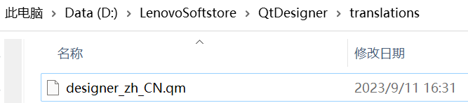

# PyQt

## QT Designer

官网下载：[Qt Designer Download for Windows and Mac (fman.io)](https://build-system.fman.io/qt-designer-download)

将汉化包移动到目录下即可汉化：



## PyQt5

安装库

```
pip install PyQt5 -i https://pypi.tuna.tsinghua.edu.cn/simple
pip install pyqt5-tools -i https://pypi.tuna.tsinghua.edu.cn/simple
```

编译ui文件

```
pyuic5 -o test.py test.ui
```

## 虚拟环境打包