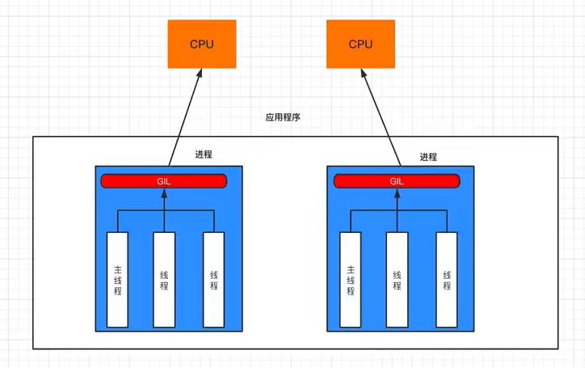
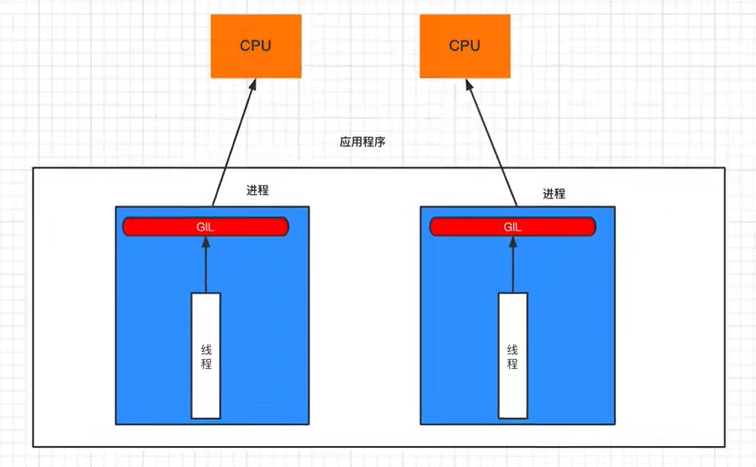
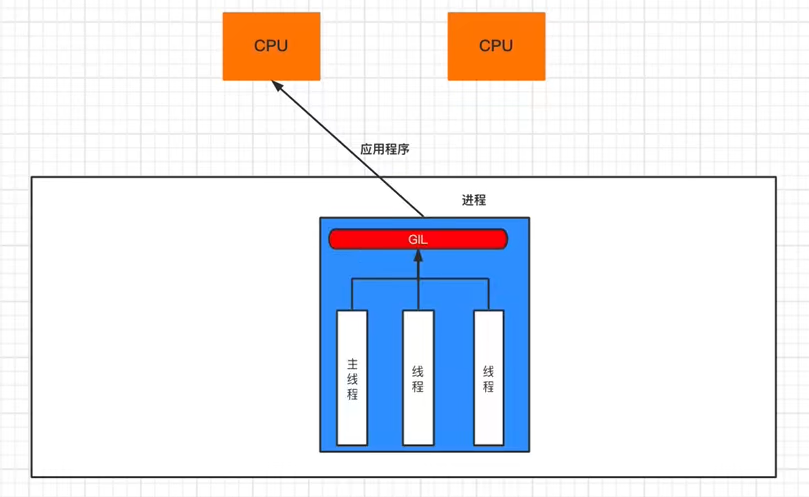

# threading线程

## GIL锁

全局解释器锁(Global Interpreter Lock)，是CPython特有的，让一个线程中间一个时刻只能有一个线程可以被cpu调用



如果程序想利用cpu的多核优势去进行计算密集型任务，让多核cpu同时处理一些任务，应该使用多进程开发(即使资源开销大)



如果需要并发的进行IO密集型任务，应该使用多线程开发



常见的程序开发中，计算操作需要使用cpu多核优势，IO操作不需要利用CPU的多核优势

- 计算密集型，用多进程，例如：大量的数据计算
- IO密集型，用多线程，例如：文件读写、网络数据传输

## Lock和RLock

> Lock为同步锁，RLock为递归锁

同步锁`threading.Lock()`

```python
import threading

lock = threading.Lock()


def task():
    # 获取锁状态
    print(lock.locked())
    # 上锁，返回值代表是否成功获取锁
    is_acquire = lock.acquire()
    # 未解锁继续上锁会导致死锁
    # lock.acquire()

    print(is_acquire)
    print(lock.locked())

    # 解锁
    lock.release()


if __name__ == '__main__':
    task()

```

递归锁`threading.RLock()`(虽然效率更低一些，但是实际开发中用得多)

```python
import threading
import time

rlock = threading.RLock()
lock = threading.RLock()


# lock.acquire()加锁
# lock.release()解锁

def func():
    with lock:
        time.sleep(2)
        print("func执行完成")


def task():
    # 这里相当于二次加锁，但是不会造成死锁情况
    with rlock:
        print("tack开始")
        func()
        time.sleep(1)
        print("tack执行完成")


if __name__ == '__main__':
    task()

```

## 死锁

```python
import threading
import time

# 定义两个锁
lock1 = threading.Lock()
lock2 = threading.Lock()


def thread_function_1():
    # 先获取锁1，再获取锁2
    print(lock2.locked())
    lock1.acquire()
    print("获取锁lock1之后做一些事。。。")
    time.sleep(1)
    lock2.acquire()

    # 释放锁
    lock2.release()
    lock1.release()


def thread_function_2():
    # 先获取锁2，再获取锁1
    print(lock1.locked())
    lock2.acquire()
    print("获取锁lock2之后做一些事。。。")
    time.sleep(1)
    lock1.acquire()

    # 释放锁
    lock1.release()
    lock2.release()


# 创建两个线程
thread1 = threading.Thread(target=thread_function_1)
thread2 = threading.Thread(target=thread_function_2)

# 启动两个线程
thread1.start()
thread2.start()

# 等待两个线程结束
thread1.join()
thread2.join()

print("Main thread is done")

```

## 线程池

