# 基本数据类型

## 数值函数

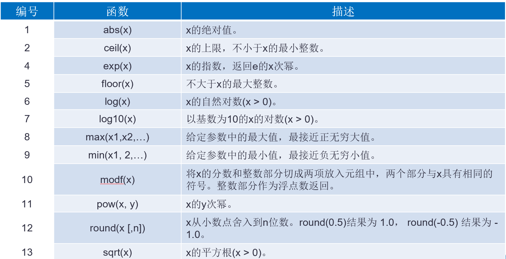

### 随机函数

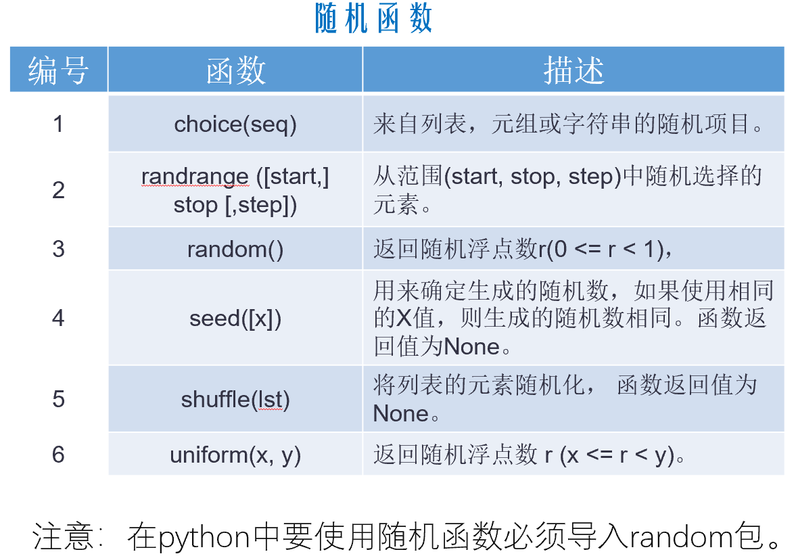

## 字符串

> 0个或多个字符组成的有序字符序列，0个字符是空字符串。**Python不支持单个字符**，是不可变数据类型

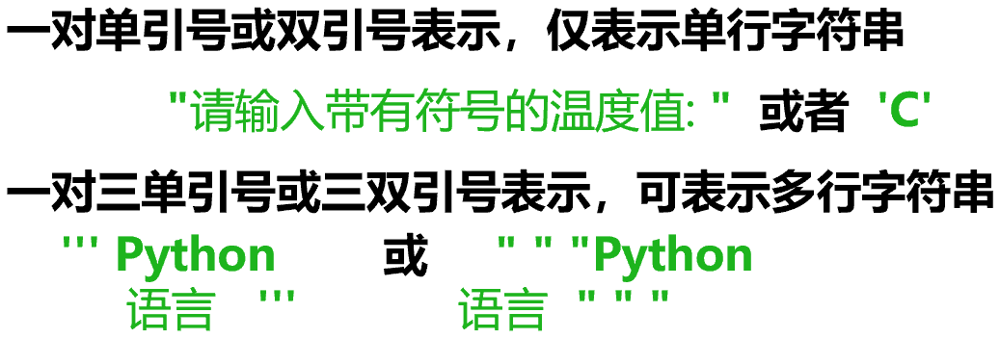

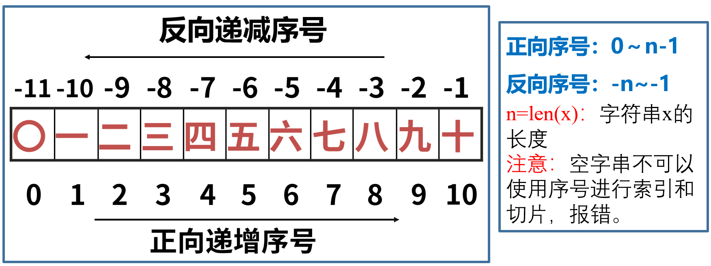

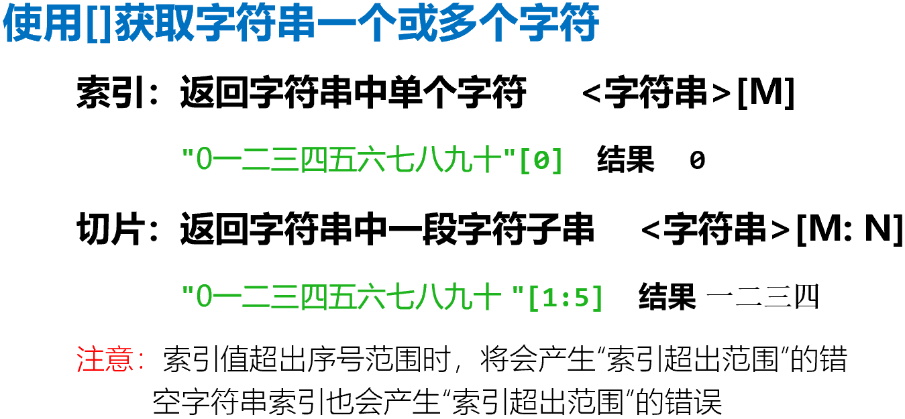

### 特殊字符串

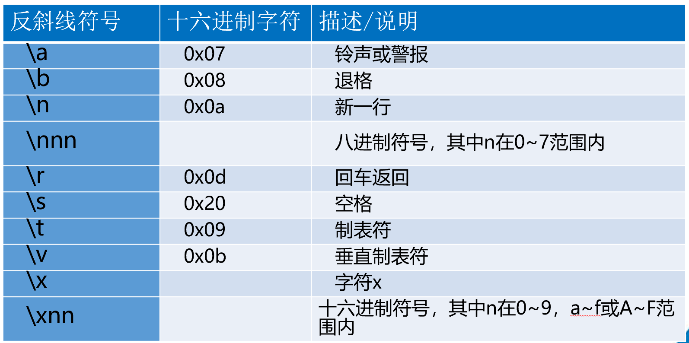

### format方法

```python
a = "{1}分隔符{0}".format("第一句话", "第二句话")#按顺序将语句放入
print(a)
#输出结果为：第二句话分隔符第一句话
```

### 字符串格式化运算符

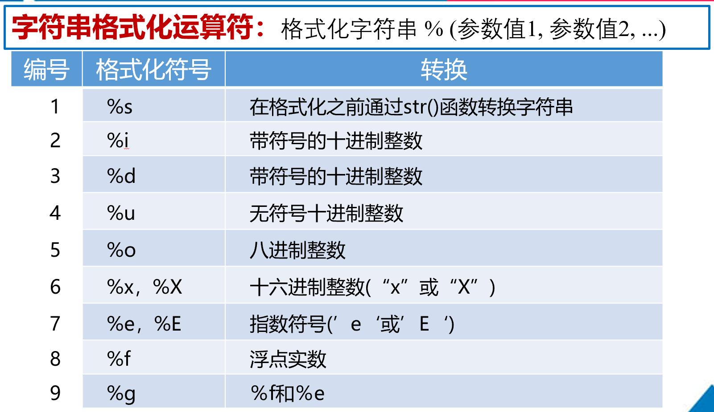

### 字符串运算符（重点）

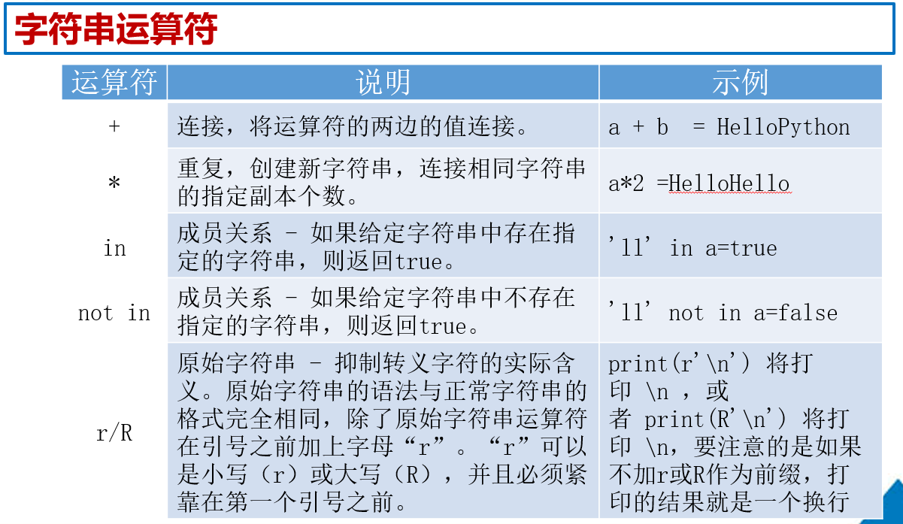

### 字符串处理函数

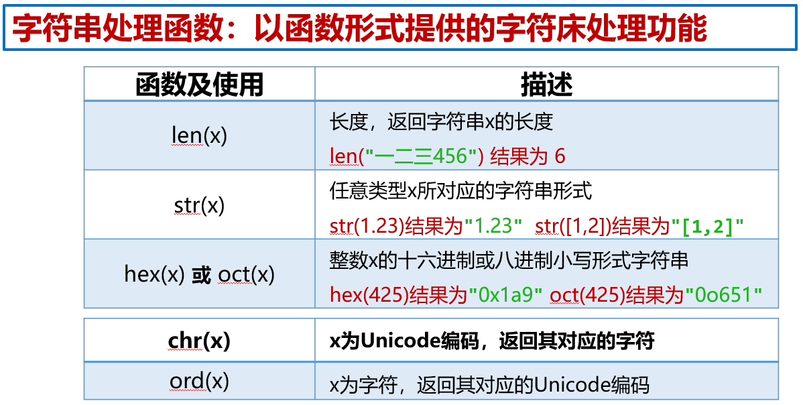

### 字符串处理方法

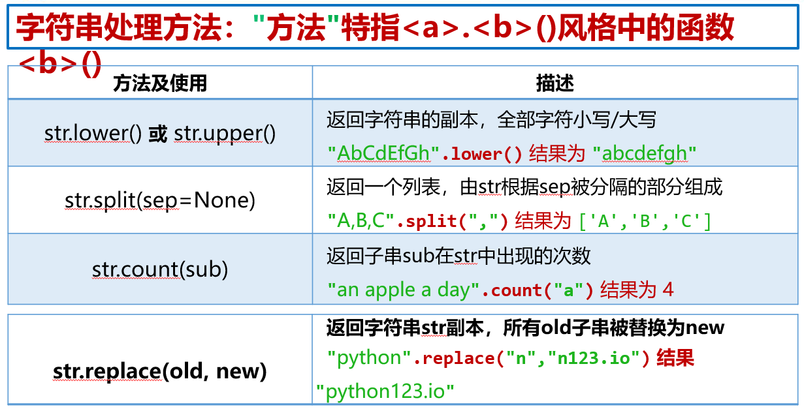

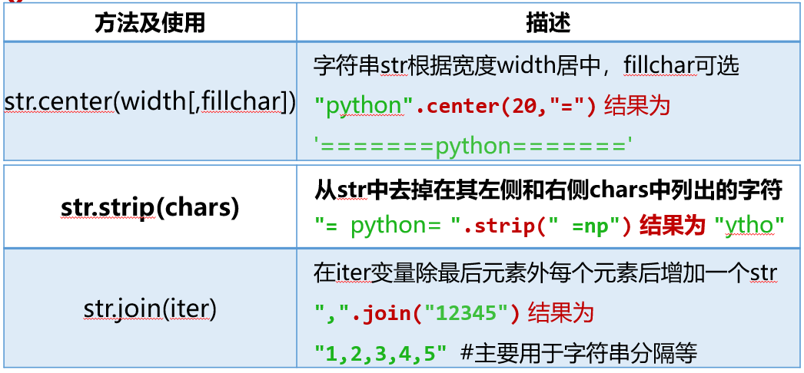

## 实例：统计文字中的字符

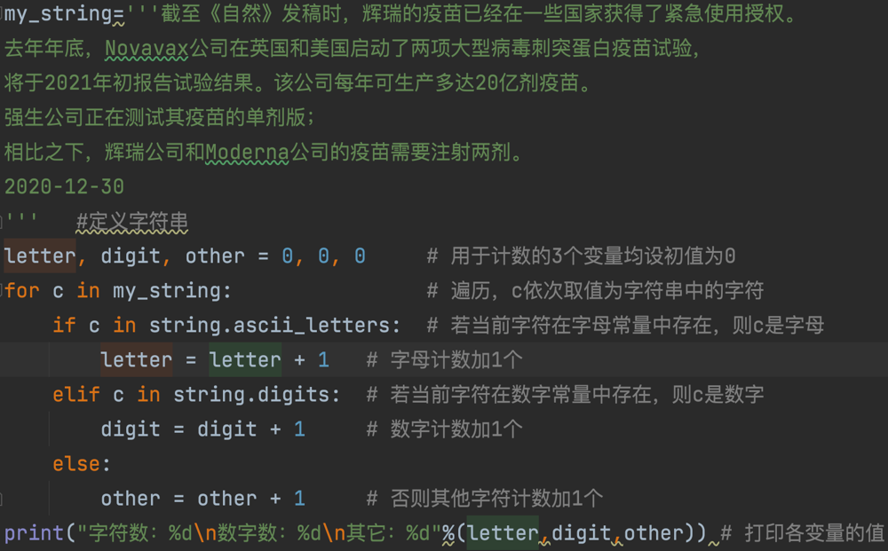

运行结果：

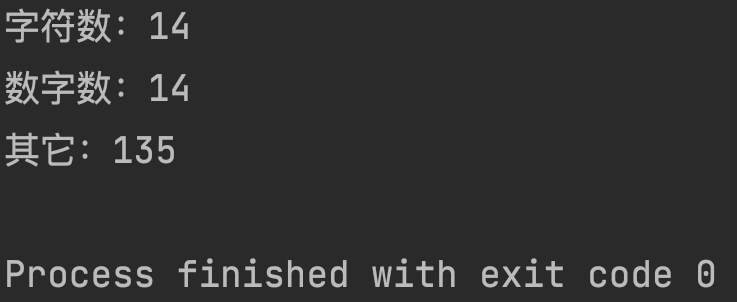

