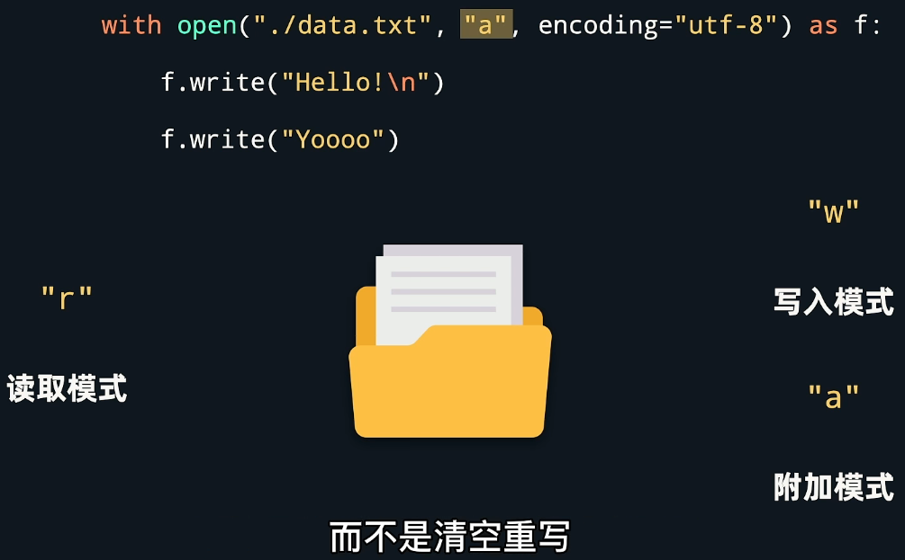

# 文件操作

## 访问模式

| 访问模式 | 说明                                                         |
| :------: | :----------------------------------------------------------- |
|    r     | 以只读方式打开文件。文件的指针将会放在文件的开头。如果文件不存在，则报错。**这是默认模式**。 |
|    w     | 打开一个文件只用于写入。如果该文件已存在则将其覆盖。如果该文件不存在，创建新文件。 |
|    a     | 打开一个文件用于追加。如果该文件已存在，文件指针将会放在文件的结尾。也就是说，新的内容将会被写入到已有内容之后。如果该文件不存在，创建新文件进行写入。 |
|    r+    | 打开一个文件用于读写。文件指针将会放在文件的开头。           |
|    w+    | 打开一个文件用于读写。如果该文件已存在则将其覆盖。如果该文件不存在，创建新文件。 |
|    a+    | 打开一个文件用于读写。如果该文件已存在，文件指针将会放在文件的结尾。文件打开时会是追加模式。如果该文件不存在，创建新文件用于读写。 |
|    rb    | 以二进制格式打开一个文件用于只读。文件指针将会放在文件的开头。 |
|    wb    | 以二进制格式打开一个文件只用于写入。如果该文件已存在则将其覆盖。如果该文件不存在，创建新文件。 |
|    ab    | 以二进制格式打开一个文件用于追加。如果该文件已存在，文件指针将会放在文件的结尾。也就是说，新的内容将会被写入到已有内容之后。如果该文件不存在，创建新文件进行写入。 |
|   rb+    | 以二进制格式打开一个文件用于读写。文件指针将会放在文件的开头。 |
|   wb+    | 以二进制格式打开一个文件用于读写。如果该文件已存在则将其覆盖。如果该文件不存在，创建新文件。 |
|   ab+    | 以二进制格式打开一个文件用于读写。如果该文件已存在，文件指针将会放在文件的结尾。如果该文件不存在，创建新文件用于读写。 |

## 文件操作流程


### 打开文件


### 文件操作

- 读取


- 写入


### 文件关闭


### 小结（重点）


复制文件TextFile.txt的内容再插入到本身

```python
tf = open("TextFile.txt", "a+",encoding="UTF-8")  # 打开文件，模式为追加读，记得定义文件编码方式，默认不为UTF-8
tf.seek(0)  # 指针移到文件开始
content = tf.read()  # 读文件内容保存到变量，read方法里面还能写数字，代表读取几个字节
tf1 = open("TextFile1.txt", "w+",encoding="UTF-8")  # 不需要定义文件TextFile1.txt
tf1.write(content)  # 写入新文件
tf.seek(0)  # 指针移动到文件开始，程序会记录文件读取到哪个位置了，调用read方法使用后已经指到结尾了
tf1.seek(0)  # 指针移动到文件开始
tf.write(tf1.read())  # 将TextFile1.txt内容写入TextFile.txt
tf.seek(0)  # 指针移动到文件开始
print(tf.read())  # 输出文件内容
tf.close()  # 关闭文件TextFile.txt
tf1.close()  # 关闭文件TextFile1.txt

# tf.tell() 方法返回文件的当前位置,即文件指针当前位置
# 在a+模式下，tf.tell()-1 代表最后一个字节
```

## 扩展：

read方法：

- readline：读取文件一行的内容，读到结尾会返回空字符串
- readlines：会读取全部文件内容，并把每行作为列表元素返回


- with方法：自动进行文件的关闭，但是需要将文件进行的操作写到方法里面


- wirte方法：调用方法写入会把原本文件的内容清空，想要不清空，可以修改模式为a，r+也可以同时支持读写




## 目录操作


### os库的基本函数


### os.path字库的基本函数


