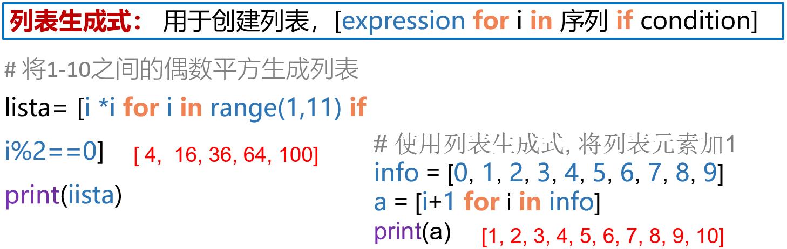

# 函数


## 函数创建


## 函数类型


## 自定义函数


### return语句

函数**默认的返回值为None**，如果有return语句则按return语句来

return语句可以返回多个值，通过","分隔，以**元组()**的方式返回

```python
def fun(a, b):
    return a, b, a + b


test = fun(1, 2)
print(test)
#运行结果：(1,2,3)
```

### 参数


```python
str = 'global'
def func1():
    global str	#定义全局变量str(覆盖原本的全局变量str了)
    str = 'local'	#使用global可以在函数内改变全局变量的值
    print(str)
func1()
print(str)
#运行结果
local
local
```

## 传递方式

- 值传递


- 引用传递


## 匿名函数

没有名字，临时使用一次的函数


```python
s=lambda a,c:a*c	#a,c为形参列表
print(s(10,20))		#结果为200
```

## 高阶函数

函数的参数是函数或函数的返回值是函数


## 装饰器

> 不改变被装饰函数源代码和调用方法的前提下，扩展被装饰函数功能的函数，有利于代码简洁


## 生成器



## 迭代器


