# CUDA

使用`nvcc --version`或者`nvidia-smi`查看cuda版本

## 升级cuda

官方驱动地址：[NVIDIA GeForce 驱动程序 - N 卡驱动 | NVIDIA](https://www.nvidia.cn/geforce/drivers/)

下载exe按照步骤升级，重启即可：


## 多版本cuda切换

### 安装对应cuda

下载cuda：[CUDA Toolkit Archive | NVIDIA Developer](https://developer.nvidia.com/cuda-toolkit-archive)

选择版本：

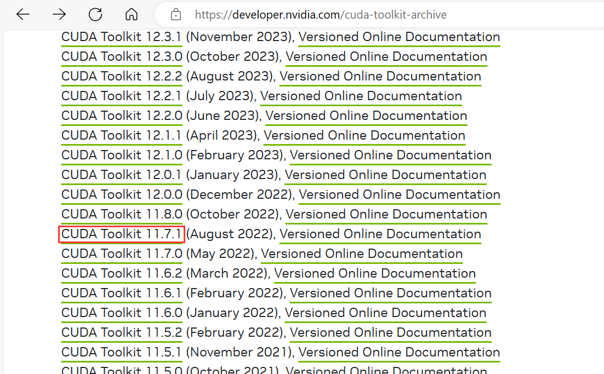

下载离线版：

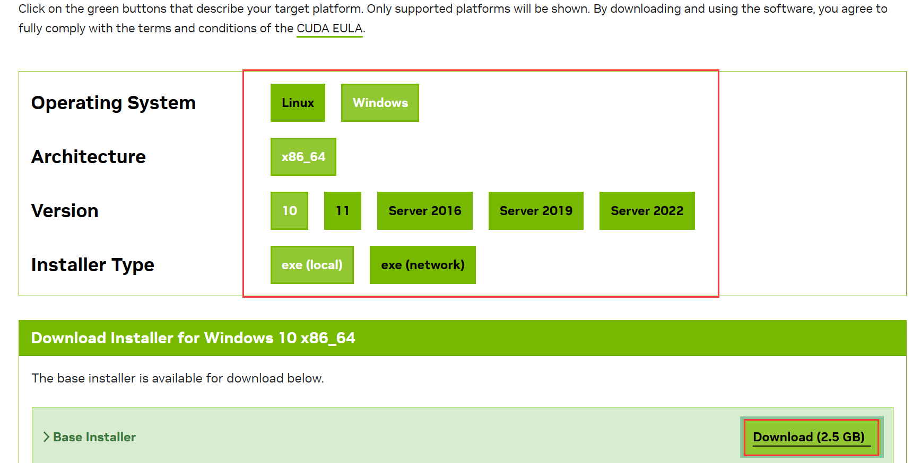

设置CUDA 安装时临时缓存位置，可以不用改，但得与原先安装的 CUDA 的安装缓存位置不同：

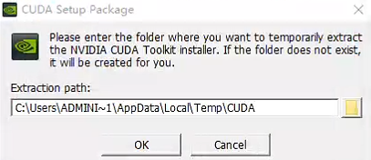

自定义安装：

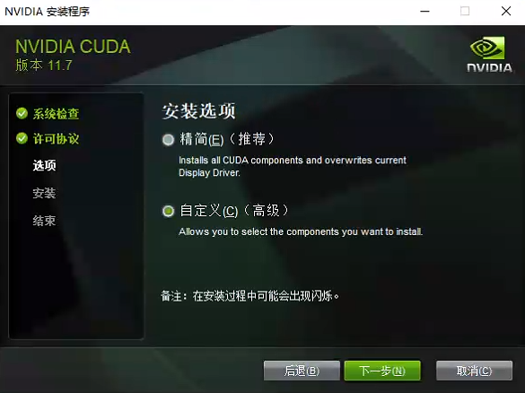

只需要选择CUDA即可：

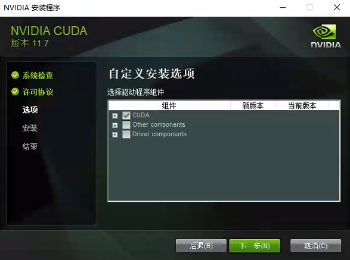

选择安装目录，需要记住安装位置：

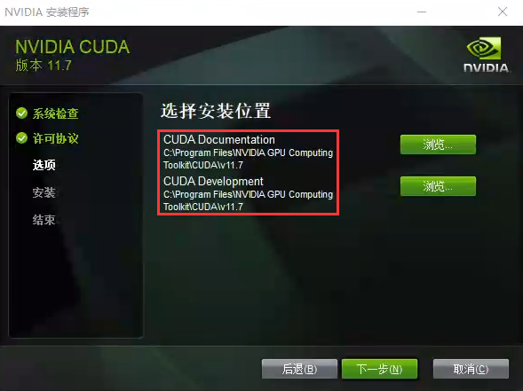

修改为：

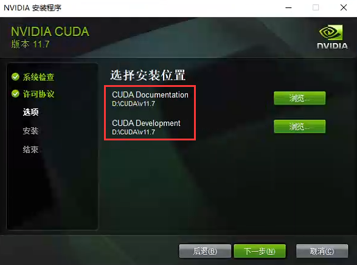

勾选后继续：

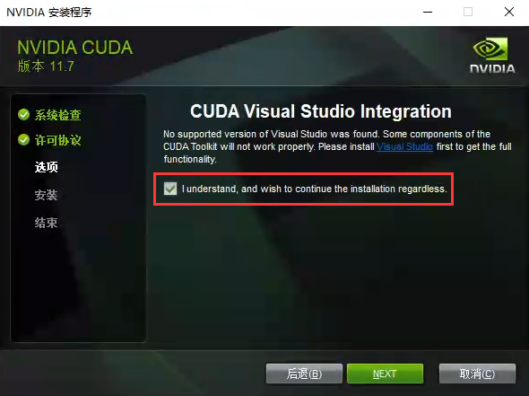

完成安装：

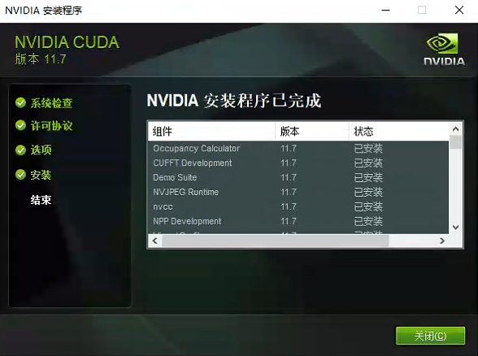

### 环境变量

安装完成后会自动配置环境变量`nvcc --version`：

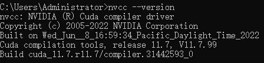

多了两个环境变量，系统变量中的`CUDA_PATH`发生了改变，增加`NVCUDASAMPLES_ROOT`：

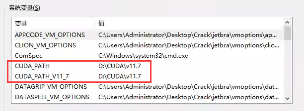

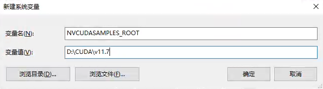

在Path中新建两个变量，并上移：

```
D:\CUDA\v11.7\bin
D:\CUDA\v11.7\libnvvp
```

> 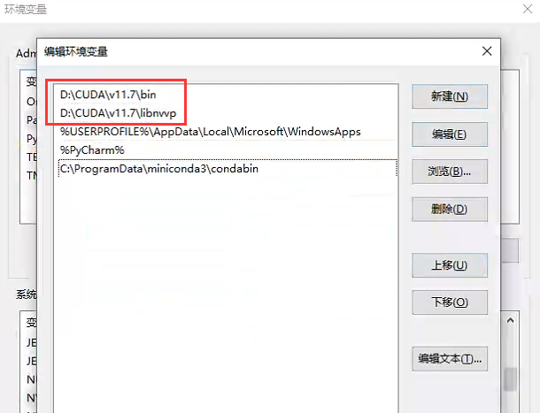

### 安装对应cudnn

下载cudnn：[cuDNN Archive | NVIDIA Developer](https://developer.nvidia.com/rdp/cudnn-archive)

解压放到对应目录：

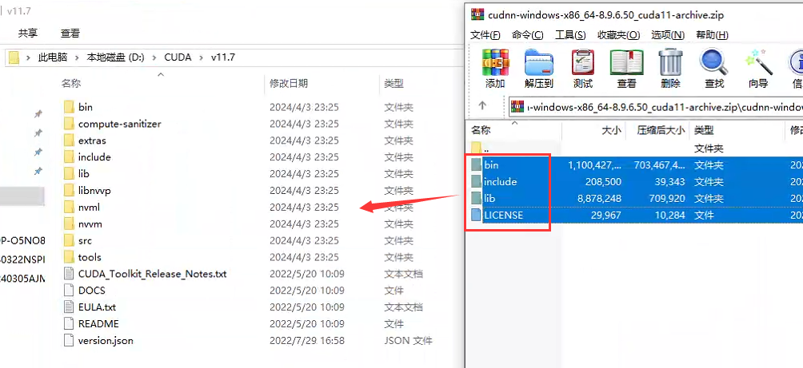

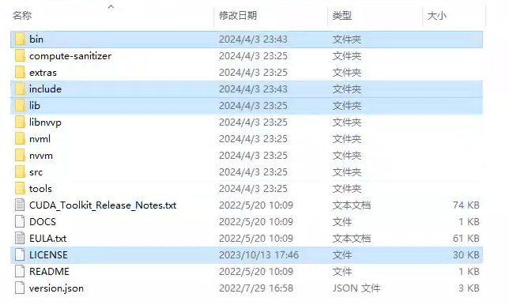

在`extras`目录下的`demo_suite`目录运行cmd，执行`bandwidthTest.exe`和`deviceQuery.exe`

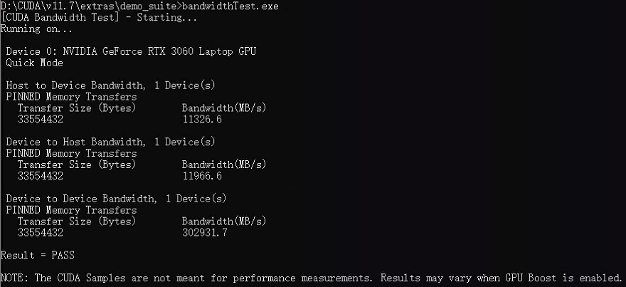

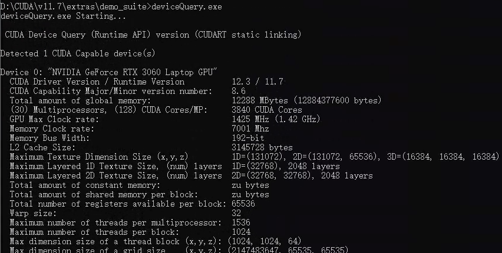

至此， 新版本的CUDA与cudnn安装成功，可以使用该版本的CUDA进行GPU加速了

### 切换cuda

> 当需要切换为其它版本，只需要对环境变量进行修改即可

在系统变量Path中，上移需要切换的版本，像是上移：

```
D:\CUDA\v12.1\bin
D:\CUDA\v12.1\libnvvp
```

修改`CUDA_PATH`的值：

```
D:\CUDA\v12.1
```

修改`NVCUDASAMPLES_ROOT`的值：

```
D:\CUDA\v12.1
```

