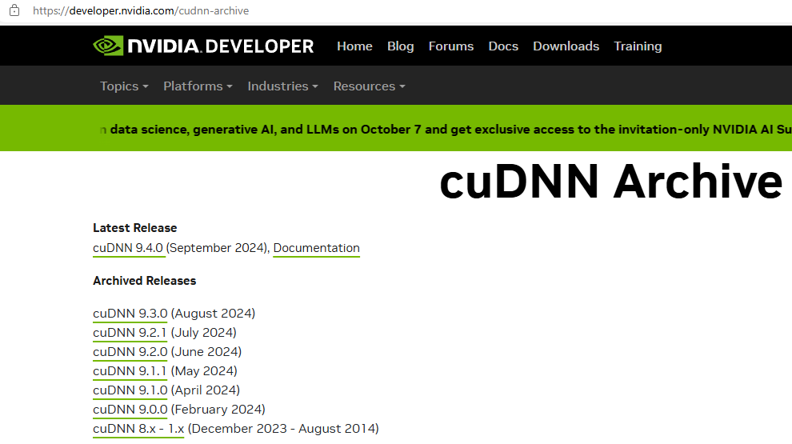

# CUDA

使用`nvcc --version`或者`nvidia-smi`查看cuda版本

## 查看CUDA版本

### torch

```python
import platform
import torch

print("python.version:", platform.python_version())
print("torch.version:", torch.__version__)
print("CUDA.version:", torch.version.cuda)
print("cuDNN.version:", torch.backends.cudnn.version())

```

> ```
> python.version: 3.9.19
> torch.version: 2.4.1
> CUDA.version: 12.1
> cuDNN.version: 90100
> ```

### paddle

```python
import platform
import paddle
import paddleocr

print("python.version:", platform.python_version())
print("PaddleOCR version:", paddleocr.__version__)
print("Paddle version:", paddle.__version__)
print("CUDA version:", paddle.version.cuda())
print("cuDNN version:", paddle.version.cudnn())

```

> ```
> python.version: 3.10.14
> PaddleOCR version: 2.7.0.3
> Paddle version: 2.6.1
> CUDA version: 11.7
> cuDNN version: 8.4.1
> ```

## 升级cuda

官方驱动地址：[NVIDIA GeForce 驱动程序 - N 卡驱动 | NVIDIA](https://www.nvidia.cn/geforce/drivers/)

下载exe按照步骤升级，重启即可：


## cuda安装

### 安装对应cuda

下载cuda：[CUDA Toolkit Archive | NVIDIA Developer](https://developer.nvidia.com/cuda-toolkit-archive)

选择版本：


下载离线版：


设置CUDA安装时临时缓存位置，可以不用改，但得与原先安装的CUDA的安装缓存位置不同：


自定义安装：


只需要选择CUDA即可：


选择安装目录，需要记住安装位置：


修改为：


勾选后继续：


完成安装：


### 环境变量

安装完成后会自动配置环境变量`nvcc --version`：


多了两个环境变量，系统变量中的`CUDA_PATH`发生了改变，增加`NVCUDASAMPLES_ROOT`：


在Path中新建两个变量，并上移：

```
D:\CUDA\v11.7\bin
D:\CUDA\v11.7\libnvvp
```

> 

### 安装对应cuDNN

下载历史cudNN：[cuDNN Archive | NVIDIA Developer](https://developer.nvidia.com/rdp/cudnn-archive)


> 登录后才能下载，cuDNN对应的版本号也需要依据实际情况进行下载，这里是`v8.9.6`

解压放到对应目录：


在`extras`目录下的`demo_suite`目录运行cmd，执行`bandwidthTest.exe`和`deviceQuery.exe`


至此， 新版本的CUDA与cudnn安装成功，可以使用该版本的CUDA进行GPU加速了

### 新版本的cuDNN

> 所有cuDNN：[cuDNN Archive | NVIDIA Developer](https://developer.nvidia.com/cudnn-archive)



> 支持下载压缩包的方式使用


> 更推荐直接使用exe文件方式使用（windows下直接兼容CUDA11和CUDA12）


自定义安装：


执行清理安装：


修改安装后的位置：


安装完成：


## 切换cuda

> 当需要切换为其它版本，只需要对环境变量进行修改即可

在系统变量`Path`中，上移需要切换的版本：

```
D:\CUDA\v12.1\bin
D:\CUDA\v12.1\libnvvp
```

> 
>
> 系统变量的`Path`比用户变量`Path`优先级更高，为了防止隐藏的问题，两个都改
>
> 

修改`CUDA_PATH`的值：

```
D:\CUDA\v12.1
```

> 

修改`NVCUDASAMPLES_ROOT`的值：

```
D:\CUDA\v12.1
```

> 

检验版本：

```
nvcc --version
```

> 

### 切换cuDNN

> 有些库对cuDNN版本有要求
>
> 

直接替换：


