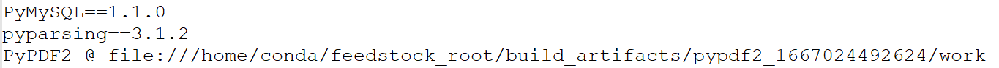

# Conda

Conda是一种通用包管理系统，旨在构建和管理任何语言和任何类型的软件。举个例子：包管理与pip的使用类似，环境管理则允许用户方便地安装不同版本的python并可以快速切换

## Anaconda

Anaconda是一个打包的集合，里面预装好了Conda、Python以及一大堆安装好的工具包，比如：numpy、pandas等，拥有众多packages、科学计算工具等，就是把很多常用的、不常用的库都安装好了

## Miniconda

Miniconda是一款小巧的python环境管理工具，安装包大约只有50M多点，其安装程序中包含conda软件包管理器和Python，以及相关的必须依赖项，对于空间要求严格的用户，Miniconda是一种选择。就只包含最基本的东西，其他的库得自己装

Miniconda与Anaconda的区别：

Miniconda是Anaconda的轻量级版本，只包含了Python和Conda，以及它们的依赖项。Miniconda的优点是其小巧且快速，用户可以自行选择并安装他们需要的软件包

- 功能角度：Anaconda ＝ Miniconda
- 大小角度：Anaconda > Miniconda
- 功能多少：Anaconda > Miniconda


Anaconda官网：[Anaconda | Unleash AI innovation and value](https://www.anaconda.com/)

Miniconda文档：[Miniconda — Anaconda documentation](https://docs.anaconda.com/free/miniconda/)，下载地址：[Index of / (anaconda.com)](https://repo.anaconda.com/miniconda/)

## Windows下安装

安装软件：


> 如果安装时没有配置环境变量的选择，需要自己配置环境变量，为如下几个
>
> ```
> D:\miniconda
> D:\miniconda\Library\mingw-w64\bin
> D:\miniconda\Library\usr\bin
> D:\miniconda\Library\bin
> D:\miniconda\Scripts
> ```

## Linux下安装

安装软件：

```
bash Miniconda3-py310_23.11.0-2-Linux-x86_64.sh
```

> 

回车确认进入下一步：

> 

一直按住回车阅读内容，直至需要同意许可条款：

> 

输入"yes"确认后输入安装目录，默认为`/root/miniconda3`：

> 

等待安装完成，提示是否需要初始化：

> 

输入"yes"进行初始化，安装完成：

> 

激活conda：

```
source ~/.bashrc
```

> - 一般软件完成安装后需要进行重启操作，该操作在Linux叫激活，其中有两种激活方式
>   - 重新登录服务器
>   - 输入以下命令：`source ~/.bashrc`

### 禁用自动激活base环境

通过查看conda的启动脚本可知，conda会在shell启动时自动激动base环境：

> 

可通过如下命令禁用conda自动激活base环境：

```
conda config --set auto_activate_base false
```

> 重新启动一个shell窗口：
>
> 
>
> 重新启用：
>
> ```
> conda config --set auto_activate_base true
> ```

### 卸载conda

删除conda的安装目录：

```
rm -rf /usr/local/miniconda
```

删除conda的环境：

```
rm -rf ~/.conda
```

删除conda的镜像配置文件：

```
rm -rf ~/.condarc
```

> 如果是重新安装，可以不用删除，因为该文件只存储的镜像信息

## 配置镜像

```
conda config --add channels https://mirrors.tuna.tsinghua.edu.cn/anaconda/pkgs/main/
conda config --add channels https://mirrors.tuna.tsinghua.edu.cn/anaconda/pkgs/free/
conda config --add channels https://mirrors.tuna.tsinghua.edu.cn/anaconda/pkgs/r/
conda config --add channels https://mirrors.tuna.tsinghua.edu.cn/anaconda/pkgs/pro/
conda config --add channels https://mirrors.tuna.tsinghua.edu.cn/anaconda/pkgs/msys2/
conda config --add channels https://mirrors.tuna.tsinghua.edu.cn/anaconda/cloud/msys2/
```

> 修改顺序，文件为`.condarc`：
>
> - Windows在`C:\Users\YourUsername`下
> - Linux在`~`(root)目录下
>
> 
>
> 清华pip包镜像：
>
> ```
> pip install page_name -i https://pypi.tuna.tsinghua.edu.cn/simple
> ```

## 基本使用

创建虚拟环境：

```
conda create --name <env_name> python=3.10
```

> `--name`可以简写为-n，`<env_name>`为虚拟环境名

查看所有虚拟环境：

```
conda env list
```

激活虚拟环境：

```
conda activate <env_name>
```

删除虚拟环境：

```
conda remove --name <env_name> --all
```

> 使用示例：
>
> ```
> conda create -n chatglm3-demo python=3.10
> conda activate chatglm3-demo
> pip install -r requirements.txt -i https://pypi.tuna.tsinghua.edu.cn/simple
> ```

## 生成requirements.txt

```
pip freeze > requirements.txt
```

> - `freeze`是 pip 下的一个子命令，它的作用是输出一个格式化的列表，列出了当前环境中通过 pip 安装的且已发布的每个包的名称和版本
> - `>`用于重定向，将`pip freeze`命令的输出重定向到`requirements.txt`文件中
>
> 对于使用conda之后再使用此命令，可能会导致一个问题，导出后发现会出现@file，而不显示具体的版本号的情况
>
> 
>
> 此时不能将生成的`requirements.txt`文件在另一台电脑上使用
>
> 
>
> 使用此命令生成一个只包含包名称和版本号的`requirements.txt`文件，不包含任何源URL
>
> ```
> pip list --format=freeze > requirements.txt
> ```
>
> 
>
> 对于导出的`requirements.txt`，如果需要在新的python虚拟环境中导入，应该使用此命令，该命令会使用该环境中的`pip`来安装包，确保安装的包与conda环境兼容
>
> ```
> python -m pip install -r requirements.txt -i https://pypi.tuna.tsinghua.edu.cn/simple
> ```
>

## 新建环境

```
conda create --name <env_name> python=3.10.13
```

启用环境：

```
conda activate <new_env_name>
```

## 拷贝环境

```
conda create --name <new_env_name> --clone <old_env_name>
```

### 导出依赖

导出`environment_name.yml`文件：

```
conda env export > environment.yml
```

导入`environment_name.yml`文件：

```
conda env create -f environment.yml
```

> 之前是把所有依赖都放在`requirements.txt`文件中，直接通过`pip install requirements.txt -i https://pypi.tuna.tsinghua.edu.cn/simple`来通过国内的镜像源来下载依赖
>
> 对于`environment.yml`文件来说如果需要指定镜像，需要修改`environment.yml`原文件：
>
> - `name`：环境的名称
>
> - `channels`：通道列表(导出机器所使用的所有通道)
>
> - `dependencies`：依赖项列表
>
> - `pip`：用于指定需要通过pip安装的包
>
> - `prefix`：环境的安装路径。可选参数，如果想要指定环境安装的位置，使用其值指定，指定后，name也需要同时指定，否则没有名称(需要指定路径的方式删除`conda remove -p D:\anaconda\envs\OCR_api_1 --all`)
>
>   - ```
>     conda env create -f environment.yml --prefix /path/to --name test
>     ```
>
> ```yaml
> name: OCR_api_1
> channels:
>   - defaults
> dependencies:
>   - annotated-types=0.6.0=py310haa95532_0
>   ......
>   - xz=5.4.6=h8cc25b3_0
>   - zlib=1.2.13=h8cc25b3_0
>   - pip:
>       - astor==0.8.1
>       ......
>       - werkzeug==3.0.1
>       - xmltodict==0.13.0
> prefix: D:\anaconda\envs\OCR_api_1
> 
> ```
>
> 在最后一行添加镜像：
>
> ```yaml
> name: OCR_api_1
> channels:
>   - defaults
> dependencies:
>   - annotated-types=0.6.0=py310haa95532_0
>   ......
>   - xz=5.4.6=h8cc25b3_0
>   - zlib=1.2.13=h8cc25b3_0
>   - pip:
>       - astor==0.8.1
>       ......
>       - werkzeug==3.0.1
>       - xmltodict==0.13.0
>       - -i https://pypi.tuna.tsinghua.edu.cn/simple
> prefix: D:\anaconda\envs\OCR_api_1
> 
> ```
>
> 再启动即可：
>
> 

### 打包环境

安装打包工具：

```
conda install conda-pack
```

打包虚拟环境：

```
conda pack -n <env_name>
```

创建新环境目录：

```
mkdir <env_name>
```

还原环境：

```
tar -zxvf <env_name>.tar.gz -C <env_name>
```

> 直接将此文件解压到conda安装目录的envs目录即可完成虚拟环境导入
>
> - Conda-Pack打包环境方式在目标计算机无法联网或者网络不畅时很好用，将Conda环境及其所有依赖项打包成一个压缩文件。这个压缩文件包含了所有必要的二进制文件和库，可以在没有网络连接或网络连接不稳定的环境中部署，但这些文件在不同的操作系统上可能不兼容
> - Conda导出`environment.yml`的方式非常适合在不同平台和操作系统之间重新创建环境，这个文件包含了环境的名称和所有安装的包及其版本

## 生成environment.yml

```
conda env export > environment.yml
```

导入`environment.yml`：

```
conda env create -f environment.yml
```

> 导入`requirements.txt`：
>
> ```
> conda create --name new_net_env --file requirements.txt
> ```

## 常用命令


> 使用`conda install`命令时，所安装的包将仅限于该环境，不会影响其他环境或全局Python安装。这是conda环境管理的一个重要特性，有助于避免不同项目间的依赖冲突 
>
> 清除缓存：
>
> ```
> conda clean --all
> ```
>
> 清除包缓存：
>
> ```
> conda clean --packages
> ```
>
> 清除索引缓存：
>
> ```
> conda clean --index-cache
> ```

## 安装优先级

> 通常在使用Conda管理的Python环境时，推荐使用`conda install`而不是`pip install`来安装那些可能依赖于系统环境变量的软件包
>
> - **环境隔离**：Conda设计用来创建独立的、可复现的环境。使用`conda install`确保了包的依赖关系在Conda环境中得到了妥善管理，而不是依赖于外部系统环境
> - **二进制兼容性**：Conda提供了许多预编译的二进制包，这些包是为特定平台和体系结构编译的，确保了与Conda环境的兼容性
> - **系统依赖性**：有些包需要系统级的依赖，例如编译器和库文件。Conda可以管理这些依赖，而`pip`则可能无法处理
> - **环境变量**：Conda可以设置和管理环境变量，确保软件包能够在 Conda环境中正确运行。如果使用`pip`安装，可能需要手动设置环境变量，这可能会导致与系统其他部分的冲突
> - **更新和回滚**：Conda提供了更好的包版本管理和环境回滚功能，这在处理复杂依赖关系时特别有用
>
> 也有一些情况，可能`pip install`更合适
>
> - 当某个包在Conda的官方通道中没有提供，但在PyPI上可用时
> - 当需要安装一个包的特定版本，而Conda只提供了其他版本时
> - 当在开发一个Python包，并且想要安装开发版本的依赖时
>
> 注意：对于一些依赖于环境变量的库包，在配置环境变量之后需要重启IDE才能使环境变量生效

## 环境对比

- Virtualenv环境：可以用于添加本地存在的conda虚拟环境，指定conda虚拟环境下的python.exe即可添加此虚拟环境


- Conda环境：PyCharm在conda环境的基础上再套一层代理，这里创建的环境会同步到conda虚拟环境中(新版本的PyCharam可以选择`使用现有环境`，并读取conda中所有的虚拟环境，直接选择添加即可)


- 系统解释器：使用系统中指定的python.exe执行文件，可以指定全局的Python环境


- 全局Python环境：全局的Python环境变量

> 如果没有安装全局的Python环境，而是只安装了Conda，那么使用`conda activate`命令可以切换到不同的Conda环境，从而实现Python环境的全局切换。如果已经有了全局Python环境，使用`conda activate`命令只会临时激活此环境
>
> 
>
> debug报错`python debug Process finished with exit code -1073741819 (0xC0000005)`问题，可以尝试关闭对PyQt的兼容：
>
> 