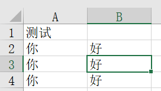

# openpyxl

库的差异

> - 如果文件是后缀xls的话，用xlwt和xlrd进行读写
>
> - 如果文件后缀是xlsx的话，用openpyxl进行读写

安装openpyxl库

```
pip install openpyxl -i https://pypi.tuna.tsinghua.edu.cn/simple
```

导入包

```python
import openpyxl
```

方法：

- `wb = openpyxl.Workbook()`：新建新的工作簿

- `wb = openpyxl.load_workbook("工作簿全路径")`：加载存在的工作簿

- `wb.sheetnames`：获取所有工作表名称

- `ws = wb.active`：加载工作表，默认为第一张sheet

- `num_rows = ws.max_row`：获取总行数

- `num_cols = ws.max_column`：获取总列数

- `ws.insert_rows(1)`：在第一行插入空白行，原本第一行的列会向下移变成第二行，以此类推

- `wb.create_sheet(index=0, title="新工作表")`：新的工作表会被插入到工作簿的最前面，也就是索引位置0，并命名为"新工作表"

- `ws = wb.worksheets[1]`：加载第二张表

- `ws['A1'] = "province_name"`：设置单元格"A1"的值为"province_name"

- `ws.append(list)`：追加写入一行内容

- `wb.save("工作簿全路径")`：保存数据

- `ws_range = ws.iter_rows(min_row=1, max_row=3, min_col=1, max_col=2)`：获取工作表单元格区域（**第一行第一个到第三行第二个区域**），循环遍历输出方式为：

  - ```python
        ws_range = ws.iter_rows(min_row=1, max_row=3, min_col=1, max_col=2)
        for row in ws_range:
            for col in row:
                print(col.value)
    ```

- `ws.cell(row=i, column=j).value`：获取到第i行，第j列的单元格数据(**并非从0开始，无需减一**)

  - ```python
        for row in range(1, ws.max_row + 1):
            for col in range(1, ws.max_column + 1):
                print(ws.cell(row=row, column=col).value)
    ```

- `ws.delete_rows(index)`：删除指定的行，下面的行**会立即往前移**，所以如果要删除多行不能边读边删，应该保存需要删除的行，然后结束从底往前删

  - ```py
    def deal_xlsx(sheet):
        # 迭代行
        ws_range = sheet.iter_rows(min_row=1, max_row=sheet.max_row, min_col=1, max_col=1)
        delete_list = []
        index = 1
        for row in ws_range:
            for col in row:
                # print(col.value)
                # 如果此行的第一列的值不包含id关键字，则将其删除，这里对于删除后往上移的一行如果为None会丢失迭代
                if '0' not in str(col.value) and '编码' not in str(col.value):
                    delete_list.append(index)
                index = index + 1
        # 逆序
        delete_list = delete_list[::-1]
        for i in delete_list:
            sheet.delete_rows(i)
    ```

- `yellow_fill = PatternFill(start_color='FFFF00', end_color='FFFF00', fill_type='solid')`：颜色填充对象，修改`fill`属性填充单元格为黄色`ws.cell(row=n_row_book, column=n_col_book).fill = yellow_fill`

## 对象类

```python
from typing import Dict, List

import openpyxl
from datetime import datetime
import os

# 未指定时最大允许读取的行
MAX_LENGTH = 100_000


class ExcelObject:
    def __init__(self, xlsx_path: str, ws_number: int = 1):
        # 判断字符串是否结尾为格式
        if xlsx_path.endswith(".xlsx"):
            self.xlsx_path = xlsx_path
        else:
            self.xlsx_path = xlsx_path + ".xlsx"

        # 如果没有此文档，则新建文档
        if not os.path.exists(self.xlsx_path):
            self.wb = openpyxl.Workbook()
        else:
            try:
                self.wb = openpyxl.load_workbook(self.xlsx_path)
            except Exception:
                raise Exception(f"读取xlsx文件出错，请检查文件路径：{self.xlsx_path}")

        # 指定工作簿
        self.ws = self.switch_ws(ws_number)

        # 设置最大的行和列
        if self.ws.max_row >= MAX_LENGTH:
            self.max_row = MAX_LENGTH
        else:
            self.max_row = self.ws.max_row
        if self.ws.max_column >= MAX_LENGTH:
            self.max_col = MAX_LENGTH
        else:
            self.max_col = self.ws.max_column

    def get_wb(self):
        return self.wb

    def switch_ws(self, number: int = 1):
        wb = self.get_wb()
        if len(wb.worksheets) < number - 1:
            count = number - len(wb.worksheets)
            for i in range(count):
                wb.create_sheet()
        self.ws = wb.worksheets[number - 1]
        return self.ws

    # 保存文档
    def save_xlsx(self, new_path: str = None) -> str:
        if new_path is None:
            obj_path = self.xlsx_path
        else:
            if new_path.endswith(".xlsx"):
                obj_path = new_path
            else:
                obj_path = new_path + ".xlsx"
        # 尝试保存
        try:
            self.get_wb().save(obj_path)
        except Exception:
            now = datetime.now()
            formatted_time = now.strftime("%Y-%m-%d %H-%M-%S")
            # 重命名保证保存成功
            obj_path = obj_path.replace(".xlsx", f"-副本{formatted_time}.xlsx")
            self.get_wb().save(obj_path)
            raise Exception(f"保存出错，可能由于你没有关闭文档导致出错\n已将文件保存为副本：{obj_path}")
        return obj_path

    # 获取某一列的值，指定列和行
    def get_column(self, col: int, start_row: int = 1, end_row: int = 0) -> list[str]:
        result_list = []
        # 如果没有指定结尾，或者指定出错了，直接返回所有的
        if end_row > start_row:
            ws_range = self.ws.iter_rows(min_row=start_row, max_row=self.max_row, min_col=col, max_col=col)
        else:
            ws_range = self.ws.iter_rows(min_row=start_row, max_row=end_row, min_col=col, max_col=col)
        for row in ws_range:
            for col in row:
                if col.value is not None:
                    # print(col.value)
                    result_list.append(str(col.value).strip())
                else:
                    result_list.append('')
        return result_list

    # 获取某一行的值
    def get_row(self, row: int, start_col: int = 1, end_col: int = 0) -> list[str]:
        result_list = []
        # 如果没有指定结尾，或者指定出错了，直接返回所有的
        if start_col > end_col:
            ws_range = self.ws.iter_rows(min_row=row, max_row=row, min_col=start_col, max_col=self.max_col)
        else:
            ws_range = self.ws.iter_rows(min_row=row, max_row=row, min_col=start_col, max_col=end_col)
        for row in ws_range:
            for col in row:
                if col.value is not None:
                    # print(col.value)
                    result_list.append(str(col.value).strip())
                else:
                    result_list.append('')
        return result_list

    # 按行读取，获取一个范围的数据
    def get_range_by_row(self, start_row: int = 1, end_row: int = 0, start_col: int = 1, end_col: int = 0,
                         filter_empty: bool = False) -> list[list[str]]:
        result_list = []
        if start_col > end_col:
            for_end = self.max_row
        else:
            for_end = end_row
        for i in range(start_row, for_end):
            result_list.append(self.get_row(i, start_col, end_col))
        if filter_empty:
            # 过滤掉所有元素都为''的列表
            result_list = [i for i in result_list if not all(j == "" for j in i)]
        return result_list

    # 按列读取，获取一个范围的数据
    def get_range_by_col(self, start_row: int = 1, end_row: int = 0, start_col: int = 1, end_col: int = 0,
                         filter_empty: bool = False) -> list[list[str]]:
        result_list = []
        if start_row > end_row:
            for_end = self.max_row
        else:
            for_end = end_col
        for i in range(start_col, for_end):
            result_list.append(self.get_column(i, start_row, end_row))
        if filter_empty:
            # 过滤掉所有元素都为''的列表
            result_list = [i for i in result_list if not all(j == "" for j in i)]
        return result_list

    # 按行读取，获取一个范围的数据 以dict_col为key
    def get_range_by_row_dict(self, dict_col: int, start_row: int = 1, end_row: int = 0, start_col: int = 1,
                              end_col: int = 0,
                              filter_empty: bool = False) -> dict[str, list[str]]:
        result_dict = {}
        result_list = self.get_range_by_row(start_row, end_row, start_col, end_col, filter_empty)
        dict_col_list = self.get_range_by_col(start_row, end_row, dict_col, dict_col, filter_empty)[0]
        for key, value in zip(dict_col_list, result_list):
            result_dict[key] = value
        return result_dict

    # 按列读取，获取一个范围的数据 以dict_row为key
    def get_range_by_col_dict(self, dict_row: int, start_row: int = 1, end_row: int = 0, start_col: int = 1,
                              end_col: int = 0,
                              filter_empty: bool = False) -> dict[str, list[str]]:
        result_dict = {}
        result_list = self.get_range_by_col(start_row, end_row, start_col, end_col, filter_empty)
        dict_row_list = self.get_range_by_row(dict_row, dict_row, start_col, end_col, filter_empty)[0]
        for key, value in zip(dict_row_list, result_list):
            result_dict[key] = value
        return result_dict

    # 删除此行的数据
    def clean_row(self, row):
        self.ws.delete_rows(row)

    # 删除所有行的数据
    def clean_all_row(self):
        for i in range(self.max_row, 0, -1):
            self.clean_row(i)

    # 获取到第i行，第j列的单元格数据
    def get_cell(self, row: int, col: int):
        return self.ws.cell(row=row, column=col).value

    # 写入到第i行，第j列的单元格数据
    def write_cell(self, new_value, row: int, col: int):
        self.ws.cell(row=row, column=col).value = str(new_value)

    # 获取写入的行列表
    def _get_list(self, result_list: list, current_list: list):
        # 到了递归的尽头
        if current_list != [] and all(
                isinstance(item, str) or isinstance(item, int) or item is None for item in current_list):
            result_list.append(current_list)
        # 如果存在一个为列表则继续递归
        if current_list != [] and any(isinstance(item, list) for item in current_list):
            str_list = []
            for index, i in enumerate(current_list):
                # 如果是字符串
                if isinstance(i, str):
                    str_list.append(i)
                # 清空str_list并继续递归
                elif isinstance(i, list):
                    if str_list:
                        result_list.append(str_list)
                        str_list = []
                    self._get_list(result_list, i)
                if index + 1 == len(current_list):
                    if str_list:
                        result_list.append(str_list)

    def write_append_list_by_row(self, current_list: list, start_row: int = 1, start_col: int = 1,
                                 is_clean_ws: bool = False):
        """
        将List写入表格中，可以进行List嵌套，按行
        :param current_list: 数据列表
        :param start_row: 开始的行
        :param start_col: 开始的列
        :param is_clean_ws: 是否清空工作簿
        :return:
        """
        if is_clean_ws:
            self.clean_all_row()
        # 构建出以'行'为开始的List嵌套列表
        row_list_list = []
        self._get_list(row_list_list, current_list)
        for row_index, current_row_list in enumerate(row_list_list):
            # 写入指定的列中
            for col_index, cell_value in enumerate(current_row_list):
                self.write_cell(cell_value, row_index + start_row, col_index + start_col)

    def write_append_list_by_col(self, current_list: list, start_row: int = 1, start_col: int = 1,
                                 is_clean_ws: bool = False):
        """
        将List写入表格中，可以进行List嵌套，按列
        :param current_list: 数据列表
        :param start_row: 开始的行
        :param start_col: 开始的列
        :param is_clean_ws: 是否清空工作簿
        :return:
        """
        if is_clean_ws:
            self.clean_all_row()
        # 构建出以'行'为开始的List嵌套列表
        col_list_list = []
        self._get_list(col_list_list, current_list)
        for col_index, current_col_list in enumerate(col_list_list):
            # 写入指定的列中
            for row_index, cell_value in enumerate(current_col_list):
                self.write_cell(cell_value, row_index + start_row, col_index + start_col)

```

## 示例代码

```python
import openpyxl
import os

# 创建一个新的
if not os.path.exists("工作簿.xlsx"):
    # 加载工作簿
    wb = openpyxl.Workbook()
    # 加载工作表
    ws = wb.active

    # 设置单元格数据
    ws['A1'] = "测试"
    # 追加一行的数据
    list = ['你', '好']
    ws.append(list)
    wb.save("工作簿.xlsx")
# 如果有，则追加数据
else:
    wb = openpyxl.load_workbook("工作簿.xlsx")
    ws = wb.active
    # 追加一行的数据
    list = ['你', '好']
    ws.append(list)
    wb.save("工作簿.xlsx")

    # 打印数据(第一行第一个到第三行第二个区域)
    ws_range = ws.iter_rows(min_row=1, max_row=3, min_col=1, max_col=2)

    for row in ws_range:
        for col in row:
            print(col.value)

```

> ```
> 测试
> None
> 你
> 好
> 你
> 好
> ```
>
> 

## 参考博客

- [【Python】使用Python操作XLSX数据表_python xlsx_爱吃糖的范同学的博客-CSDN博客](https://blog.csdn.net/weixin_52058417/article/details/123266853)
- [python--xlsx文件的读写_python xlsx_囊萤映雪的萤的博客-CSDN博客](https://blog.csdn.net/liuyingying0418/article/details/101066630)
