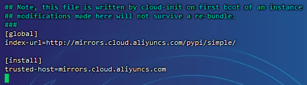

# pip

## 使用镜像

> pip使用的是国外的镜像，在下载的时候速度非常慢，使用国内清华大学的源，地址为：

```
https://pypi.tuna.tsinghua.edu.cn/simple
```

可以直接在pip命令中使用-i参数来指定镜像地址，例如：

```
pip3 install numpy -i https://pypi.tuna.tsinghua.edu.cn/simple
```

> 其它国内镜像：
>
> - 中国科学技术大学：`https://pypi.mirrors.ustc.edu.cn/simple`
> - 豆瓣：`http://pypi.douban.com/simple/`
> - 阿里云：`http://mirrors.aliyun.com/pypi/simple/`

## 全局配置

> 全局配置对conda下的python环境也是生效的

### Linux全局配置

> Linux/Mac环境中，配置文件位置在`~/.pip/pip.conf`（如果不存在创建该目录和文件）

```
mkdir ~/.pip
```

打开配置文件`~/.pip/pip.conf`：

```
vim ~/.pip/pip.conf
```

> 阿里云的服务器会自带阿里云镜像配置
>
> 

修改如下：

```
[global]
index-url = https://pypi.tuna.tsinghua.edu.cn/simple

[install]
trusted-host = https://pypi.tuna.tsinghua.edu.cn
```

查看镜像配置：

```
pip3 config list
```

> ```
> (base) [root@iZf8zaso97ymfxtjl94idqZ .pip]# pip3 config list
> global.index-url='https://pypi.tuna.tsinghua.edu.cn/simple'
> install.trusted-host='https://pypi.tuna.tsinghua.edu.cn'
> ```

### Windows全局配置

> 需要在当前对用户目录下（`C:\Users\xx\pip`，xx表示当前使用用户）创建一个`pip.ini`

在`pip.ini`文件中输入以下内容：

```
[global]
index-url = https://pypi.tuna.tsinghua.edu.cn/simple

[install]
trusted-host = https://pypi.tuna.tsinghua.edu.cn
```

查看镜像配置：

```
pip3 config list
```

> ```
> (base) C:\Users\yxx>pip3 config list
> global.index-url='https://pypi.tuna.tsinghua.edu.cn/simple'
> install.trusted-host='https://pypi.tuna.tsinghua.edu.cn'
> ```

## 常用命令

安装`whl`包：

```
pip install [package.whl]
```

列出已安装的包：

```
pip list
```

检查是否有依赖冲突：

```
pip check
```

展示包的信息：

```
pip show [package]
```

搜索包：

```
pip search [search_query]
```

> 命令已废弃，有需要直接去官网搜索：[Search results · PyPI](https://pypi.org/search/)

清除缓存的包：

```
pip cache purge
```

导出当前的包列表：

```
pip freeze > requirements.txt
```

> 不包含源url：
>
> ```
> pip list --format=freeze > requirements.txt
> ```

依据`requirements.txt`安装包：

```
pip install -r requirements.txt
```

配置pip：

```
pip config set global.index-url [mirror_url]
```

> 会修改全局配置文件

查看配置：

```
pip config list
```

查看帮助：

```
pip --help
```

