# RabbitMQ入门

## 同异步调用

同步调用：

> 优点：时效性较强，可以立即得到结果
>
> 缺点：
>
> - 耦合度高
> - 性能和吞吐能力下降
> - 有额外的资源消耗
> - 有级联失败问题

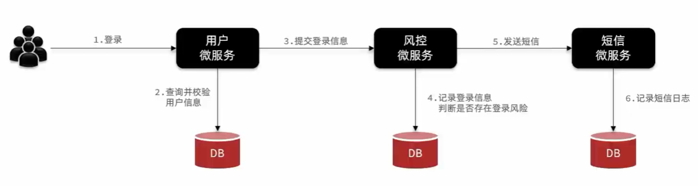

异步调用：

> 优点：
>
> - 耦合度低
> - 吞吐量提升
> - 故障隔离
> - 流量削峰
>
> 缺点：
>
> - 依赖于Broker的可靠性、安全性、吞吐能力
> - 架构复杂了，业务没有明显的流程线，不好追踪管理

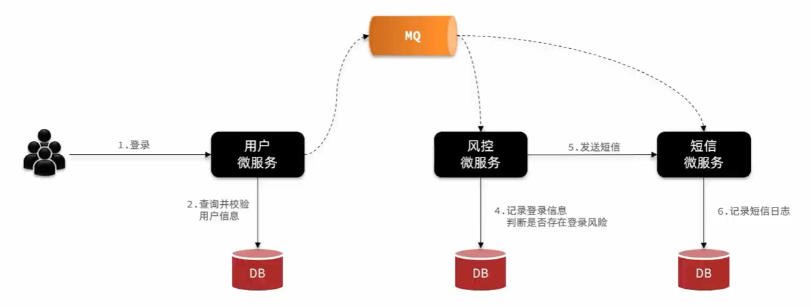

## MQ

> MQ （MessageQueue），中文是消息队列，字面来看就是存放消息的队列。也就是事件驱动架构中的Broker

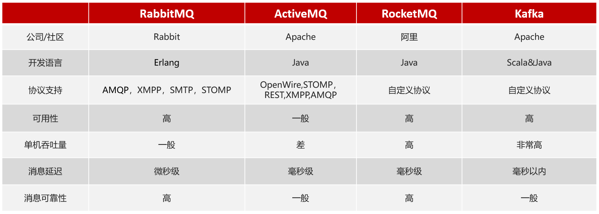

## RabbitMQ结构

- `publisher`：消息发送者
- `consumer`：消息的消费者
- `exchange`：交换机，负责路由信息
- `queue`：队列，存储消息
- `virtual host`：虚拟主机，是对queue、exchange等资源的逻辑分组，起到数据隔离的作用
- `channel`：操作MQ的工具

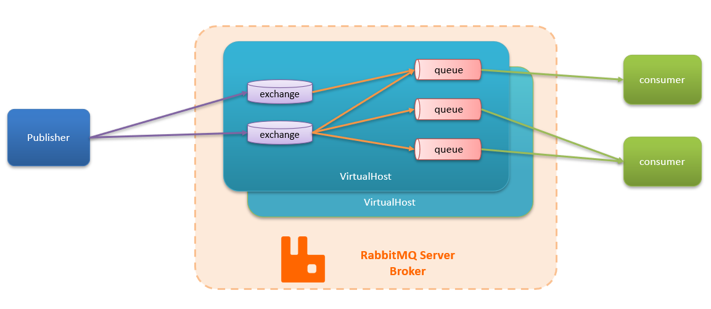

## RabbitMQ安装

> 官网：https://www.rabbitmq.com/

上传到虚拟机，本地解压：

```
cd /usr/local
mkdir RabbitMQ
cd RabbitMQ

docker load -i mq.tar
```

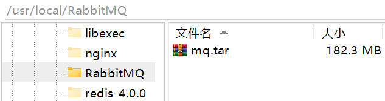

> 也可以仓库拉取：
>
> ```
> docker pull rabbitmq:3.8-management
> ```

使用docker命令运行MQ容器：

```
docker run -d \
  -e RABBITMQ_DEFAULT_USER=itcast \
  -e RABBITMQ_DEFAULT_PASS=123321 \
  -v mq-plugins:/plugins \
  --name mq \
  --hostname mq \
  -p 15672:15672 \
  -p 5672:5672 \
  rabbitmq:3.8-management
```

> 命名数据卷目录：
>
> ```
> /usr/local/docker/mq-plugins
> ```

访问管理端：

```
192.168.138.100:15672
```

> 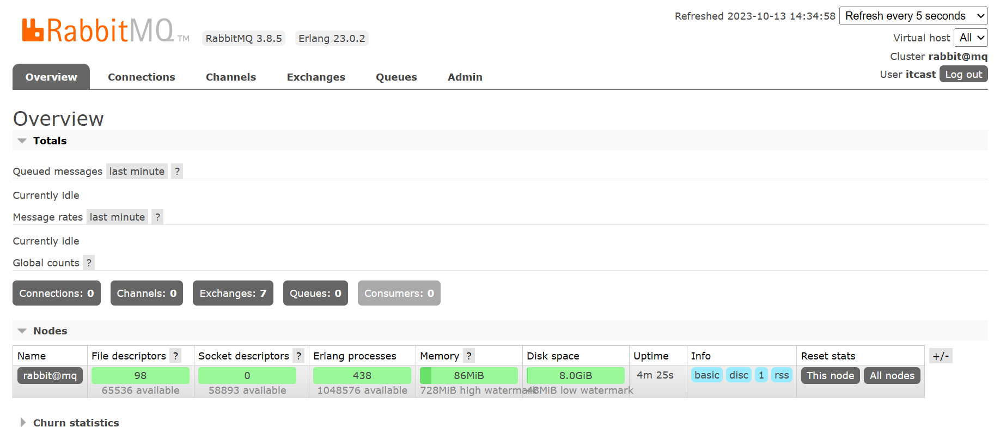

## 快速入门

### 新建队列

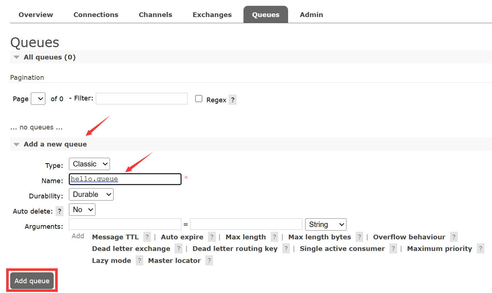

### 绑定交换机

选择一个交换机：

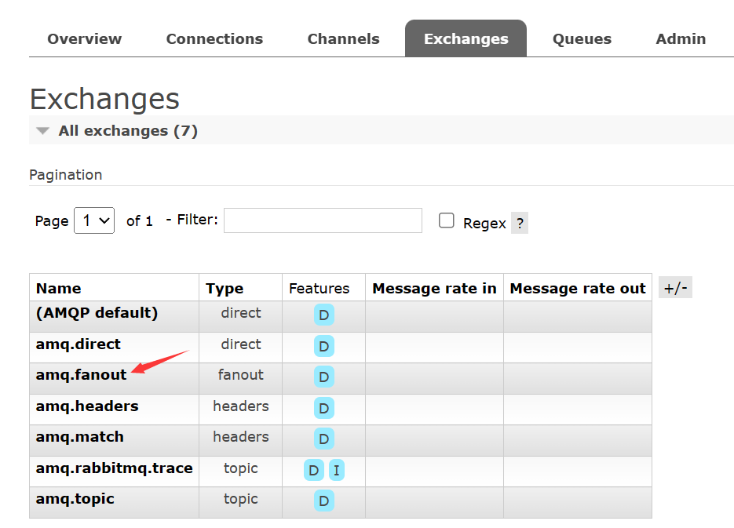

绑定新建的队列：

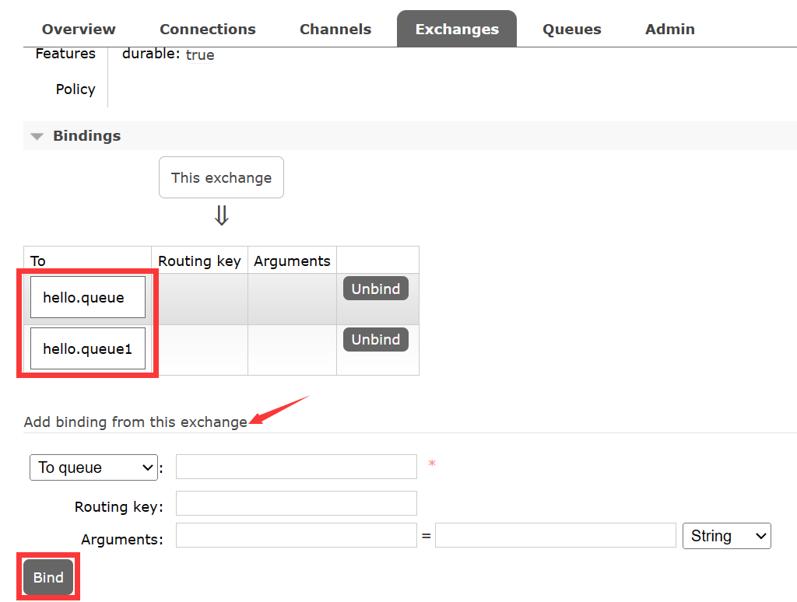

### 发送消息

使用`amp.fanout`交换机发送消息，发送到绑定其的所有队列中：

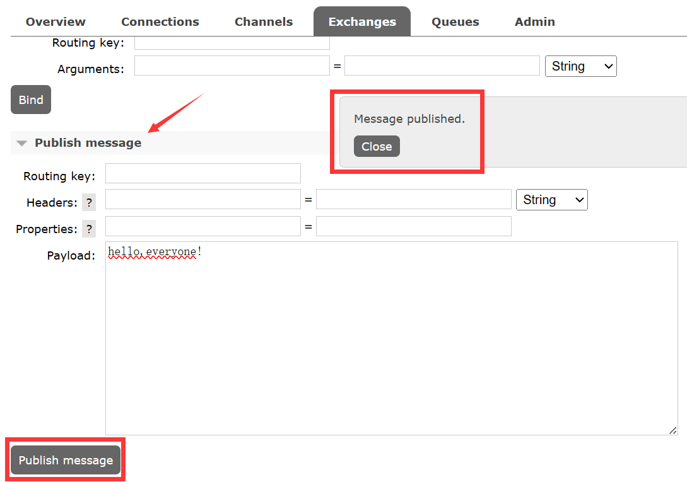

### 查看消息

选择一个队列：

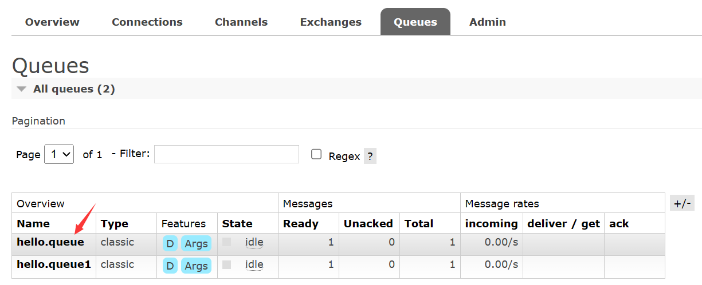

查看队列中的消息：

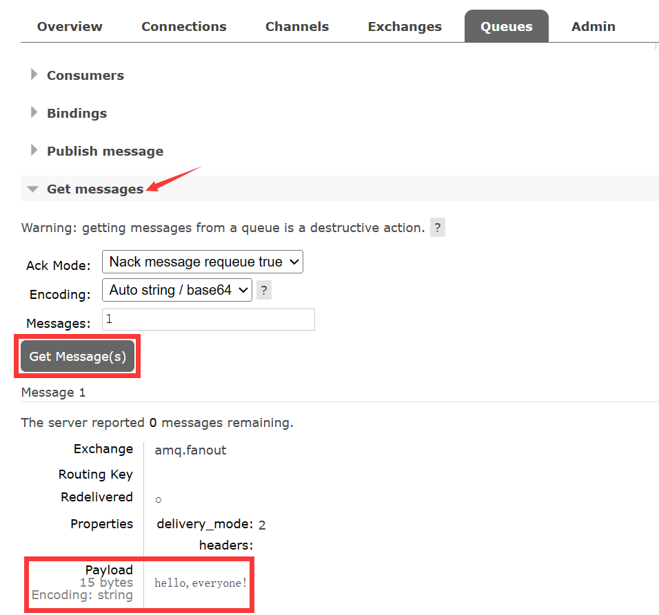