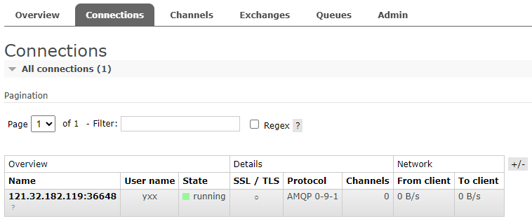
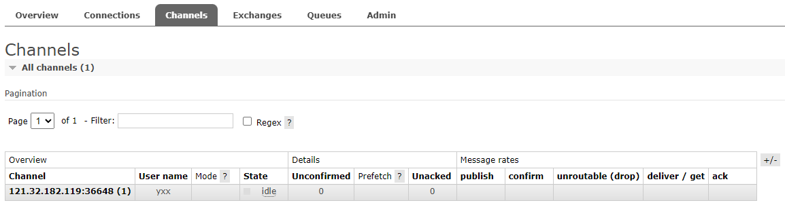
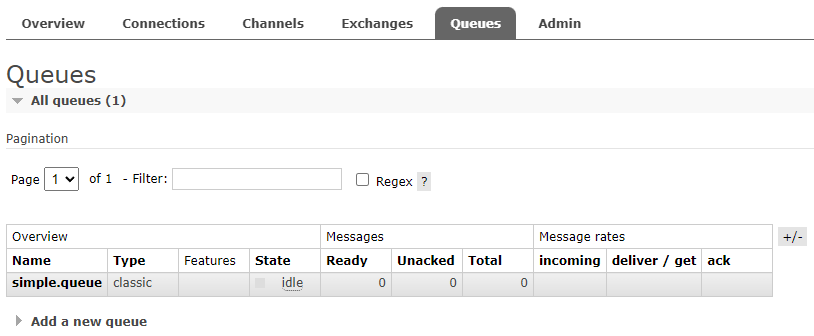
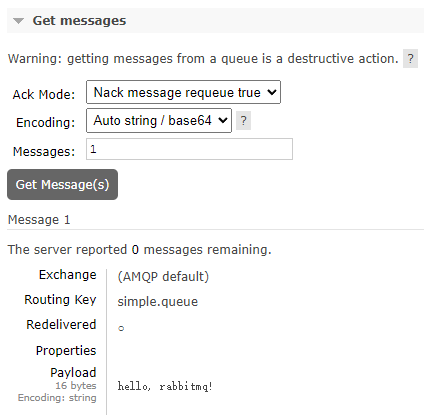

# SpringAMQP


pom.xml

```xml
        <!-- AMQP依赖，包含RabbitMQ -->
        <dependency>
            <groupId>org.springframework.boot</groupId>
            <artifactId>spring-boot-starter-amqp</artifactId>
        </dependency>
```

## 基本使用

发送者`PublisherTest.java`

```java
import com.rabbitmq.client.Channel;
import com.rabbitmq.client.Connection;
import com.rabbitmq.client.ConnectionFactory;
import org.junit.jupiter.api.Test;

import java.io.IOException;
import java.util.concurrent.TimeoutException;

public class PublisherTest {
    @Test
    public void testSendMessage() throws IOException, TimeoutException {
        // 连接工厂
        ConnectionFactory factory = new ConnectionFactory();
        factory.setHost("47.113.186.151");
        factory.setPort(5672);
        factory.setVirtualHost("/");
        factory.setUsername("yxx");
        factory.setPassword("xxxxx");

        // 建立连接
        Connection connection = factory.newConnection();
        // 创建通道Channel
        Channel channel = connection.createChannel();
        // 创建队列
        String queueName = "simple.queue";
        channel.queueDeclare(queueName, false, false, false, null);

        // 发送消息
        String message = "hello, rabbitmq!";
        channel.basicPublish("" , queueName, null, message.getBytes());
        System.out.println("发送消息成功：【" + message + "】");

        // 关闭通道和连接
        channel.close();
        connection.close();
    }
}
```

> 建立连接：
>
> 
>
> 创建通道：
>
> 
>
> 创建队列：
>
> 
>
> 发送消息：
>
> 
>
> ```
> 发送消息成功：【hello, rabbitmq!】
> ```

接收者`ConsumerTest.java`：

```java
import com.rabbitmq.client.*;
import org.junit.jupiter.api.Test;

import java.io.IOException;
import java.util.concurrent.TimeoutException;

public class ConsumerTest {
    @Test
    public void testReceiver() throws IOException, TimeoutException {
        // 连接工厂
        ConnectionFactory factory = new ConnectionFactory();
        factory.setHost("47.113.186.151");
        factory.setPort(5672);
        factory.setVirtualHost("/");
        factory.setUsername("yxx");
        factory.setPassword("xxxxx");

        // 建立连接
        Connection connection = factory.newConnection();
        // 创建通道Channel
        Channel channel = connection.createChannel();
        // 创建队列(为了避免不存在，rabbitmq不会重复创建)
        String queueName = "simple.queue";
        channel.queueDeclare(queueName, false, false, false, null);

        // 订阅消息
        channel.basicConsume(queueName, true, new DefaultConsumer(channel) {
            @Override
            public void handleDelivery(String consumerTag, Envelope envelope, AMQP.BasicProperties properties, byte[] body) throws IOException {
                // 处理消息
                String message = new String(body);
                System.out.println("接收到消息：【" + message + "】");
            }
        });
        System.out.println("等待接收消息。。。");

        // 关闭通道和连接
        channel.close();
        connection.close();
    }
}
```

> ```
> 等待接收消息。。。
> 接收到消息：【hello, rabbitmq!】
> ```

## SpringBoot集成

配置RabbitMQ服务端信息：

```yaml
spring:
  rabbitmq:
    host: 127.0.0.1 # 主机名
    port: 5672 # 端口
    virtual-host: /hmall # 虚拟主机
    username: hmall # 用户名
    password: 123 # 密码
```

发送者`SpringAmqpTest.java`：

```java
import org.junit.jupiter.api.Test;
import org.springframework.amqp.rabbit.core.RabbitTemplate;
import org.springframework.beans.factory.annotation.Autowired;
import org.springframework.boot.test.context.SpringBootTest;

@SpringBootTest
public class SpringAmqpTest {

    @Autowired
    private RabbitTemplate rabbitTemplate;

    @Test
    public void testSimpleQueue() {
        String queueName = "simple.queue";
        String message = "hello，spring amqp";
        rabbitTemplate.convertAndSend(queueName, message);
    }
}
```

SpringAMQP把消息传递给当前方法，`SpringRabbitListener.java`：

```java
import org.springframework.amqp.rabbit.annotation.RabbitListener;
import org.springframework.stereotype.Component;

@Component
public class SpringRabbitListener {

    @RabbitListener(queues = "simple.queue")
    public void listenSimpleQueueMessage(String msg) {
        System.out.println("spring 消费者接收到消息：【" + msg + "】");
    }
}
```

> ```
> spring 消费者接收到消息：【hello，spring amqp】
> ```
