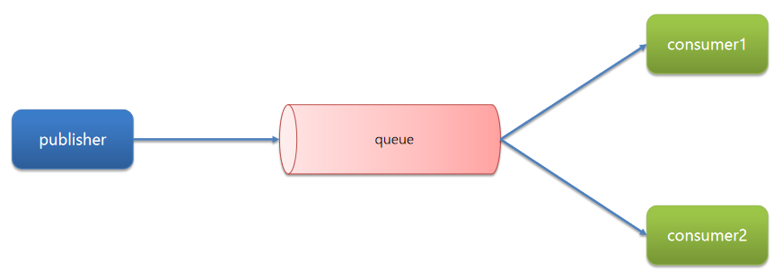
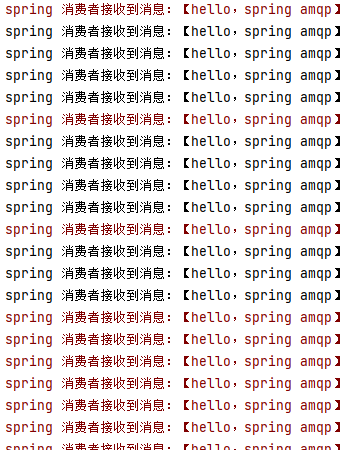
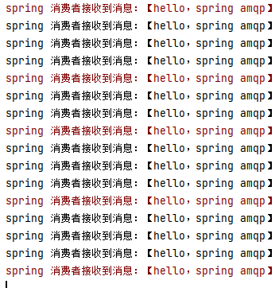
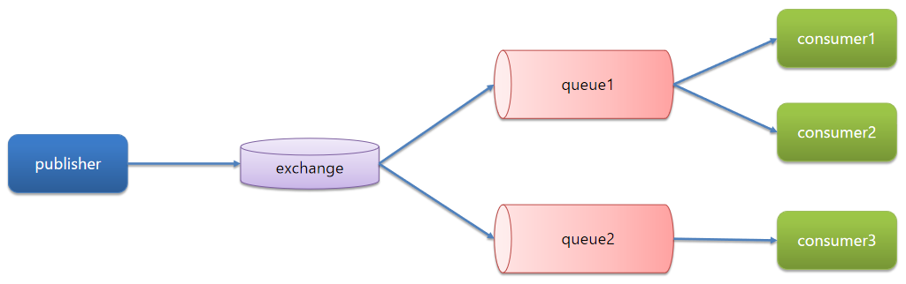
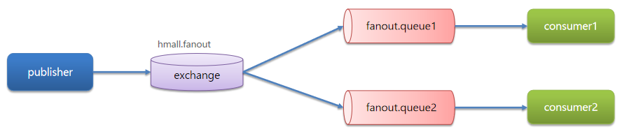
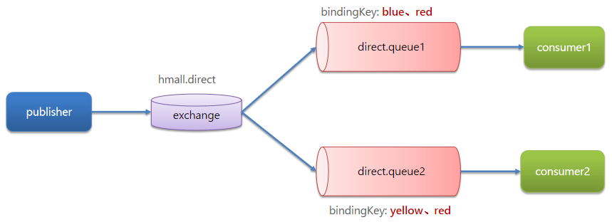
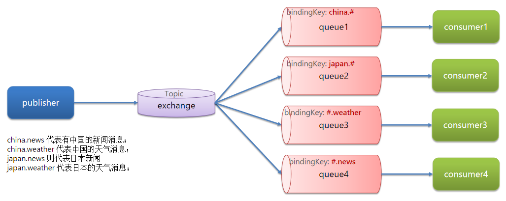

# 任务模型

## BasicQueue简单队列模型


## WorkQueuee工作队列模型

> Work queues，任务模型。简单来说就是让多个消费者绑定到一个队列，共同消费队列中的消息



基本思路如下：

- 在`RabbitMQ`的控制台创建一个队列，名为`work.queue`
- 在`publisher`服务中定义测试方法，发送50条消息到`work.queue`
- 在`consumer`服务中定义两个消息监听者，都监听`work.queue`队列
- 消费者1每秒处理40条消息，消费者2每秒处理5条消息

SpringAmqpTest.java

```java
    @Test
    public void testSimpleQueue() {
        String queueName = "simple.queue";
        String message = "hello，spring amqp";
        for (int i = 0; i < 500; i++) {
            rabbitTemplate.convertAndSend(queueName, message);
        }
    }
```

SpringRabbitListener.java

```java
@Component
public class SpringRabbitListener {

    @RabbitListener(queues = "simple.queue")
    public void listenSimpleQueueMessage(String msg) throws InterruptedException {
        System.out.println("spring 消费者接收到消息：【" + msg + "】");
        Thread.sleep(25);
    }

    @RabbitListener(queues = "simple.queue")
    public void listenSimpleQueueMessage1(String msg) throws InterruptedException {
        System.err.println("spring 消费者接收到消息：【" + msg + "】");
        Thread.sleep(100);
    }
}
```

> 

### 消费者消息推送限制

> 默认情况下，RabbitMQ的会将消息依次轮询投递给绑定在队列上的每一个消费者。但这并没有考虑到消费者是否已经处理完消息，可能出现消息堆积

修改消费者的`application.yml`，设置`preFetch`值为1，确保同一时刻最多投递给消费者1条消息：

```yaml
spring:
  rabbitmq:
    listener:
      simple:
        prefetch: 1 # 每次只能获取一条消息，处理完成才能获取下一个消息，防止处理慢的消费者影响整体的处理进度
```



## 发布订阅模型

> 允许将同一消息发送给多个消费者。实现方式是加入了exchange(交换机)



### Fanout广播

> `Fanout Exchange`会将接收到的消息路由到每一个跟其绑定的queue，所以也叫广播模式



### Direct路由

> `Direct Exchange`会将接收到的消息根据规则路由到指定的queue，因此称为定向路由



### Topic话题

> `TopicExchange`与`DirectExchange`类似，区别在于`routingKey`可以是多个单词的列表，并且以`.`分割

`Queue`与`Exchange`指定`BindingKey`时可以使用通配符：

- `#`：代指0个或多个单词
- `*`：代指一个单词

