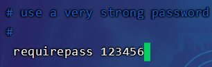

# Redis基本使用

## Redis入门

### Redis简介


关系型数据库和非关系型数据库：


### Redis应用场景

- 缓存
- 任务队列
- 消息队列
- 分布式锁

## Redis下载和安装


### Linux下安装


解压安装包：

```
tar -zxvf redis-4.0.0.tar.gz
```

安装依赖环境gcc：(**centos 7.9自带gcc**，可以通过命令`gcc -v`查看是否已经有安装)

```
yum install gcc-c++
```

> 以下内容，废弃，依赖过于繁杂：
>
> 如果无法访问外网，手动安装gcc，下载地址：[Index of /gnu/gcc](http://ftp.gnu.org/gnu/gcc/)
>
> 在安装之前，需要先安装 ：GMP >=4.2+, MPFR >=2.4.0+ and MPC >=0.8.0+
>
> - GMP：[Index of /download/gmp/ (gmplib.org)](https://gmplib.org/download/gmp/)，版本：gmp-6.1.2.tar.xz
>
> > 如果GMP ./configure 配置失败，报错如下：configure: error: gmp.h cannot be found，则还需要安装gmp-devel：http://mirror.centos.org/centos/7/os/x86_64/Packages/gmp-devel-6.0.0-15.el7.x86_64.rpm
> >
> > ```
> > rpm -ivh gmp-devel-6.0.0-15.el7.x86_64.rpm
> > ```
>
> - MPRF：[The GNU MPFR Library](https://www.mpfr.org/)，历史版本：[History of MPFR and Past Events](https://www.mpfr.org/history.html)
>
> 
>
> - MPC：[Index of /gnu/mpc](https://ftp.gnu.org/gnu/mpc/)，版本：mpc-1.0.2.tar.gz
>
> 解压：
>
> ```
> cd /usr/local
> mkdir gcc_depend
> cd gcc_depend
> 
> 
> tar -xf gmp-6.1.2.tar.xz
> tar -xf mpc-1.0.2.tar.gz
> tar -xf mpfr-3.1.2.tar.gz
> tar -xf gcc-4.8.5.tar.gz
> ```
>
> 移动到gcc目录：
> ```
> mkdir gcc-4.8.5/gmp gcc-4.8.5/mpc gcc-4.8.5/mpfr
> mv gmp-6.1.2/* gcc-4.8.5/gmp
> mv mpc-1.0.2/* gcc-4.8.5/mpc
> mv mpfr-3.1.2/* gcc-4.8.5/mpfr
> ```
>
> 安装gcc：
>
> ```
> cd gcc-4.8.5
> ./configure # 检测配置没问题就会创建Makefile文件
> 
> make # 编译没问题就会创建install文件
> make install
> ```
>
> > 如果make过程出错，可以尝试更换更高版本的依赖库

编译源码：

```
cd /usr/local/redis-4.0.0
make
```


进入src目录，进行安装：

```
cd /usr/local/redis-4.0.0/src
make install
```


### Windows下安装


## Redis服务启动与停止


启动服务端：

```
cd /usr/local/redis-4.0.0/src
./redis-server
```


客户端连接：

```
cd /usr/local/redis-4.0.0/src
./redis-cli
```


修改配置文件使其可以在后台运行（Ctrl + C先停止）：

```
cd /usr/local/redis-4.0.0
vim redis.conf
```

输入"/daemonize"查找：


修改：

```
daemonize yes
:wq
```


再次启动：

```
src/redis-server ./redis.conf
```


### 开启密码

```
cd /usr/local/redis-4.0.0
vim redis.conf
```

输入"/requirepass foobared"查找：


修改：

```
requirepass 123456
:wq
```



重新启动：

```
ps -ef|grep redis
kill -9 xxx

cd /usr/local/redis-4.0.0
src/redis-server ./redis.conf
```

连接：

```
src/redis-cli -h localhost -p 6379
```


输入密码：

```
auth 123456
```


> 连接并输入密码命令：
>
> ```
> src/redis-cli -h localhost -p 6379 -a 123456
> ```

### 允许远程连接

```
cd /usr/local/redis-4.0.0
vim redis.conf
```

输入"/bind"查找：


> 将其中的bind全部注释即代表允许任意连接

开启防火墙端口6479：

```
firewall-cmd --zone=public --add-port=6379/tcp --permanent
firewall-cmd --reload
firewall-cmd --list-ports
```

输入"/protected-mode"查找：


> 将"yes"修改为"no"代表关闭保护模式

重新启动：

```
cd /usr/local/redis-4.0.0
src/redis-server ./redis.conf
```

### 远程连接

在windows的redis目录下使用cmd：

```
.\redis-cli.exe -h 192.168.138.100 -p 6379 -a 123456
```

> 注意：
>
> - Redis生成的配置文件是redis目录下的`redis.conf`，`redis-server`服务在src目录下
> - **如果需要配置文件生效，需要指定Redis配置文件进行启动**：`redis-server ../redis.conf`。如果没有指定，则按默认的配置启动(无密码，无远程连接)

