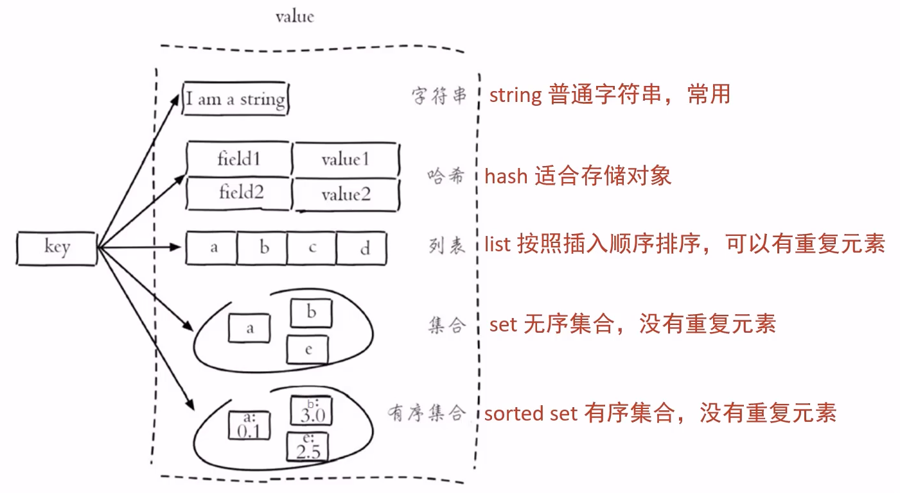
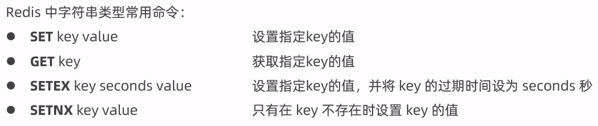
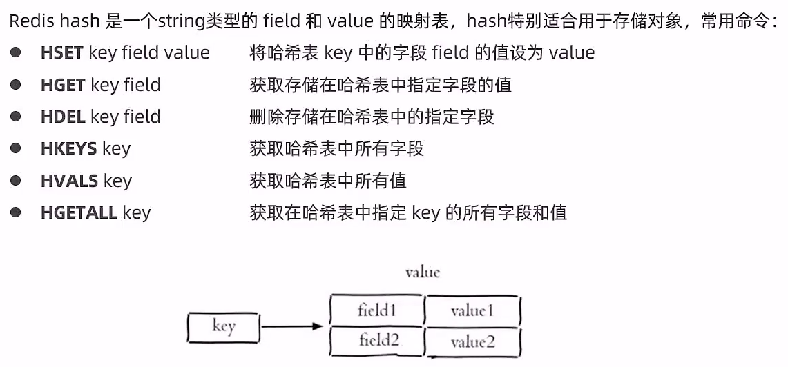
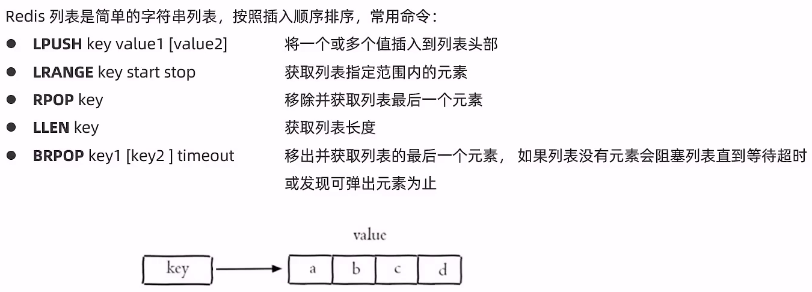
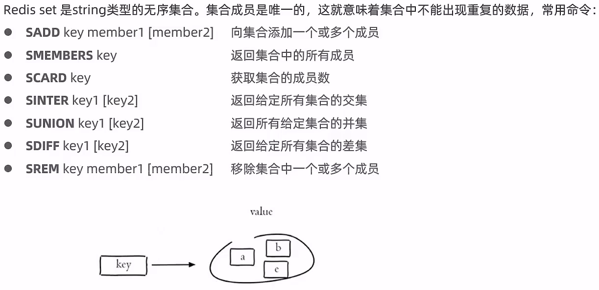
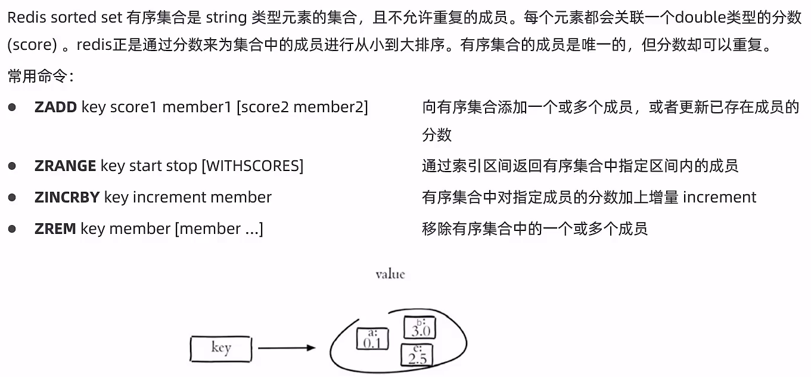
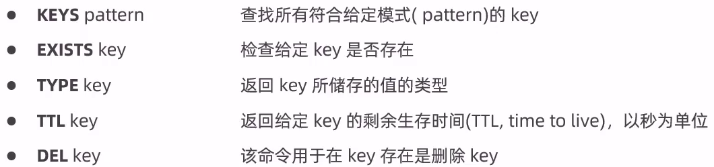

# Redis常用命令

Redis中文网：[Redis 教程_redis教程](https://www.redis.net.cn/tutorial/3501.html)

## Redis数据类型

Redis存储的是key-value结构的数据，其中key是字符串类型，value有5中常用的数据类型：

- 字符串 string
- 哈希 hash
- 列表 list
- 集合 set
- 有序几何 sorted set

## 字符串string操作命令

## 哈希hash操作命令

## 列表list操作命令

## 集合set操作命令

### Redis set

### sorted set

## 通用命令

