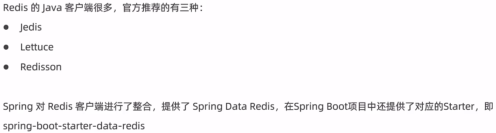
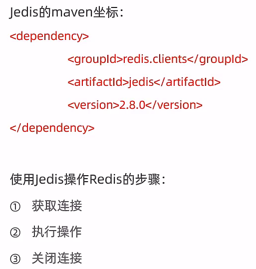
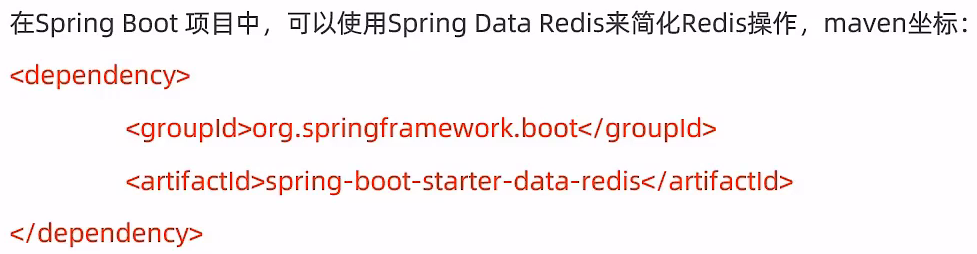
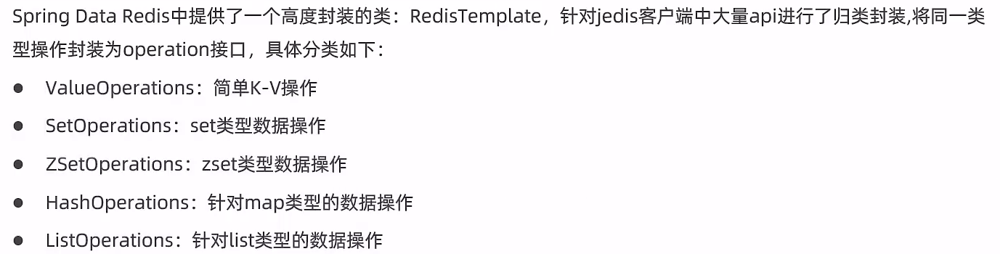
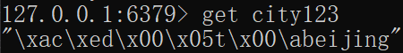
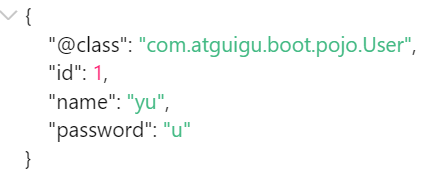
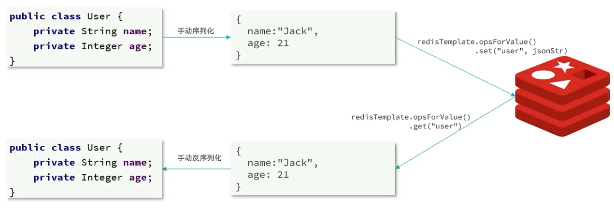
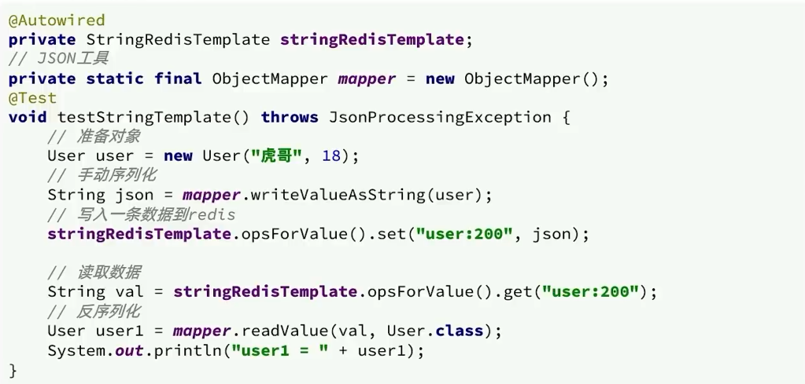

# Java中操作Redis

## 介绍



- Jedis：以Redis命令作为方法名称，学习成本低，简单实用。但是Jedis实例是线程不安全的，多线程环境下需要基于连接池来使用
- Lettuce：Lettuce是基于Netty实现的，支持同步、异步和响应式编程方式，并且是线程安全的。支持Redis的哨兵模式、集群模式和管道模式
- Redisson：Redisson是一个基于Redis实现的分布式、可伸缩的Java数据结构集合。包含了诸如Map、Oueue、LockSemaphore、AtomicLong等强大功能

## Jedis



```xml
        <dependency>
            <groupId>redis.clients</groupId>
            <artifactId>jedis</artifactId>
            <version>2.8.0</version>
        </dependency>
        <dependency>
            <groupId>junit</groupId>
            <artifactId>junit</artifactId>
            <scope>test</scope>
        </dependency>
```

JedisTest.java

```java
import org.junit.Test;
import redis.clients.jedis.Jedis;

import java.util.Set;

public class RedisTest {
    @Test
    public void JedisTest(){
        //获取连接
        Jedis jedis = new Jedis("localhost",6379);

        //执行具体的操作
        jedis.set("username","xiaoming");
        System.out.println(jedis.get("username")); // xiaoming
        jedis.del("username");

        jedis.hset("myhash","addr","bj");
        System.out.println(jedis.hget("myhash","addr")); // bj

        Set<String> keys = jedis.keys("*");
        for (String key : keys) {
            System.out.println(key); //myhash
        }

        //关闭连接
        jedis.close();
    }
}
```

## Spring Data Redis



RedisTemplate



```xml
        <dependency>
            <groupId>org.springframework.boot</groupId>
            <artifactId>spring-boot-starter-test</artifactId>
            <scope>test</scope>
        </dependency>
		<dependency>
            <groupId>org.springframework.boot</groupId>
            <artifactId>spring-boot-starter-data-redis</artifactId>
        </dependency>
```

application.yml

```yaml
spring:
  application:
    name: MainApplication
  #Redis相关配置
  redis:
    host: localhost
    port: 6379
    #password: 123456
    database: 0 #操作的是0号数据库(默认共16个)
    jedis: #现在更多的是使用lettuce
      #Redis连接池配置
      pool:
        max-active: 8 #最大连接数
        max-wait: 1ms #连接池最大阻塞等待时间
        max-idle: 4 #连接池中的最大空闲连接
        min-idle: 0 #连接池中的最小空闲连接
```

> 如果连接长时间没有数据传输，中间的网络设备（如路由器、交换机）可能会认为这个连接已经失效，并关闭这个连接，导致远程连接报错
>
> ```
> 09:23:43.984 [http-nio-8080-exec-73] WARN  o.s.w.s.m.m.a.ExceptionHandlerExceptionResolver - [logException,208] - Resolved [org.springframework.data.redis.RedisSystemException: Redis exception; nested exception is io.lettuce.core.RedisException: java.io.IOException: 远程主机强迫关闭了一个现有的连接。]
> 09:23:43.993 [lettuce-eventExecutorLoop-1-11] INFO  i.l.c.p.ConnectionWatchdog - [log,171] - Reconnecting, last destination was /47.113.186.151:6379
> 09:23:44.047 [lettuce-nioEventLoop-4-5] INFO  i.l.c.p.ReconnectionHandler - [lambda$null$3,174] - Reconnected to 47.113.186.151:6379
> ```
>
> 需要修改Redis的保活探测包发送时间，这是从Redis 3.2.1版本开始的新默认设置，默认值为300
>
> 修改为60，代表60秒内没有任何数据传输，Redis服务器将开始发送保活探测包，防止连接被掐断
>
> ```
> tcp-keepalive 60
> ```

RedisConfig.java

```java
import org.springframework.cache.annotation.CachingConfigurerSupport;
import org.springframework.context.annotation.Bean;
import org.springframework.context.annotation.Configuration;
import org.springframework.data.redis.connection.RedisConnectionFactory;
import org.springframework.data.redis.core.RedisTemplate;
import org.springframework.data.redis.serializer.GenericJackson2JsonRedisSerializer;
import org.springframework.data.redis.serializer.RedisSerializer;

/**
 * Redis配置类
 */

@Configuration
public class RedisConfig extends CachingConfigurerSupport {

    @Bean
    public RedisTemplate<Object, Object> redisTemplate(RedisConnectionFactory connectionFactory) {

        // 创建RedisTemplate对象
        RedisTemplate<Object, Object> redisTemplate = new RedisTemplate<>();

        // 默认的Key序列化器为：JdkSerializationRedisSerializer
        redisTemplate.setKeySerializer(RedisSerializer.string());
        redisTemplate.setHashKeySerializer(RedisSerializer.string());

//        // 1.创建JSON序列化工具
//        GenericJackson2JsonRedisSerializer jsonRedisSerializer = new GenericJackson2JsonRedisSerializer();
//
//        // 2.设置Value、HashKey和HashValue的序列化(对于对象来说，会占用额外的空间去存储class的位置)
//        redisTemplate.setValueSerializer(jsonRedisSerializer);
//        redisTemplate.setHashKeySerializer(jsonRedisSerializer);
//        redisTemplate.setHashValueSerializer(jsonRedisSerializer);

        // 设置连接工厂
        redisTemplate.setConnectionFactory(connectionFactory);

        return redisTemplate;
    }

}
```

> 这里只设置了Key的序列化，所以可以直接通过"city123"获取到值，对于Value可以不进行序列化的更改，因为Java在取出的时候会进行反序列化，但会降低可读性，占用额外空间
>
> 
>
> 如果在配置类中使用JSON序列化工具，对象的存入时会自动存储一个`@Class`的值，用于取出时指定反序列化的对象
>
> 
>
> 也可以将对象序列化和反序列化，这样可以不存入冗余字段`@class`
>
> 对象手动序列化：
>
> ```java
> // 创建一个对象
> Person person = new Person("Tom", 20);
> 
> // 使用Jackson将对象转换为JSON字符串
> ObjectMapper mapper = new ObjectMapper();
> String personStr = mapper.writeValueAsString(person);
> 
> // 存储对象
> redisTemplate.opsForValue().set("person", personStr);
> ```
>
> 对象手动反序列化：
>
> ```java
> // 从Redis中取出对象
> String personStr = (String) redisTemplate.opsForValue().get("person");
> 
> // 使用Jackson将JSON字符串转换回对象
> Person person = mapper.readValue(personStr, Person.class);
> ```

### RedisTemplate

SpringDataRedisTest.java

```java
import hello.MainApplication;
import org.junit.Test;
import org.junit.runner.RunWith;
import org.springframework.boot.test.context.SpringBootTest;
import org.springframework.data.redis.connection.DataType;
import org.springframework.data.redis.core.*;
import org.springframework.test.context.junit4.SpringRunner;

import javax.annotation.Resource;
import java.util.List;
import java.util.Set;
import java.util.concurrent.TimeUnit;

@SpringBootTest(classes = MainApplication.class)
@RunWith(SpringRunner.class)
public class SpringDataRedisTest {

    @Resource
    private RedisTemplate redisTemplate;

    /**
     * 操作String类型数据
     */
    @Test
    public void testString(){
        redisTemplate.opsForValue().set("city123","beijing");

        String value = (String) redisTemplate.opsForValue().get("city123");
        System.out.println(value); //beijing

        redisTemplate.opsForValue().set("key1","value1",10l, TimeUnit.SECONDS);

        // 如果key存在了则返回false，且设置失败
        Boolean aBoolean = redisTemplate.opsForValue().setIfAbsent("city1234", "nanjing");
        System.out.println(aBoolean);
    }

    /**
     * 操作Hash类型数据
     */
    @Test
    public void testHash(){
        HashOperations hashOperations = redisTemplate.opsForHash();

        //存值
        hashOperations.put("002","name","xiaoming");
        hashOperations.put("002","age","20");
        hashOperations.put("002","address","bj");

        //取值
        String age = (String) hashOperations.get("002", "age");
        System.out.println(age); // 20

        //获得hash结构中的所有字段
        Set keys = hashOperations.keys("002");
        for (Object key : keys) {
            System.out.println(key); // name age address
        }

        //获得hash结构中的所有值
        List values = hashOperations.values("002");
        for (Object value : values) {
            System.out.println(value); // xiaoming 20 bj
        }
    }

    /**
     * 操作List类型的数据
     */
    @Test
    public void testList(){
        ListOperations listOperations = redisTemplate.opsForList();

        //存值
        listOperations.leftPush("mylist","a");
        listOperations.leftPushAll("mylist","b","c","d");

        //取值
        List<String> mylist = listOperations.range("mylist", 0, -1);
        for (String value : mylist) {
            System.out.println(value); // d c b a
        }

        //获得列表长度 llen
        Long size = listOperations.size("mylist");
        int lSize = size.intValue();
        for (int i = 0; i < lSize; i++) {
            //出队列
            String element = (String) listOperations.rightPop("mylist");
            System.out.println(element); // a b c d
        }
        // 左push左pop它就是栈，左push右pop它就是队列
    }

    /**
     * 操作Set类型的数据
     */
    @Test
    public void testSet(){
        SetOperations setOperations = redisTemplate.opsForSet();

        //存值(不允许存在重复元素且无序)
        setOperations.add("myset","a","b","c","a");

        //取值
        Set<String> myset = setOperations.members("myset");
        for (String o : myset) {
            System.out.println(o); // a c b
        }

        //删除成员
        setOperations.remove("myset","a","b");

        //取值
        myset = setOperations.members("myset");
        for (String o : myset) {
            System.out.println(o); // c
        }

    }

    /**
     * 操作ZSet类型的数据
     */
    @Test
    public void testZset(){
        ZSetOperations zSetOperations = redisTemplate.opsForZSet();

        //存值(有顺序但不能重复，后来的会覆盖前面的)
        zSetOperations.add("myZset","a",10.0);
        zSetOperations.add("myZset","b",11.0);
        zSetOperations.add("myZset","c",12.0);
        zSetOperations.add("myZset","a",13.0);

        //取值
        Set<String> myZset = zSetOperations.range("myZset", 0, -1);
        for (String s : myZset) {
            System.out.println(s); // b c a
        }

        //修改分数
        zSetOperations.incrementScore("myZset","b",20.0);

        //取值
        myZset = zSetOperations.range("myZset", 0, -1);
        for (String s : myZset) {
            System.out.println(s); // c a b
        }

        //删除成员
        zSetOperations.remove("myZset","a","b");

        //取值
        myZset = zSetOperations.range("myZset", 0, -1);
        for (String s : myZset) {
            System.out.println(s); // c
        }
    }

    /**
     * 通用操作，针对不同的数据类型都可以操作
     */
    @Test
    public void testCommon(){
        //获取Redis中所有的key
        Set<String> keys = redisTemplate.keys("*");
        for (String key : keys) {
            System.out.println(key);
        }

        //判断某个key是否存在
        Boolean itcast = redisTemplate.hasKey("itcast");
        System.out.println(itcast);

        //删除指定key
        redisTemplate.delete("myZset");

        //获取指定key对应的value的数据类型
        DataType dataType = redisTemplate.type("myset");
        System.out.println(dataType.name());

    }
}
```

### StringRedisTemplate

> 为了节省内存空间，一般不使用JSON序列化器来处理value，而是统一使用String序列化器，要求只能存储String类型的key和value。在存储Java对象时，手动完成对象的序列化和反序列化



Spring默认提供了一个StringRedisTemplate类，它的key和value的序列化方式默认就是String方式



SpringDataRedisTest.java

```java
    @Autowired
    private StringRedisTemplate stringRedisTemplate;

    private static final ObjectMapper mapper = new ObjectMapper();

    @Test
    public void testStringRedis() throws JsonProcessingException {
        // 创建对象
        User user = new User(2L, "yx", "yu");
        // 手动序列化
        String json = mapper.writeValueAsString(user);
        // 写入数据
        stringRedisTemplate.opsForValue().set("user1", json);

        // 获取数据
        String jsonUser = stringRedisTemplate.opsForValue().get("user1");
        // 手动反序列化(对象得有无参构造方法和get、set方法才能成功)
        User user1 = mapper.readValue(jsonUser, User.class);
        // User(id=2, name=yx, password=yu)
        System.out.println(user1);
    }
```

