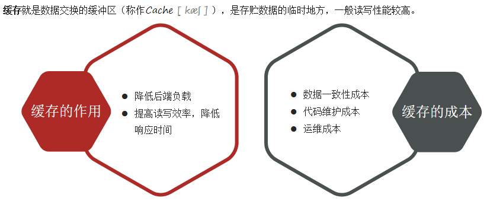
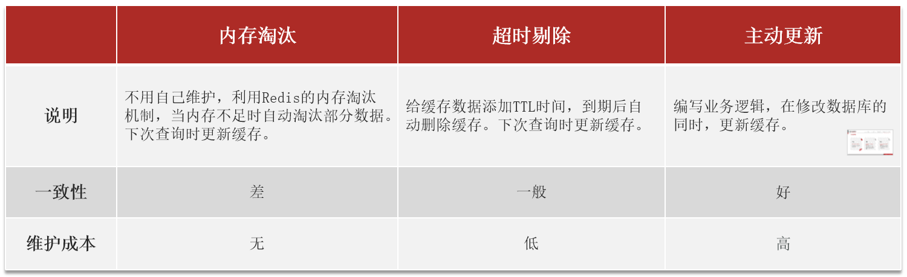
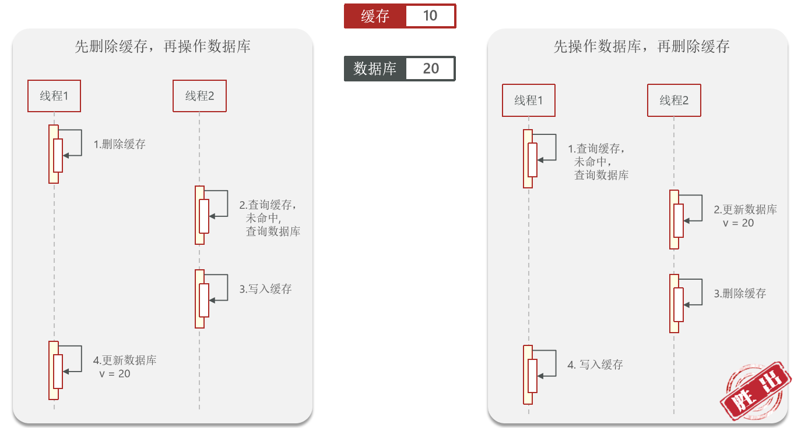
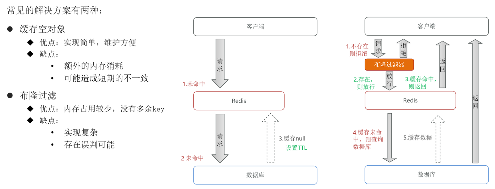
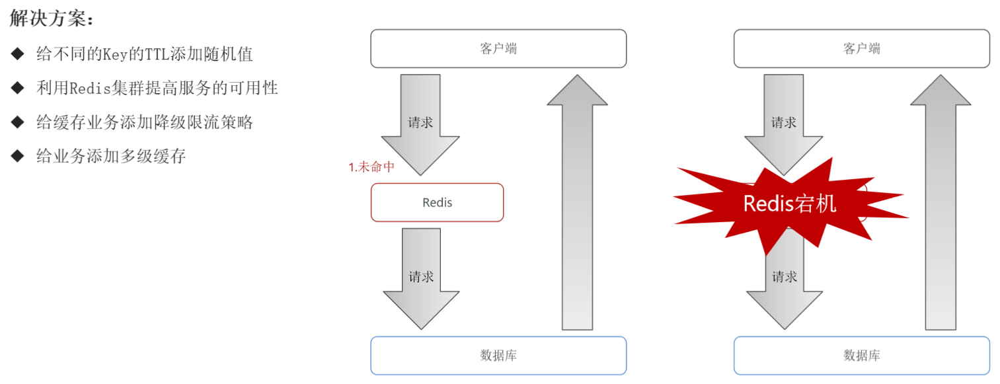
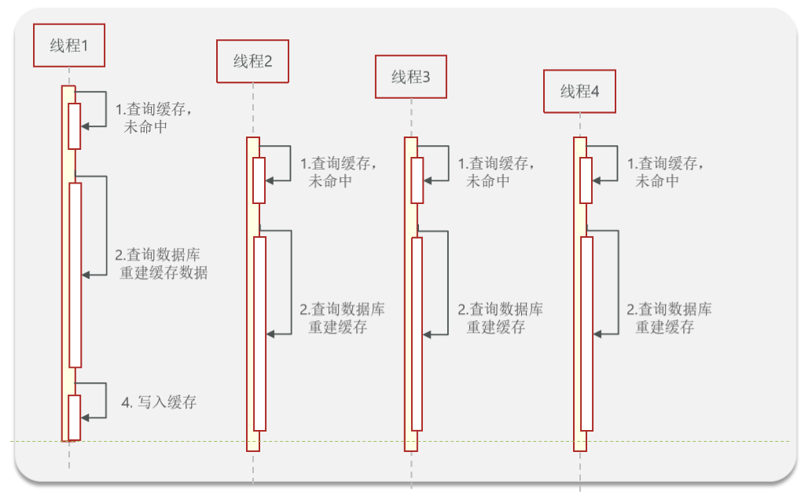
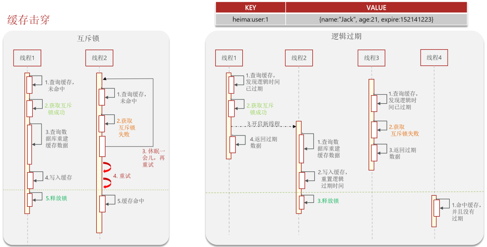
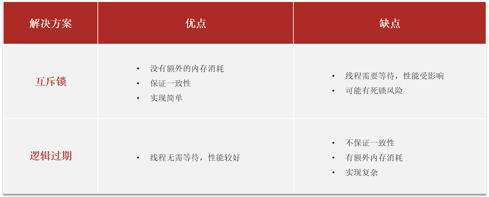

# Redis缓存

## 缓存更新策略

业务场景：

- 低一致性需求：使用内存淘汰机制
- 高一致性需求：主动更新，并以超时剔除作为兜底方案

### 操作缓存和数据库问题

- 删除缓存还是更新缓存
  - 更新缓存：每次更新数据库都更新缓存，无效写操作较多
  - 删除缓存：更新数据库时让缓存失效，查询时再更新缓存
- 如何保证缓存与数据库操作的同时成功或失败？
  - 单体系统：将缓存与数据库操作放在一个事务
  - 分布式系统：利用TCC等分布式事务方案
- 先操作缓存还是先操作数据库？
  - 先删除缓存，再操作数据库（一致性较弱，因为更新数据库的操作往往耗时较长，很容易出现还没更新完毕就因为查询请求构建了缓存旧数据）
  - 先操作数据库，再删除缓存（一致性更强，只有当缓存由于时间到期等原因恰好失效了，且在线程1查询出结果后写入缓存之前执行了数据库更新和缓存无效删除操作才会出现问题，机率很低，并且可以采取延迟双删的方式再删除一遍缓存进一步提高一致性）

### 最佳实践方案

- 低一致性需求：使用Redis自带的内存淘汰机制
- 高一致性需求：主动更新，并以超时剔除作为兜底方案
  - 读操作：
    - 缓存命中则直接返回
    - 缓存未命中则查询数据库，并写入缓存，设定超时实践
  - 写操作：
    - 先写数据库，然后再删除缓存
    - 要确保数据库与缓存操作的原子性

## 缓存穿透

> 指客户端请求的数据库在缓存中和数据库中都不存在，这样缓存永远不会生效，这些请求都会打到数据库

> 除此之外，还可以使用如下几点措施来尽可能避免缓存穿透
>
> - 增加id的复杂度，避免被猜测id规律
> - 做好数据的基础格式校验
> - 加强用户权限校验
> - 做好热点参数的限流

## 缓存雪崩

> 指在同一时段大量的缓存key同时失效或者Redis服务宕机，导致大量请求到达数据库，带来巨大压力

## 缓存击穿

> 也叫热点Key问题，就是一个高并发访问并且缓冲重建业务比较复杂的key突然失效了，无数的请求访问会在瞬间给数据库带来巨大的冲击

解决方式：

- 互斥锁
- 逻辑过期

两者优略对比：

