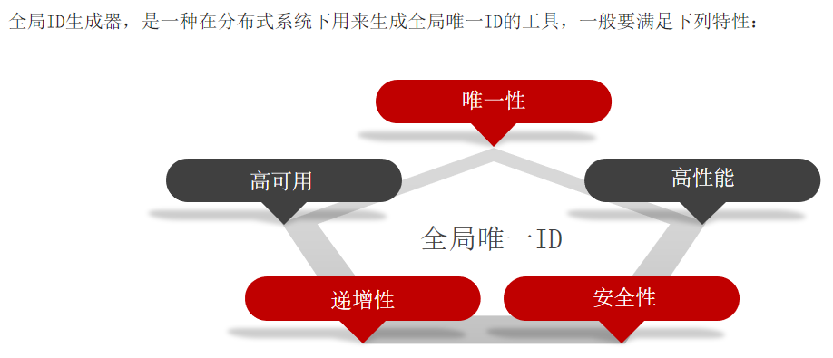
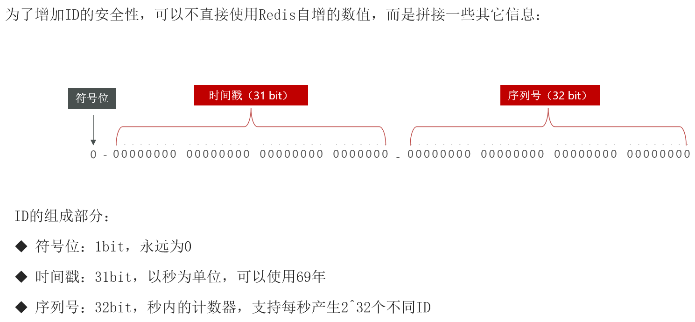
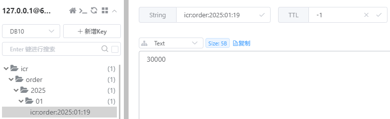

# Redis全局唯一ID生成

## 基本概念

全局唯一ID生成策略：

- UUID
- Redis自增
- snowflake算法
- 数据库自增

Redis自增ID策略：

- 每天一个key，方便统计量
- ID构造方式为：时间戳 + 计数器





## 示例代码

RedisIdWorker.java

```java
import org.springframework.beans.factory.annotation.Autowired;
import org.springframework.data.redis.core.StringRedisTemplate;
import org.springframework.stereotype.Component;

import java.time.LocalDateTime;
import java.time.ZoneOffset;
import java.time.format.DateTimeFormatter;

@Component
public class RedisIdWorker {

    /**
     * 开始时间戳
     */
    private static final long BEGIN_TIMESTAMP = 1735689600L;

    /**
     * 序列号的位数(31位为大概69年)，这里40位可以覆盖到3万年，剩下23位可以支持到一秒838万数量
     */
    private static final int COUNT_BITS = 40;

    @Autowired
    private StringRedisTemplate stringRedisTemplate;

    public long nextId(String keyPrefix) {
        // 生成时间戳
        LocalDateTime now = LocalDateTime.now();
        long newSecond = now.toEpochSecond(ZoneOffset.UTC);
        long timestamp = newSecond - BEGIN_TIMESTAMP;

        // 生成序列号
        String date = now.format(DateTimeFormatter.ofPattern("yyyy:MM:dd"));
        long count = stringRedisTemplate.opsForValue().increment("icr:" + keyPrefix + ":" + date);
        // 拼接并返回
        return timestamp << COUNT_BITS | count;
    }
}
```

> 测试方法：
>
> ```java
> import org.springframework.beans.factory.annotation.Autowired;
> import org.springframework.stereotype.Component;
> 
> import javax.annotation.PostConstruct;
> import java.util.concurrent.CountDownLatch;
> import java.util.concurrent.ExecutorService;
> import java.util.concurrent.Executors;
> 
> @Component
> public class RedisIdWorkerTest {
> 
>        @Autowired
>        private RedisIdWorker redisIdWorker;
> 
>        @PostConstruct
>        public void testRedisId() throws InterruptedException {
>            // 创建一个固定大小为500的线程池
>            ExecutorService es = Executors.newFixedThreadPool(500);
> 
>            // 初始化CountDownLatch，计数器初始值设为300
>            CountDownLatch latch = new CountDownLatch(300);
> 
>            // 记录开始时间
>            long begin = System.currentTimeMillis();
> 
>            // 循环提交300个任务到线程池中执行
>            for (int i = 0; i < 300; i++) {
>                es.submit(() -> {
>                    // 每个任务内部循环100次生成ID并打印
>                    for (int j = 0; j < 100; j++) {
>                        long id = redisIdWorker.nextId("order");
>                        System.out.println("id = " + id);
>                    }
>                    // 任务完成后，减少CountDownLatch的计数
>                    latch.countDown();
>                });
>            }
> 
>            // 等待所有任务完成（即CountDownLatch计数归零）
>            latch.await();
> 
>            // 记录结束时间，并计算和打印总耗时
>            long end = System.currentTimeMillis();
>            System.out.println("time = " + (end - begin));
>        }
> }
> ```
>
> 3秒内生成了30W的ID：
>
> ```
> ......
> id = 1398405067693973391
> id = 1398405067693973389
> id = 1398405067693973387
> id = 1398405067693973384
> id = 1398405067693973392
> time = 2897
> ```
>
> 

