# Redis分布式锁

> 满足分布式系统或集群模式下多进程可见并且互斥的锁

## 分布式锁流程

原本流程：

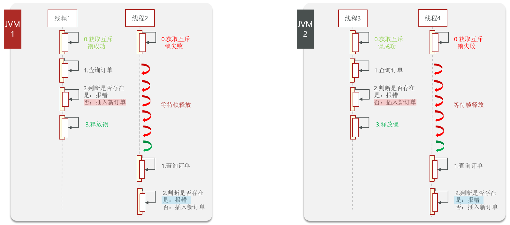

分布式锁流程：

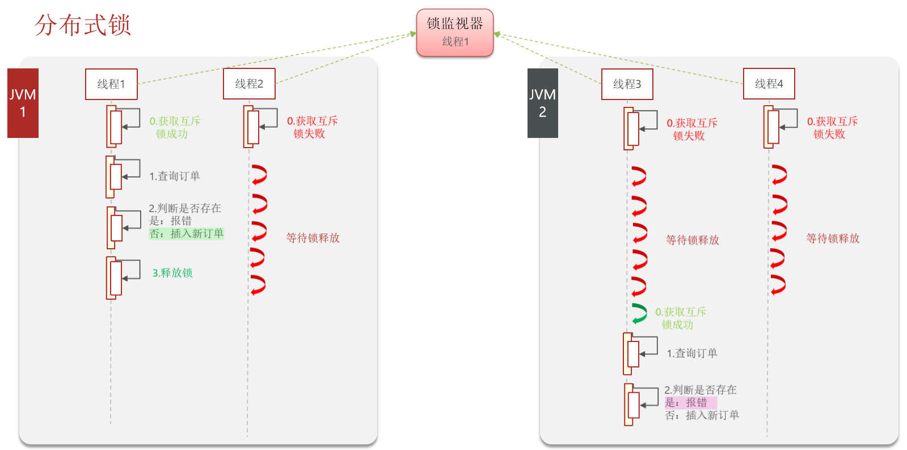

## 分布式锁实现

> 分布式锁的核心是实现多进程之间互斥，而满足这一点的方式有很多

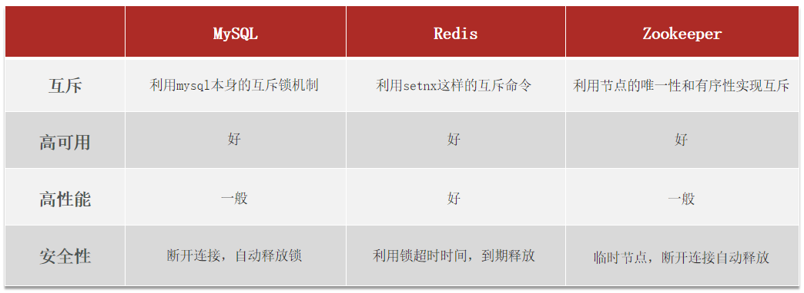

## Redis互斥锁

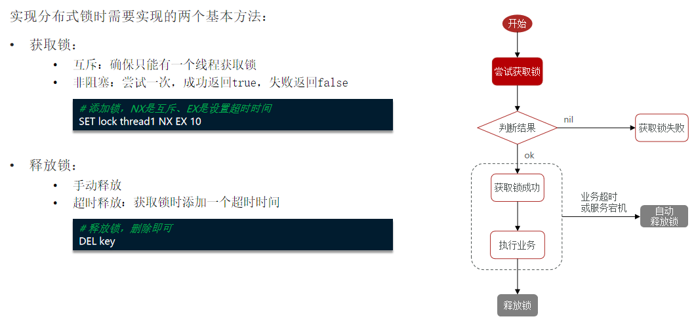

考虑可能存在的误删问题，需要额外进行一次线程标示的判断：

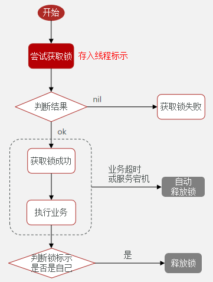

## Lua脚本

> Redis提供了Lua脚本功能，在一个脚本中编写多条Redis命令，确保多条命令执行时的原子性。Lua是一种编程语言
>
> 基本语法可以参考网站：https://www.runoob.com/lua/lua-tutorial.html

函数调用：

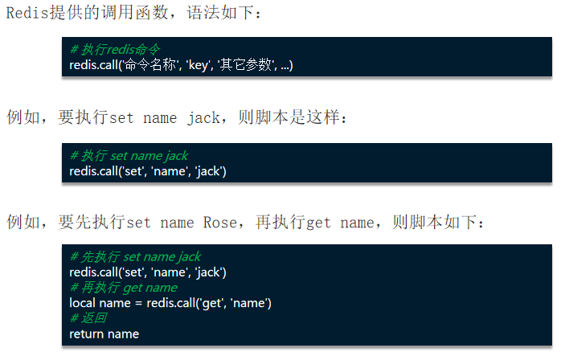

基本使用：

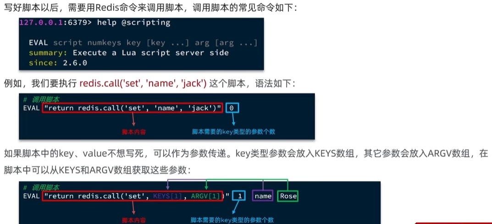

RedisTemplate调用Lua脚本的API如下：

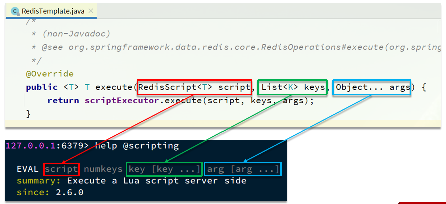

## 示例代码

### Java

> - 在获取锁时存入线程标示（可以用UUID表示）
> - 在释放锁时先获取锁中的线程标示，判断是否与当前线程标示一致
>   - 如果一致则释放锁
>   - 如果不一致则不释放锁，因为代表自己的锁已经因为超时而过期释放了，此时的锁为其它线程的锁

`resource`目录下创建`unlock.lua`：

```lua
-- 比较线程标示与锁中的标示是否一致
if (redis.call('get', KEYS[1])) then
    -- 释放锁 del key
    return redis.call('del', KEYS[1])
end
return 0
```

RedisLockSimple.java

```java
import com.yxx.common.utils.uuid.UUID;
import org.springframework.beans.factory.annotation.Autowired;
import org.springframework.core.io.ClassPathResource;
import org.springframework.data.redis.core.StringRedisTemplate;
import org.springframework.data.redis.core.script.DefaultRedisScript;
import org.springframework.stereotype.Component;

import java.util.Collections;
import java.util.concurrent.TimeUnit;

@Component
public class RedisLockSimple {

    @Autowired
    private StringRedisTemplate stringRedisTemplate;

    private static final String KEY_PREFIX = "lock:";

    private static final String ID_PREFIX = UUID.randomUUID().toString(true) + "-";

    private static final DefaultRedisScript<Long> UNLOCK_SCRIPT;

    static {
        UNLOCK_SCRIPT = new DefaultRedisScript<>();
        UNLOCK_SCRIPT.setLocation(new ClassPathResource("unlock.lua"));
        UNLOCK_SCRIPT.setResultType(Long.class);
    }

    /**
     * 尝试获取锁
     *
     * @param name    锁名称
     * @param timeout 锁持有的超时时间，单位毫秒，过期后自动释放
     * @return true代表获取锁成功; false代表获取锁失败
     */
    public boolean tryLock(String name, long timeout) {
//        String threadId = String.valueOf(Thread.currentThread().getId());
        // 获取线程标示，id前缀是防止多个JVM递增线程ID导致的重复
        String threadId = ID_PREFIX + Thread.currentThread().getId();
        // 获取锁
        Boolean success = stringRedisTemplate.opsForValue().setIfAbsent(KEY_PREFIX + name, threadId, timeout, TimeUnit.MILLISECONDS);
        return Boolean.TRUE.equals(success);
    }

    /**
     * 释放锁
     */
    public void unlock(String name) {
//        stringRedisTemplate.delete(KEY_PREFIX + name);
        // 调用lua脚本
        stringRedisTemplate.execute(UNLOCK_SCRIPT,
                Collections.singletonList(KEY_PREFIX + name),
                ID_PREFIX + Thread.currentThread().getId());
    }
}
```

RedisLockTest.java

```java
import org.springframework.beans.factory.annotation.Autowired;
import org.springframework.stereotype.Component;

import javax.annotation.PostConstruct;

@Component
public class RedisLockTest {

    @Autowired
    private RedisLockSimple redisLockSimple;

    @PostConstruct
    public void testLock() throws InterruptedException {
        String name = "lockTest";
        boolean lock = redisLockSimple.tryLock(name, 150000);
        if (lock) {
            System.out.println("------获取锁成功------");
            Thread.sleep(3000);
            redisLockSimple.unlock(name);
            System.out.println("------释放锁成功------");
        } else {
            System.out.println("------获取锁失败------");
        }
    }
}
```

配置不同的启动端口：

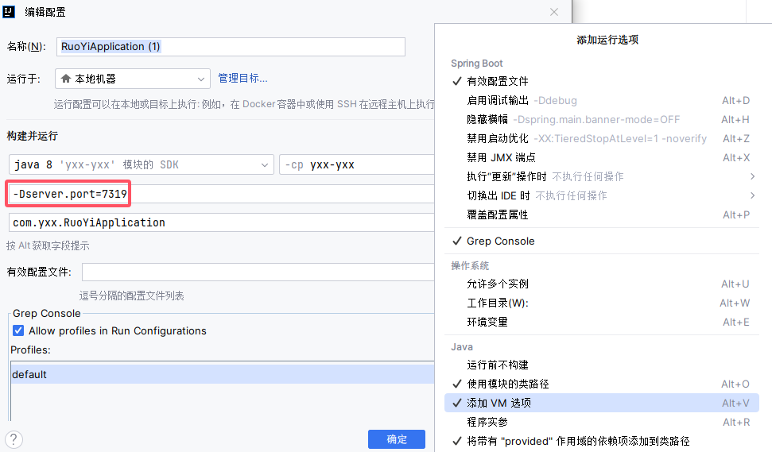

分布式锁效果：

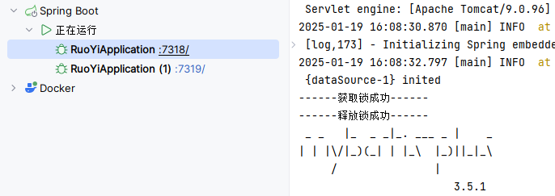

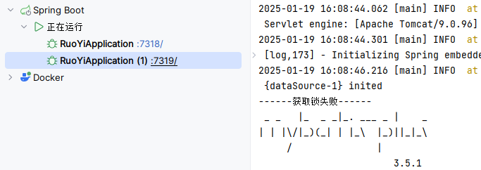

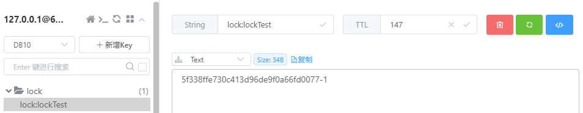

### python

```python
import redis
import threading
import uuid

# 创建Redis连接
r = redis.Redis(host='localhost', password='', port=6379, db=0, socket_connect_timeout=3)

redis_key = 'python:lock_redis'
uuid_str = str(uuid.uuid4())  # 使用UUID作为唯一标识符
thread_value = f"{uuid_str}_{threading.get_ident()}"


def get_lock_redis(name=redis_key, timeout=70):
    """
    尝试获取锁，并返回是否成功获取。

    :param name: 锁名称
    :param timeout: 锁的过期时间（秒）
    :return: 是否成功获取锁
    """
    r_result = r.set(name, thread_value, nx=True, ex=timeout)
    result = r_result is not None
    if result:
        print("------获取锁成功------")
    return result


def release_lock_redis():
    """
    使用Lua脚本释放锁，仅当锁是由当前线程持有的时候才删除。
    """
    lua_script = open("unlock.lua", 'r', encoding='utf-8').read()
    script = r.register_script(lua_script)
    result = script(keys=[redis_key], args=[thread_value])
    if result == 1:
        print("------锁释放成功------")
    else:
        print("------锁无法释放，因为它不是由当前线程持有或锁已不存在------")

```

