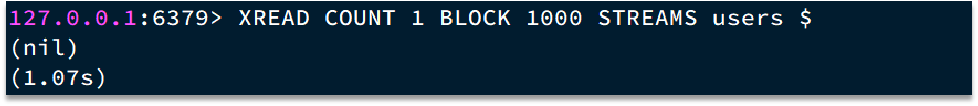
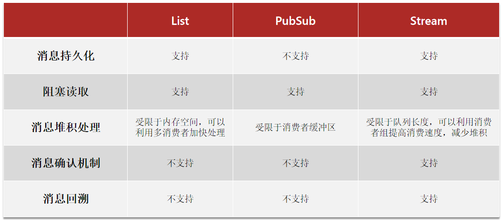

# Redis消息队列

## List模式

> Redis的list数据结构是一个双向链表，可以模拟出队列效果


优点：

- 利用Redis存储，不受限于JVM内存上限
- 基于Redis的持久化机制，数据安全性有保证
- 可以满足消息有序性

缺点：

- 无法避免消息丢失
- 只支持单消费者

**LPUSH**

> 将一个或多个值插入到列表的头部（最左侧）。如果指定的键不存在，则在执行操作前会创建一个新的列表。如果键存在但其值不是列表，则返回错误

```
LPUSH key value [value ...]
```

> - `key`：列表的名称
> - `value`：要插入的一个或多个值

**BRPOP**

> 一个阻塞式的命令，它从列表的尾部（最右侧）移除并返回元素。如果列表为空，则命令会阻塞直到有其他客户端向该列表添加元素，或者达到超时时间（以秒为单位）

```
BRPOP key [key ...] timeout
```

> - `key`：要操作的一个或多个列表键名
> - `timeout`：当没有元素可弹出时，命令阻塞等待的秒数。若设置为0，则无限期等待

## PubSub模式

> 发布/订阅模式是一种消息范式，它允许发送者（发布者）向某个频道发送消息，而不必指定具体的接收者。相反，接收者（订阅者）通过订阅特定频道来接收消息。这种方式解耦了消息的生产者和消费者，使得系统更加灵活、可扩展


```
SUBSCRIBE channel [channel] ：订阅一个或多个频道
PUBLISH channel msg ：向一个频道发送消息
PSUBSCRIBE pattern[pattern] ：订阅与pattern格式匹配的所有频道
```

优点：

- 采用发布订阅模型，支持多生产、多消费

缺点：

- 不支持数据持久化
- 无法避免消息丢失
- 消息堆积有上限，超出时数据丢失

### 基本命令

**SUBSCRIBE**

> 功能：订阅给定的一个或多个频道。一旦订阅成功，客户端会进入订阅状态，在此状态下不能执行除订阅相关命令外的其他命令
>
> 格式：`SUBSCRIBE channel [channel ...]`

订阅`news`和`announcements`频道参考命令：

```
SUBSCRIBE news announcements
```

**UNSUBSCRIBE**

> 当一个客户端不再需要接收某些频道上的消息时，可以使用`UNSUBSCRIBE`命令来取消订阅，如果没有指定频道，则默认取消订阅所有频道；如果有指定，则只取消订阅指定的频道

取消订阅`news`频道：

```
UNSUBSCRIBE news
```

取消订阅所有频道：

```
UNSUBSCRIBE
```

**模式匹配**

> 除了直接订阅具体的频道之外，Redis还支持通过模式匹配的方式进行订阅，即使用`PSUBSCRIBE`命令根据模式匹配来订阅频道

- `SUBSCRIBE`：订阅符合给定模式的所有频道。模式允许包含通配符，如`*`表示任意数量的字符，订阅所有以`.end`结尾的频道：

  - ```
    PSUBSCRIBE *.end
    ```

- `PUNSUBSCRIBE [pattern [pattern ...]]`：取消根据模式的订阅。如果没有提供模式，则取消所有模式订阅：

  - ```
    PUNSUBSCRIBE *.end
    
    PUNSUBSCRIBE
    ```

### 示例代码

pom.xml

```xml
    <dependency>
        <groupId>org.springframework.boot</groupId>
        <artifactId>spring-boot-starter-data-redis</artifactId>
    </dependency>
```

RedisMessageListener.java

```java
import org.springframework.context.annotation.Scope;
import org.springframework.data.redis.connection.Message;
import org.springframework.data.redis.connection.MessageListener;
import org.springframework.stereotype.Component;

/**
 * 自定义的消息监听器，用于处理接收到的Redis消息。
 */
@Component
@Scope("prototype")
public class RedisMessageListener implements MessageListener {

    /**
     * 当从Redis订阅的主题中接收到消息时调用此方法。一个对象也可以订阅多个频道，但是在取消订阅时所有频道就都被取消订阅了
     *
     * @param message 接收到的实际消息对象。可以通过调用message.getBody()来获取消息内容，
     *                而调用message.toString()则可以获取关于消息的更多信息，如频道等
     * @param pattern 订阅模式匹配的字节数组，如果使用的是模式匹配订阅（PSUBSCRIBE）而不是直接的主题订阅（SUBSCRIBE）
     *                对于直接的主题订阅，这个值通常是null
     */
    @Override
    public void onMessage(Message message, byte[] pattern) {
        // 打印接收到的消息内容
        System.out.println("Received message: " + new String(message.getBody()) + "; Topic：" + new String(pattern));
    }
}
```

RedisPubSubUtil.java

```java
import org.springframework.beans.factory.annotation.Autowired;
import org.springframework.data.redis.connection.MessageListener;
import org.springframework.data.redis.core.StringRedisTemplate;
import org.springframework.data.redis.listener.ChannelTopic;
import org.springframework.data.redis.listener.RedisMessageListenerContainer;
import org.springframework.stereotype.Component;

import java.util.HashMap;
import java.util.Map;

@Component
public class RedisPubSubUtil {

    private final StringRedisTemplate redisTemplate;
    private final RedisMessageListenerContainer listenerContainer;
    private final Map<String, MessageListener> listeners = new HashMap<>();

    @Autowired
    public RedisPubSubUtil(StringRedisTemplate redisTemplate, RedisMessageListenerContainer listenerContainer) {
        this.redisTemplate = redisTemplate;
        this.listenerContainer = listenerContainer;
    }

    /**
     * 发布消息到指定主题
     *
     * @param topic   消息将被发送到的主题名称
     * @param message 要发布的消息内容
     */
    public void publish(String topic, String message) {
        redisTemplate.convertAndSend(topic, message);
    }

    /**
     * 订阅某个主题的消息
     *
     * @param listener 实现了MessageListener接口的对象，用于定义如何处理接收到的消息
     * @param topic    要订阅的主题名称
     */
    public String subscribe(MessageListener listener, String topic) {
        // 单次订阅
        listenerContainer.addMessageListener(listener, new ChannelTopic(topic));
        // 一个对象允许多次订阅(无法取消订阅)
//        listenerContainer.addMessageListener((message, pattern) -> listener.onMessage(message, pattern), new ChannelTopic(topic));
        listeners.put(topic, listener);
        return topic; // 返回订阅的topic作为订阅ID
    }

    /**
     * 取消订阅
     *
     * @param topic 要订阅的主题名称
     */
    public String unsubscribe(String topic) {
        MessageListener listener = listeners.remove(topic);
        if (listener != null) {
            listenerContainer.removeMessageListener(listener);
            return "Unsubscribed from " + topic;
        } else {
            return "No subscription found for " + topic;
        }
    }
}
```

RedisTestController.java

```java
import com.yxx.common.annotation.Anonymous;
import com.yxx.common.utils.spring.SpringUtils;
import org.springframework.beans.factory.annotation.Autowired;
import org.springframework.web.bind.annotation.GetMapping;
import org.springframework.web.bind.annotation.RequestParam;
import org.springframework.web.bind.annotation.RestController;

@RestController
@Anonymous
public class RedisTestController {

    @Autowired
    private RedisPubSubUtil redisPubSubUtil;

    // 使用工厂模式进行生成bean
    private RedisMessageListener getRedisMessageListener() {
        return SpringUtils.getBean(RedisMessageListener.class);
    }

    @GetMapping("/subscribe")
    public String subscribe(@RequestParam String topic) {
        return "Subscribed! " + redisPubSubUtil.subscribe(getRedisMessageListener(), topic);
    }

    @GetMapping("/publish")
    public String publish(@RequestParam String message, @RequestParam String topic) {
        redisPubSubUtil.publish(topic, message);
        return "Published! " + topic;
    }

    @GetMapping("/unsubscribe")
    public String unsubscribe(@RequestParam String topic) {
        return redisPubSubUtil.unsubscribe(topic);
    }
}
```

订阅消息：

```
http://localhost:8080/subscribe?topic=test
http://localhost:8080/subscribe?topic=test1
```

> 可以订阅多个频道

发送消息到频道：

```
http://localhost:8080/publish?message=Hello%20World&topic=test
http://localhost:8080/publish?message=Hello%20World&topic=test1
```

> ```
> Received message: Hello World; Topic：test
> Received message: Hello World; Topic：test1
> ```

取消订阅`test1`：

```
http://localhost:8080/unsubscribe?topic=test1
```

发送消息到频道`test1`：

```
http://localhost:8080/publish?message=Hello%20World&topic=test1
```

> 没有消息展示

### Python代码

```python
import time

import redis
import threading
from abc import abstractmethod

channel = 'test'


# 消息处理父类
class HandleMessage:
    def __init__(self):
        self.data: str = ""
        self.channel: str = ""

    @abstractmethod
    def deal_with_message(self, data, channel):
        """需要重写的接收方法"""
        pass

    def handle_message(self, message):
        """处理接收到的消息"""
        self.data = message['data']
        self.channel = message['channel'].decode()
        print(f"Received message: {self.data} on channel {self.channel}")
        self.deal_with_message(self.data, self.channel)


# 监听消息
def handle_listen(current_channel, handleMessage: HandleMessage):
    # 创建Redis连接
    r = redis.Redis(host='localhost', password='', port=6379, db=0, socket_connect_timeout=10)

    # 创建发布订阅对象
    pubsub = r.pubsub()

    # 订阅一个或多个频道
    pubsub.subscribe(current_channel)  # 可以添加更多频道如 'test', 'news'

    # 监听消息
    for message in pubsub.listen():
        if message['type'] == 'message':
            handleMessage.handle_message(message)


# 订阅频道
def subscribe_to_channels(target_channel, handle_message: HandleMessage):
    threading.Thread(target=handle_listen, args=(target_channel, handle_message)).start()
    time.sleep(0.1)


# 推送消息
def publish_message(target_channel, message):
    # 创建Redis连接
    r = redis.Redis(host='localhost', password='', port=6379, db=0, socket_connect_timeout=10)

    # 向指定频道发布消息
    count = r.publish(target_channel, message)

    # 接受的通道
    print(count)


subscribe_to_channels(channel, HandleMessage())
publish_message(channel, 'Hello, Redis Pub/Sub!')

```

> ```
> Received message: b'Hello, Redis Pub/Sub!' on channel test
> 1
> ```

## Stream的消息队列

> Stream是Redis 5.0引入的一种新数据类型，可以实现一个功能非常完善的消息队列
>
> STREAM类型消息队列的`XREAD`命令特点：
>
> - 消息可回溯
> - 一个消息可以被多个消费者读取
> - 可以阻塞读取
> - 有消息漏读的风险

发送消息的命令`XADD`：


例如：


读取消息的方式之一`XREAD`：


例如，使用`XREAD`读取第一个消息：


`XREAD`阻塞方式，读取最新的消息：



在业务开发中，可以循环的调用`XREAD`阻塞方式来查询最新消息，从而实现持续监听队列的效果，伪代码如下：


注意：当指定起始ID为$时，代表读取最新的消息，如果处理一条消息的过程中，又有超过1条以上的消息到达队列，则下次获取时也只能获取到最新的一条，会出现漏读消息的问题

### 消费者组

> 将多个消费者划分到一个组中，监听同一个队列

具备下列特点：


创建：


读取：


基本思路：


### 常用命令

#### 查看信息`XINFO`

查看Stream信息：

```
XINFO STREAM <stream-key>
```

> ```
> 1) "length"             # Stream 当前消息总数
> 2) (integer) 5
> 3) "radix-tree-keys"    # 底层数据结构（基数树）的节点数
> 4) (integer) 1
> 5) "radix-tree-nodes"
> 6) (integer) 2
> 7) "last-generated-id"  # 最后一条消息的 ID
> 8) "1640000000000-0"
> 9) "groups"             # 关联的消费者组数量
> 10) (integer) 1
> 11) "first-entry"       # 第一条消息的详情
> 12) 1) "1630000000000-0"
>     2) 1) "name"
>        2) "jack"
> 13) "last-entry"        # 最后一条消息的详情
> 14) 1) "1640000000000-0"
>     2) 1) "name"
>        2) "lisa"
> ```

查看消费者组信息：

```
XINFO GROUPS <stream-key>
```

> ```
> 1) 1) "name"            # 消费者组名称
>    2) "usergroup"
>    3) "consum       # 组内消费者数量
>    4) (integer) 2
>    5) "pending"         # 全组未确认（pending）消息总数
>    6) (integer) 3
>    7) "last-delivered-id"  # 最后投递给消费者的消息 ID
>    8) "1640000000000-0"
> ```

查看消费者信息：

```
XINFO CONSUMERS <stream-key> <group-name>
```

> ```
> 1) 1) "name"            # 消费者名称
>    2) "consumer1"
>    3) "pending"         # 该消费者的未确认消息数
>    4) (integer) 1
>    5) "idle"            # 空闲时间（毫秒，自最后一次操作起）
>    6) (integer) 15000
> ```

#### 新增消息`XADD`

```
XADD <stream-key> [MAXLEN|MINID [~] <阈值>] * <field1> <value1> <field2> <value2> ...  
```

> - `MAXLEN ~ 1000`：保留最多1000条消息（`~`表示近似修剪，性能更优）
> - `MINID ~ <id>`：删除所有早于指定ID的消息
> - `*`：自动生成消息ID（格式为：`<时间戳>-<序号>`）
>
> 示例：
>
> ```
> XADD user * name jack age 20          # 添加消息  
> XADD user MAXLEN ~ 1000 * name lisa   # 添加消息并限制 Stream 最大长度  
> ```
>
> 命令`MAXLEN`或`MINID`可自动清理旧消息，避免内存无限增长

#### 创建消费者组`XGROUP CREATE`

```
XGROUP CREATE <stream-key> <group-name> <起始ID> [MKSTREAM]  
```

> - `<起始ID>`：
>   - `$`：从最新消息开始消费
>   - `0`：从第一条消息开始消费历史消息
> - `MKSTREAM`：若Stream不存在，自动创建空Stream
>
> 示例：
>
> ```
> XGROUP CREATE user usergroup $ MKSTREAM   # 创建消费者组并自动创建 Stream  
> ```

#### 删除操作

|    **场景**     |       **命令**       |                  **示例**                  |
| :-------------: | :------------------: | :----------------------------------------: |
|   删除消费者    | `XGROUP DELCONSUMER` | `XGROUP DELCONSUMER user usergroup mytest` |
|  删除消费者组   |   `XGROUP DESTROY`   |      `XGROUP DESTROY user usergroup`       |
|  删除单条消息   |        `XDEL`        |        `XDEL user 1744616884096-0`         |
| 删除整个 Stream |        `DEL`         |                 `DEL user`                 |

#### 清理与修剪消息`XTRIM`

```
XTRIM <stream-key> MAXLEN [~] <长度>    # 保留最新 N 条消息  
XTRIM <stream-key> MINID [~] <id>      # 删除所有早于指定 ID 的消息  
```

> 示例：
>
> ```
> XTRIM user MAXLEN 1000     # 精确保留 1000 条消息  
> XTRIM user MAXLEN ~ 1000   # 近似保留约 1000 条（性能更高）  
> XTRIM user MINID 1650000000000-0  # 删除所有 ID 小于 1650000000000-0 的消息  
> ```

**其他常用命令**

|   **命令**   |           **用途**            |                          **示例**                          |
| :----------: | :---------------------------: | :--------------------------------------------------------: |
| `XREADGROUP` |      从消费者组读取消息       |     `XREADGROUP GROUP usergroup mytest STREAMS user >`     |
|    `XACK`    |        确认消息已处理         |           `XACK user usergroup 1744616884096-0`            |
|  `XPENDING`  | 查看未确认（Pending）消息列表 |                 `XPENDING user usergroup`                  |
|   `XCLAIM`   | 将未确认消息转移给其他消费者  | `XCLAIM user usergroup new_consumer 60000 1744616884096-0` |

## 消息队列对比

