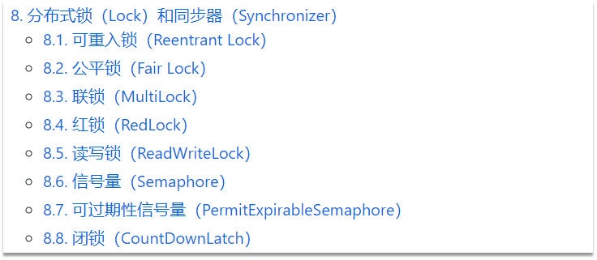
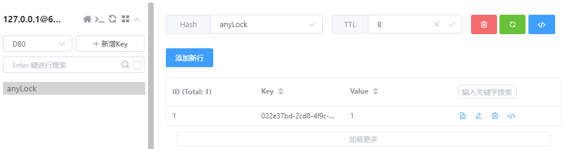

# Redisson

> Redisson是一个在Redis的基础上实现的Java驻内存数据网格（In-Memory Data Grid）。它不仅提供了一系列的分布式的Java常用对象，还提供了许多分布式服务，其中就包含了各种分布式锁的实现
>
> 官网地址： https://redisson.orgGitHub
>
> 地址： https://github.com/redisson/redisson



## Redisson入门

pom.xml

```xml
    <dependency>
        <groupId>org.redisson</groupId>
        <artifactId>redisson</artifactId>
        <version>3.43.0</version>
    </dependency>
```

RedissonConfig.java

```java
import org.redisson.Redisson;
import org.redisson.api.RedissonClient;
import org.redisson.config.Config;
import org.springframework.context.annotation.Bean;
import org.springframework.context.annotation.Configuration;

@Configuration
public class RedissonConfig {

    @Bean
    public RedissonClient redissonClient() {
        // 配置类
        Config config = new Config();
        // 添加redis地址，这里添加了单点的地址，也可以使用config.useClusterServers()添加集群地址
        config.useSingleServer().setAddress("redis://localhost:6379");
//        config.useSingleServer().setPassword("");
        // 创建客户端
        return Redisson.create(config);
    }
}
```

RedissonTest.java

```java
import org.redisson.api.RLock;
import org.redisson.api.RedissonClient;
import org.springframework.stereotype.Component;

import javax.annotation.PostConstruct;
import javax.annotation.Resource;
import java.util.concurrent.TimeUnit;

@Component
public class RedissonTest {

    @Resource
    private RedissonClient redissonClient;

    @PostConstruct
    public void testRedisson() throws InterruptedException {
        // 获取锁（可重入），指定锁的名称
        RLock lock = redissonClient.getLock("anyLock");
        // 尝试获取锁，参数分别是：获取锁的最大等待时间（期间会重试），锁自动释放时间，时间单位
        boolean isLock = lock.tryLock(1, 10, TimeUnit.SECONDS);
        // 判断释放获取成功
        if (isLock) {
            try {
                System.out.println("------获取锁成功------");
            } finally {
                // 释放锁
                lock.unlock();
            }
        }
    }
}
```

> 