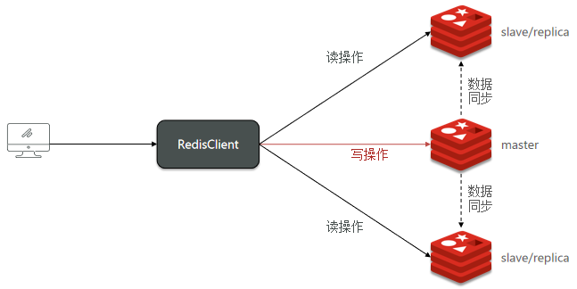
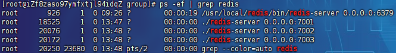
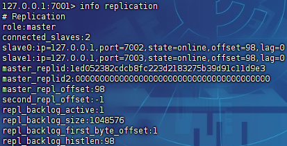
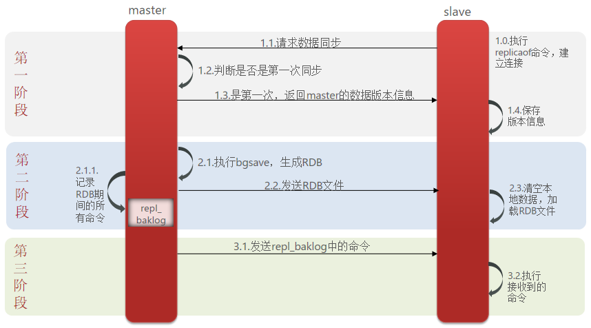
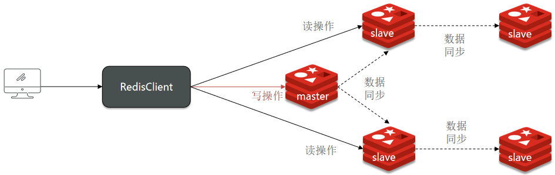

# Redis主从集群

## 集群搭建

主从集群结构如图：



### 服务准备

开启3个redis实例，模拟主从集群：

|    IP     | PORT |  角色  |
| :-------: | :--: | :----: |
| 127.0.0.1 | 7001 | master |
| 127.0.0.1 | 7002 | slave  |
| 127.0.0.1 | 7003 | slave  |

将其中的持久化模式改为默认的RDB模式，AOF保持关闭状态：

```
# 开启RDB
save 3600 1
save 300 100
save 60 10000

# 关闭AOF
appendonly no
```

Redis副本（Replica）相关的配置项：

```
# redis实例的声明IP，主从可访问的地址
replica-announce-ip 127.0.0.1

# 在集群中广播的端口号
replica-announce-port 7001


# redis服务绑定的端口号
port 7001

# 主redis密码，如果主redis连接需要密码，则需要配置
masterauth xxxxx
```

启动服务：

```
# 第1个
./redis-server group/redis.conf
# 第2个
./redis-server 7002/redis.conf
# 第3个
./redis-server 7003/redis.conf
```

> 

### 开启主从

临时主从：

```
slaveof <masterip> <masterport>
```

永久主从，修改conf文件：

```
slaveof <masterip> <masterport>
```

> 在5.0以后新增命令`replicaof`，与`salveof`效果一致

配置：

```
[root@iZf8zaso97ymfxtjl94idqZ group]# redis-cli -p 7002
127.0.0.1:7002> auth xxxxx
OK
127.0.0.1:7002> slaveof 127.0.0.1 7001
OK
127.0.0.1:7002> exit
[root@iZf8zaso97ymfxtjl94idqZ group]# redis-cli -p 7003
127.0.0.1:7003> auth xxxxx
OK
127.0.0.1:7003> slaveof 127.0.0.1 7001
OK
127.0.0.1:7003> exit
```

> 连接结果`info replication`：
>
> 

### 读写效果

主库写入：

```
127.0.0.1:7001> set num 123
```

从库读取：

```
127.0.0.1:7002> get num
"123"
```

> 从库尝试写入：
>
> ```
> 127.0.0.1:7002> set test 123
> (error) READONLY You can't write against a read only replica.
> ```

## 主从同步原理

> 主从第一次同步是全量同步，但如果slave重启后同步，则执行增量同步

- `Replication Id`：简称`replid`，是数据集的标记，id一致则说明是同一数据集。每一个`master`都有唯一的`replid`，`slave`则会继承`master`节点的`replid`
- `offset`：偏移量，随着记录在`repl_baklog`中的数据增多而逐渐增大。`slave`完成同步时也会记录当前同步的`offset`。如果`slave`的`offset`小于`master`的`offset`，说明`slave`数据落后于`master`，需要更新



> 注意：`repl_baklog`大小有上限，写满后会覆盖最早的数据。如果slave断开时间过久，导致尚未备份的数据被覆盖，则无法基于log做增量同步，只能再次全量同步

### 主从集群优化

- 在master中配置`repl-diskless-sync yes`启用无磁盘复制，避免全量同步时的磁盘IO
- Redis单节点上的内存占用不要太大，减少RDB导致的过多磁盘IO
- 适当提高`repl_baklog`的大小，发现slave宕机时尽快实现故障恢复，尽可能避免全量同步
- 限制一个master上的slave节点数量，如果实在是太多slave，则可以采用主-从-从链式结构，减少master压力



