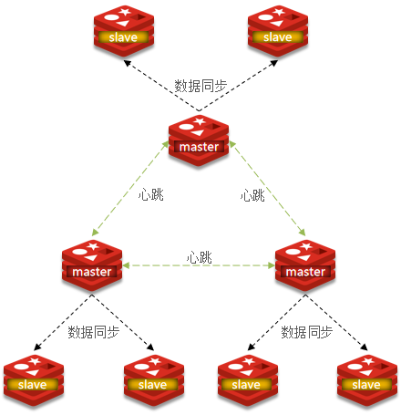
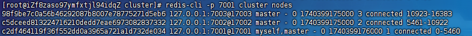
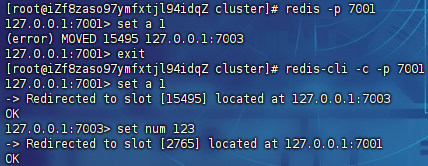
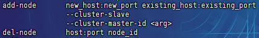
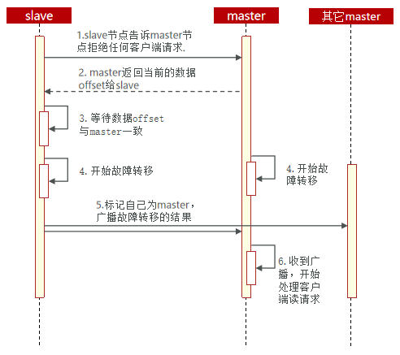
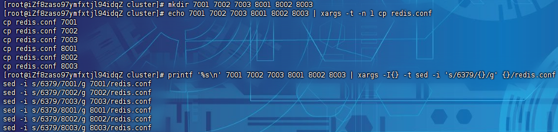
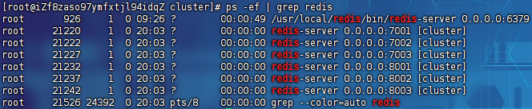
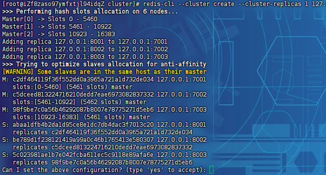
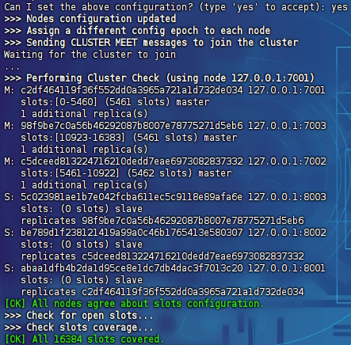
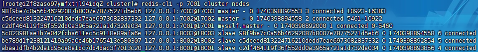

# Redis分片集群

> 主从和哨兵可以解决高可用、高并发读的问题。但是依然有两个问题没有解决：
>
> - 海量数据存储问题
> - 高并发写的问题

使用分片集群可以解决上述问题，分片集群特征：

- 集群中有多个`master`，每个`master`保存不同数据
- 每个`master`都可以有多个`slave`节点
- `master`之间通过`ping`监测彼此健康状态
- 客户端请求可以访问集群任意节点，最终都会被转发到正确节点



## 散列插槽

> Redis会把每一个`master`节点映射到`0~16383`共16384个插槽（hash slot）上，查看集群信息时就能看到

```
redis-cli -p 7001 cluster nodes
```



使用集群模式连接，插入数据：

```
redis-cli -c -p 7001
```

> 数据key不是与节点绑定，而是与插槽绑定。redis会根据key的有效部分计算插槽值，分两种情况：
>
> - key中包含`{}`，且`{}`中至少包含1个字符，`{}`中的部分是有效部分
> - key中不包含`{}`，整个key都是有效部分
>
> 例如：`key`是`num`，那么就根据`num`计算，如果是`{itcast}num`，则根据`itcast`计算。计算方式是利用CRC16算法得到一个hash值，然后对16384取余，得到的结果就是slot值
>
> 

## 集群伸缩

`redis-cli --cluster`提供了很多操作集群的命令，可以通过下面方式查看：



## 故障转移

当集群中有一个master宕机的情况：

首先是该实例与其它实例失去连接：

然后是疑似宕机：

最后是确定下线，自动提升一个slave为新的master：

## 数据迁移

> 利用`cluster failover`命令可以手动让集群中的某个master宕机，切换到执行`cluster failover`命令的这个slave节点，实现无感知的数据迁移。其流程如下：



手动的`Failover`支持三种不同模式：

- 缺省：默认的流程，如图1~6歩
- `force`：省略了对`offset`的一致性校验
- `takeover`：直接执行第5歩，忽略数据一致性、忽略`master`状态和其它`master`的意见

## 分片集群搭建

### 服务准备

开启6个redis实例：

|    IP     | PORT |  角色  |
| :-------: | :--: | :----: |
| 127.0.0.1 | 7001 | master |
| 127.0.0.1 | 7002 | master |
| 127.0.0.1 | 7003 | master |
| 127.0.0.1 | 8001 | slave  |
| 127.0.0.1 | 8002 | slave  |
| 127.0.0.1 | 8003 | slave  |

创建配置文件`redis.conf`：

```
# 监听端口
port 6379

# 开启集群功能
cluster-enabled yes
# 集群的配置文件名称，不需要创建，由redis自己维护
cluster-config-file /usr/local/redis/cluster/6379/nodes.conf
# 节点心跳失败的超时时间
cluster-node-timeout 5000

# 持久化文件存放目录
dir "/usr/local/redis/cluster/6379"
# 绑定地址
bind 0.0.0.0
# 让redis后台运行
daemonize yes
# 注册的实例ip
replica-announce-ip 127.0.0.1
# 保护模式
protected-mode no

# 数据库数量
databases 1
# 日志
logfile "/usr/local/redis/cluster/6379/run.log"
```

创建目录：

```
mkdir 7001 7002 7003 8001 8002 8003
```

批量复制：

```
echo 7001 7002 7003 8001 8002 8003 | xargs -t -n 1 cp redis.conf
```

将其中的6379修改为与所在目录一致：

```
# 修改配置文件
printf '%s\n' 7001 7002 7003 8001 8002 8003 | xargs -I{} -t sed -i 's/6379/{}/g' {}/redis.conf
```

> 

全部启动：

```
# 一键启动所有服务
printf '%s\n' 7001 7002 7003 8001 8002 8003 | xargs -I{} -t redis-server {}/redis.conf
```

> 
>
> 关闭命令：
>
> ```
> printf '%s\n' 7001 7002 7003 8001 8002 8003 | xargs -I{} -t redis-cli -p {} shutdown
> ```
>
> 杀死所有redis进程：
>
> ```
> ps -ef | grep redis | awk '{print $2}' | xargs kill
> ```

### 集群搭建

> `Redis5.0`之前，用`redis`安装包下的`src/redis-trib.rb`来实现的。因为`redis-trib.rb`是有`ruby`语言编写的所以需要安装`ruby`环境：
>
> ```
> yum -y install zlib ruby rubygems
> gem install redis
> ```
>
> 通过命令来管理集群：
>
> ```
> # 创建集群
> ./redis-trib.rb create --replicas 1 127.0.0.1:7001 127.0.0.1:7002 127.0.0.1:7003 127.0.0.1:8001 127.0.0.1:8002 127.0.0.1:8003
> ```

`Redis5.0`以后，集群管理已经集成到了`redis-cli`中：

```
redis-cli --cluster create --cluster-replicas 1 127.0.0.1:7001 127.0.0.1:7002 127.0.0.1:7003 127.0.0.1:8001 127.0.0.1:8002 127.0.0.1:8003
```

> 命令说明：
>
> - `redis-cli --cluster`或者`./redis-trib.rb`：代表集群操作命令
> - `create`：代表是创建集群
> - `--replicas 1`或者`--cluster-replicas 1`：指定集群中每个master的副本个数为1，此时`节点总数 ÷ (replicas + 1)` 得到的就是master的数量。因此节点列表中的前n个就是master，其它节点都是slave节点，随机分配到不同master

自动处理：



前三个为主，后三个为从：



查看集群状态：

```
redis-cli -p 7001 cluster nodes
```


