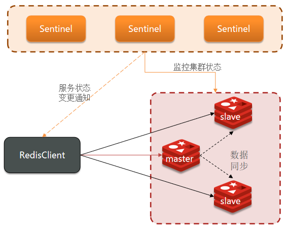
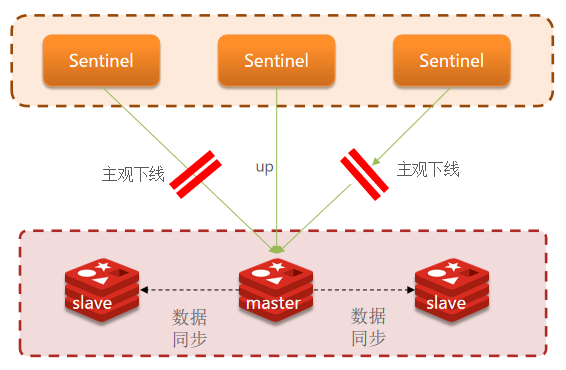
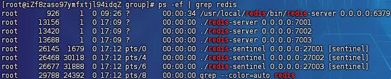
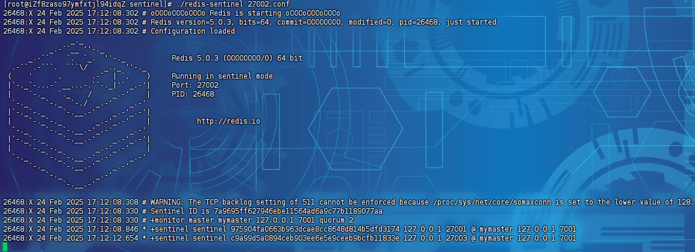
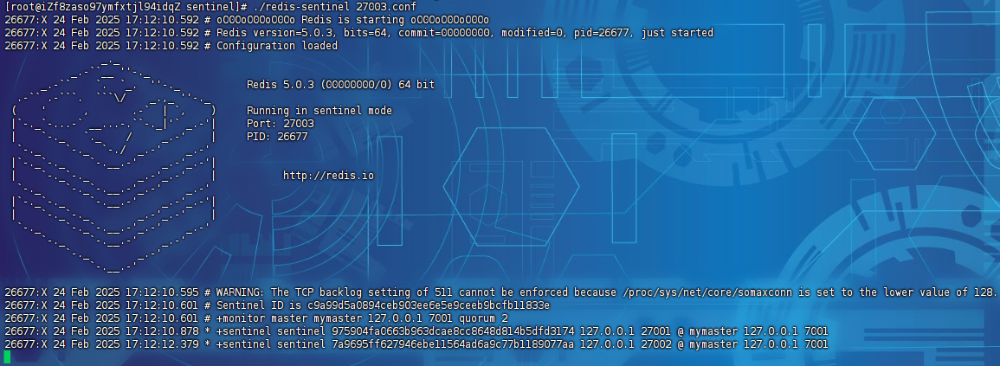
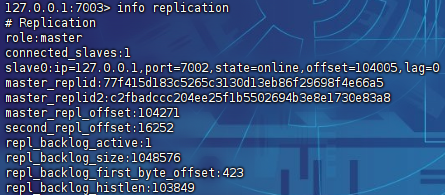

# Redis哨兵集群

> Redis提供了哨兵（Sentinel）机制来实现主从集群的自动故障恢复。哨兵的结构和作用如下：
>
> - 监控：Sentinel 会不断检查您的master和slave是否按预期工作
> - 自动故障恢复：如果master故障，Sentinel会将一个slave提升为master。当故障实例恢复后也以新的master为主
> - 通知：Sentinel充当Redis客户端的服务发现来源，当集群发生故障转移时，会将最新信息推送给Redis的客户端



## 服务状态监控

`Sentinel`基于心跳机制监测服务状态，每隔1秒向集群的每个实例发送ping命令：

- 主观下线：如果某`sentinel`节点发现某实例未在规定时间响应，则认为该实例主观下线
- 客观下线：若超过指定数量（quorum）的`sentinel`都认为该实例主观下线，则该实例客观下线。(`quorum`值最好超过`Sentinel`实例数量的一半)



## 哨兵原理

### 选举新的master

一旦发现`master`故障，`sentinel`需要在`salve`中选择一个作为新的`master`，选择依据是这样的：

- 首先会判断`slave`节点与`master`节点断开时间长短，如果超过指定值(`down-after-milliseconds * 10`)则会排除该`slave`节点
- 然后判断`slave`节点的`slave-priority`值，越小优先级越高，如果是0则永不参与选举
- 如果`slave-prority`一样，则判断`slave`节点的`offset`值，越大说明数据越新，优先级越高
- 最后是判断`slave`节点的运行`id`大小，越小优先级越高

### 故障转移

当选中了其中一个`slave`为新的`master`后(例如`slave1`)，故障的转移的步骤如下：

- `sentinel`给备选的`slave1`节点发送`slaveof no one`命令，让该节点成为`master`
- `sentinel`给所有其它`slave`发送`slaveof 127.0.0.1 7002`命令，让这些`slave`成为新`master`的从节点，开始从新的`master`上同步数据
- 最后，`sentinel`将故障节点标记为`slave`，当故障节点恢复后会自动成为新的`master`的`slave`节点

## 集群服务搭建

三个sentinel实例信息如下：

| 节点 |    IP     | PORT  |
| :--: | :-------: | :---: |
|  s1  | 127.0.0.1 | 27001 |
|  s2  | 127.0.0.1 | 27002 |
|  s3  | 127.0.0.1 | 27003 |

集群配置：

```
# redis服务端口
port 27001

# 阻塞启动
daemonize no

# 日志定向到控制台
# logfile "/usr/local/redis/logs/6379.log"

#################################
# 指定 Sentinel 对外广播的 IP 地址
sentinel announce-ip 127.0.0.1

# monitor <主节点的名称> <主节点的 IP 地址> <主节点的端口号> <至少需要多少个Sentinel同意才能判定主节点失效并触发故障转移>
sentinel monitor mymaster 127.0.0.1 27001 2

# 节点密码
sentinel auth-pass <master-name> <password>

# 指定Sentinel认为主节点或从节点不可用的时间阈值(毫秒)
sentinel down-after-milliseconds mymaster 5000

# 指定故障转移的最大超时时间(毫秒)
sentinel failover-timeout mymaster 60000
#################################
```

启动服务：

```
# 第1个
./redis-sentinel 27001.conf
# 第2个
./redis-sentinel 27002.conf
# 第3个
./redis-sentinel 27003.conf
```

> 
>
> 
>
> 
>
> 

关闭端口为`7001`的主库，切换日志：

```
# 哨兵检测到主节点mymaster（IP: 127.0.0.1, 端口: 7001）进入了主观下线状态
26145:X 24 Feb 2025 17:28:24.946 # +sdown master mymaster 127.0.0.1 7001
# quorum3/2表示当前有3个哨兵，需要至少2个哨兵达成一致
26145:X 24 Feb 2025 17:28:24.998 # +odown master mymaster 127.0.0.1 7001 #quorum 3/2
# 哨兵创建了一个新的纪元（Epoch），用于协调选举和故障转移
26145:X 24 Feb 2025 17:28:40.976 # +new-epoch 7
# 哨兵节点7a9695ff627946ebe11564ad6a9c77b1189077aa提名自己作为领导者，并请求其他哨兵投票
26145:X 24 Feb 2025 17:28:40.980 # +vote-for-leader 7a9695ff627946ebe11564ad6a9c77b1189077aa 7
# 哨兵暂时不会启动新的故障转移操作，冷却时间为2分钟
26145:X 24 Feb 2025 17:28:40.980 # Next failover delay: I will not start a failover before Mon Feb 24 17:30:41 2025
# 当前哨兵从另一个哨兵（7a9695ff627946ebe11564ad6a9c77b1189077aa）同步了最新的配置信息
26145:X 24 Feb 2025 17:28:41.706 # +config-update-from sentinel 7a9695ff627946ebe11564ad6a9c77b1189077aa 127.0.0.1 27002 @ mymaster 127.0.0.1 7001
# 将从节点7003提升为主节点
26145:X 24 Feb 2025 17:28:41.706 # +switch-master mymaster 127.0.0.1 7001 127.0.0.1 7003
# 从节点7002被重新配置为新的主节点7003的从节点
26145:X 24 Feb 2025 17:28:41.706 * +slave slave 127.0.0.1:7002 127.0.0.1 7002 @ mymaster 127.0.0.1 7003
# 原主节点7001被降级为从节点，并重新配置为新的主节点7003的从节点
26145:X 24 Feb 2025 17:28:41.706 * +slave slave 127.0.0.1:7001 127.0.0.1 7001 @ mymaster 127.0.0.1 7003
# 哨兵检测到从节点7001进入了主观下线状态
26145:X 24 Feb 2025 17:28:46.760 # +sdown slave 127.0.0.1:7001 127.0.0.1 7001 @ mymaster 127.0.0.1 7003
```


